# Appendix: Diagram Index

Every diagram in the documentation, grouped by theme. Click a card to jump to
the section where the diagram appears in context. All are hand-authored SVG
(they scale crisply and render on GitHub too).

## The domain model

::::{grid} 1 2 2 3

:::{card}
:link: ./philosophy/domain_model.md#crudlu
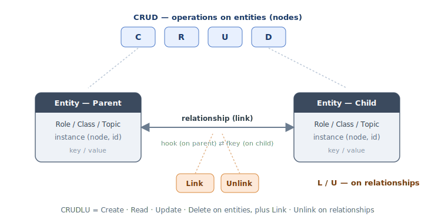

**CRUDLU** — CRUD on entities, Link / Unlink on relationships.
:::

:::{card}
:link: ./philosophy/domain_model.md#entity-relationship-model
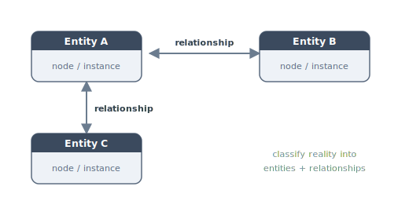

**Entity / Relationship** — reality as entities + the relationships between them.
:::

:::{card}
:link: ./philosophy/domain_model.md#entities
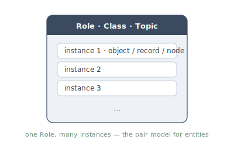

**Entities** — one Role (class / topic) and its many instances.
:::

:::{card}
:link: ./philosophy/domain_model.md#relationships
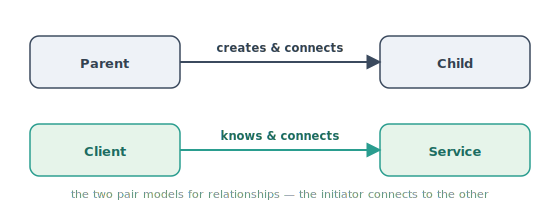

**Relationships** — the Parent/Child and Client/Service pair models.
:::

:::{card}
:link: ./philosophy/typed_graph_model.md#the-unit-is-not-node-edge-it-is-typed-instance-with-typed-bindings
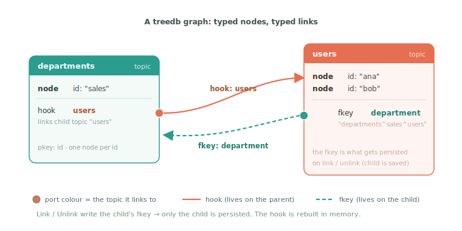

**TreeDB graph** — topics, nodes, hooks and fkeys; port colour = linked topic.
:::

:::{card}
:link: ./philosophy/typed_graph_model.md#what-this-lets-you-model
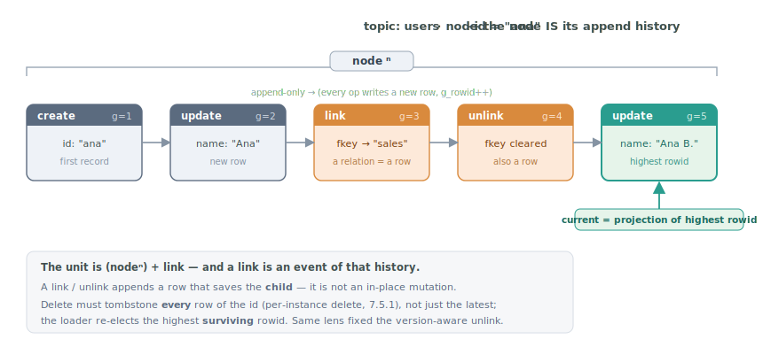

**Node is its history** — `node`ⁿ as an append timeline; a link is an event.
:::

::::

## Runtime: gobj, lifecycle & scaffolding

::::{grid} 1 2 2 3

:::{card}
:link: ../../yunos/c/yuno_agent/GOBJ.md#id-6-the-runtime-tree
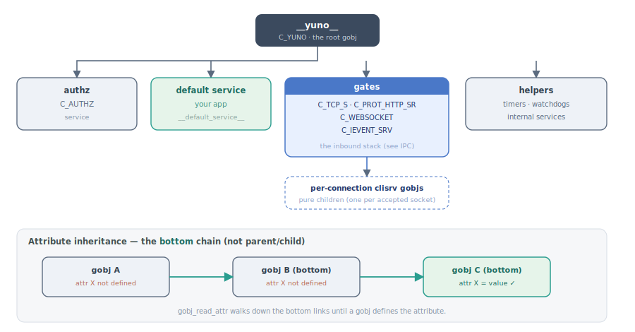

**Gobj runtime tree** — `__yuno__` children + the bottom chain for attributes.
:::

:::{card}
:link: ../../yunos/c/yuno_agent/ENTRY_POINT.md#id-1-the-picture

**Process tree** — grandparent / watcher / yuno; two pids per yuno.
:::

:::{card}
:link: ../../yunos/c/yuno_agent/YUNO_LIFECYCLE.md#id-4-1-state-machine-of-a-single-yuno-as-the-agent-sees-it
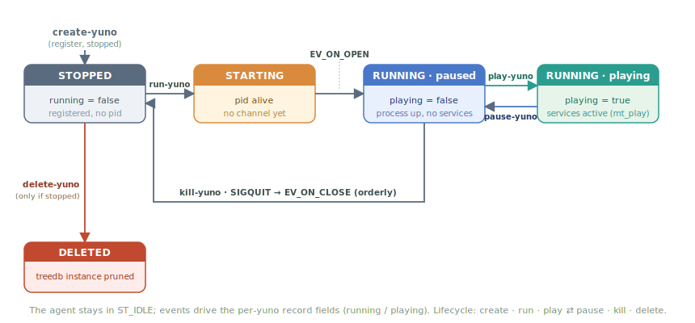

**Yuno lifecycle FSM** — create → run → play ⇄ pause → kill → delete.
:::

:::{card}
:link: ./guide/guide_gclass.md#components-of-a-gclass
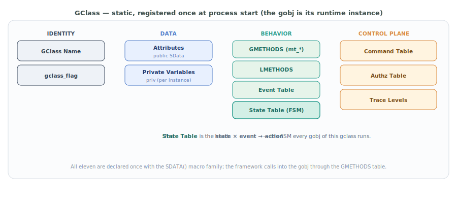

**GClass anatomy** — the eleven components, grouped.
:::

:::{card}
:link: ../../yunos/c/yuno_agent/SCAFFOLDING.md#id-1-which-template-to-pick

**Scaffolding decision tree** — which `yuno-skeleton` template to pick.
:::

::::

## Messaging & IPC

::::{grid} 1 2 2 3

:::{card}
:link: ../../yunos/c/yuno_agent/IPC.md#id-6-gates-how-external-traffic-becomes-events

**Message pipeline** — bytes climb the gate stack to a service; traces per layer.
:::

:::{card}
:link: ../../yunos/c/yuno_agent/IPC.md#id-4-1-the-two-ends
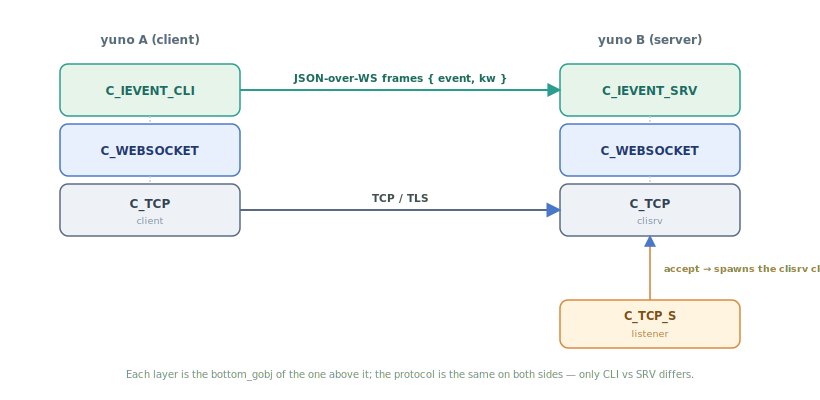

**ievent stack across the WS boundary** — two yunos, CLI ⇄ SRV.
:::

::::

## Persistence (timeranger2 / treedb)

::::{grid} 1 2 2 3

:::{card}
:link: ../../yunos/c/yuno_agent/YUNO_TREEDB.md#id-2-2-records-and-the-md2-index

**md2 record + O(1) lookup** — rowid × 32 → `.md2` → offset/size → `.json`.
:::

:::{card}
:link: ../../yunos/c/yuno_agent/YUNO_TREEDB.md#id-2-1-the-on-disk-layout
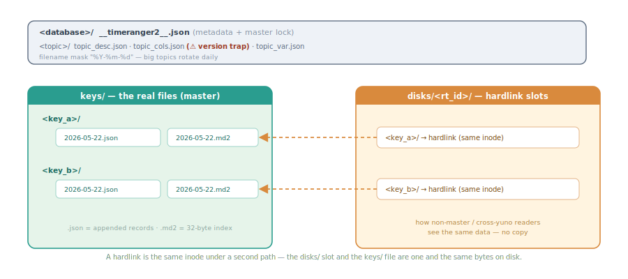

**On-disk layout** — `keys/` real files vs `disks/` hardlink slots.
:::

::::

## Auth & TLS

::::{grid} 1 2 2 3

:::{card}
:link: ./guide/guide_oauth2_pkce_bff.md#complete-authentication-flow
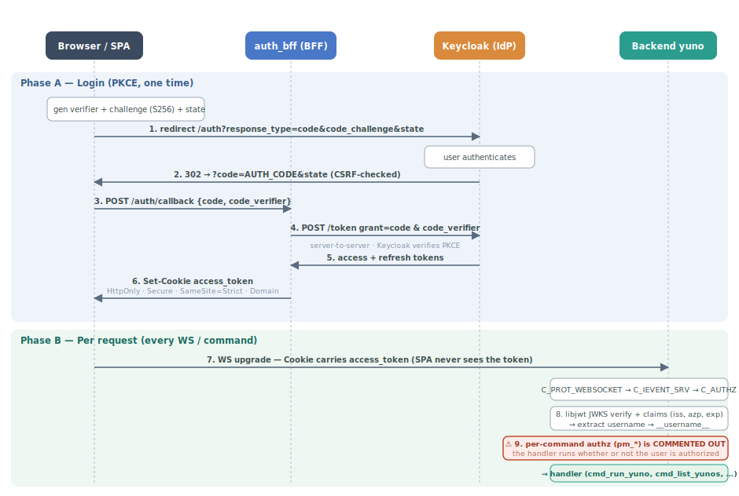

**OIDC / PKCE auth flow** — login + per-request, with the disabled authz gate.
:::

:::{card}
:link: ./guide/guide_authz.md#authorization-workflow
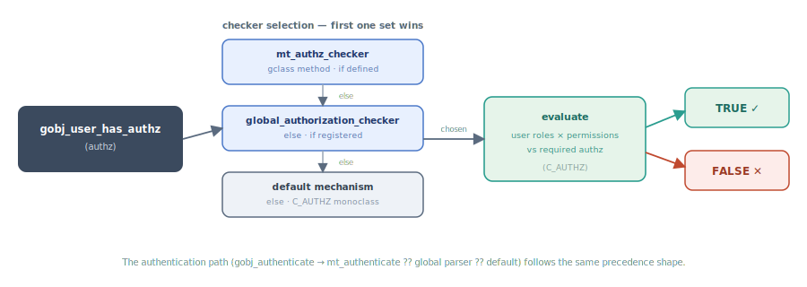

**Authz decision** — checker precedence → TRUE / FALSE.
:::

:::{card}
:link: ./guide/guide_cert_management.md#how-live-sessions-survive-the-swap
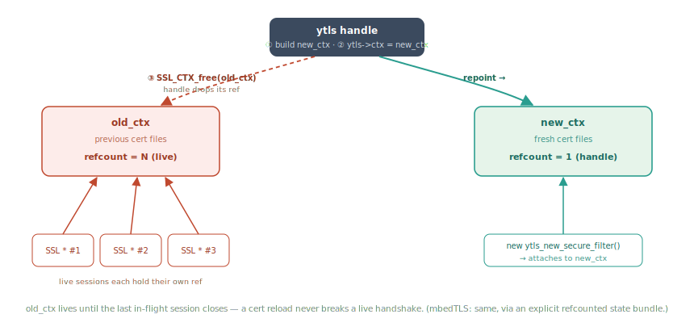

**Cert hot-swap** — `old_ctx` kept alive by live sessions until they close.
:::

:::{card}
:link: ./guide/guide_cert_management.md#the-three-layer-defense-in-depth
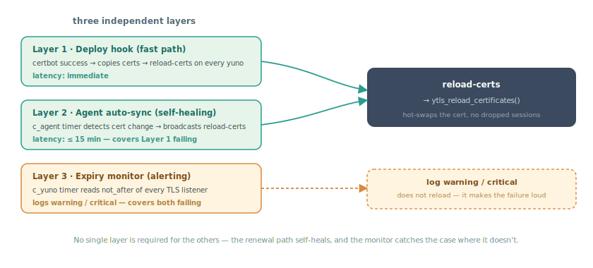

**Cert defense in depth** — three layers → `ytls_reload_certificates()`.
:::

::::

## Operations, build & buffers

::::{grid} 1 2 2 3

:::{card}
:link: ./yunos/controlcenter.md
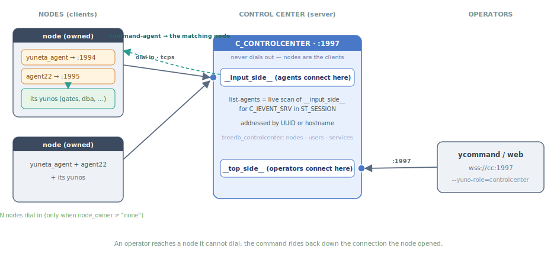

**Control-center topology** — nodes dial in; `command-agent` routed back.
:::

:::{card}
:link: ./yunos/emailsender.md#delivery-semantics
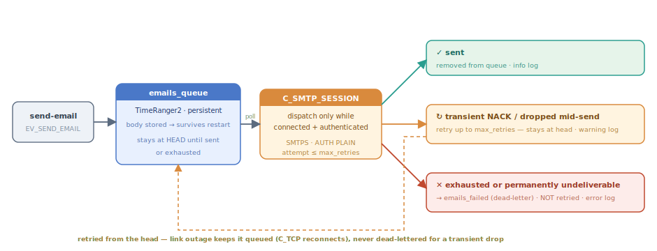

**Emailsender retry / dead-letter** — queue → SMTP → sent / retry / failed.
:::

:::{card}
:link: ./yunos/logcenter.md#what-it-does-with-each-record
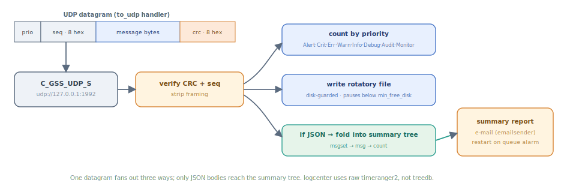

**logcenter ingest** — UDP datagram → verify → count / rotatory / summary.
:::

:::{card}
:link: ./tools/sync_binaries.md#rebuild-lifecycle-is-automated-the-bump-path-is-not
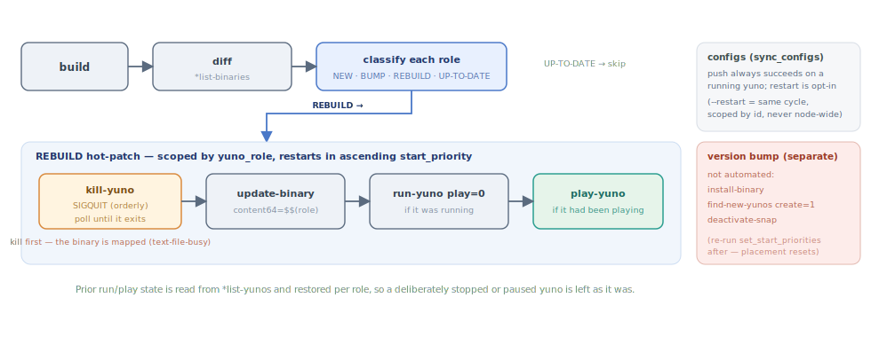

**Deploy / sync cycle** — build → diff → REBUILD hot-patch by start_priority.
:::

:::{card}
:link: ./guide/folders.md#kernel
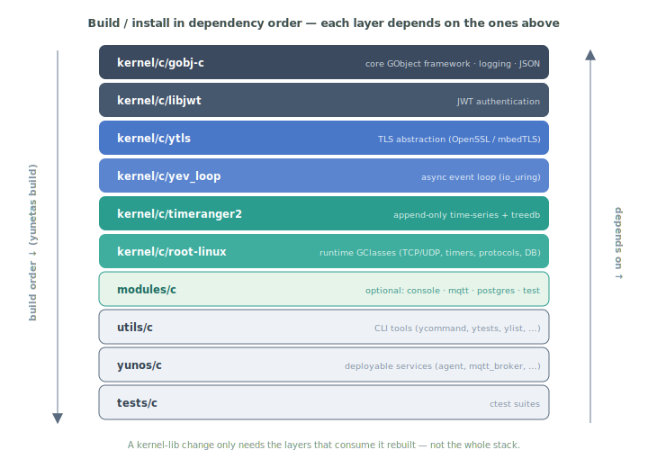

**Build dependency stack** — gobj-c → … → yunos → tests.
:::

:::{card}
:link: ./guide/guide_gbuffer.md#structure-overview
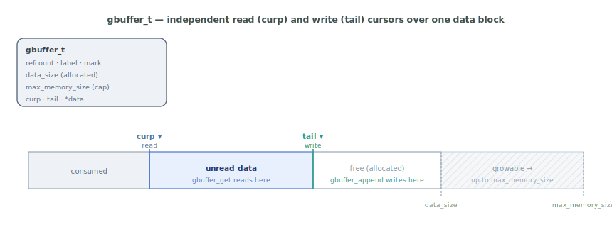

**gbuffer layout** — independent `curp` (read) / `tail` (write) cursors.
:::

::::
