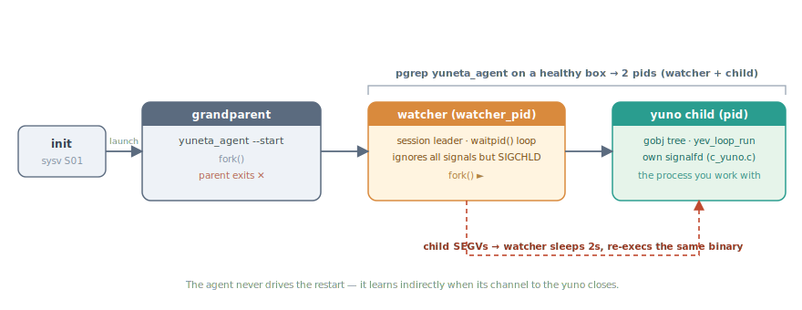

# Entry point: [`yuneta_entry_point`](#yuneta_entry_point) + `ydaemon`

> **Read this first.** Everything else under *Operating Yuneta* assumes you
> already know what `main()` does, who is the parent of who, and why a yuno
> survives a `kill -9` of its agent.

A yuno is an **autonomous machine**. It is engineered to keep running with
or without an agent on the box. The agent is one more peer in the ecosystem
— a manager, not a parent. The mechanism that makes that autonomy concrete
lives in two files of `kernel/c/root-linux/src/`:

| File              | Role                                                                 |
|-------------------|----------------------------------------------------------------------|
| [`entry_point.c`](https://github.com/artgins/yunetas/blob/7.5.5/kernel/c/root-linux/src/entry_point.c)   | The `int main()` body every yuno calls. argp, gbmem, config, log, gobj_start_up, registration, then either daemon or foreground. |
| [`ydaemon.c`](https://github.com/artgins/yunetas/blob/7.5.5/kernel/c/root-linux/src/ydaemon.c)       | The supervision kernel under `--start`. Double fork, watcher process, auto-relaunch on abnormal exit. |

Every standalone or citizen yuno's `main.c` boils down to one call to
`yuneta_entry_point()` (optionally preceded by [`yuneta_setup()`](#yuneta_setup) if it wants
to override defaults). See [`yunos/c/yuno_agent/src/main.c`](https://github.com/artgins/yunetas/blob/7.5.5/yunos/c/yuno_agent/src/main.c) for the
canonical example.

---

## 1. The picture



The same picture in text:

```
                 ┌─────────────────────────────────────────┐
init / sysv ──►  │ grandparent: yuneta_agent --start       │
                 │   fork()  ── parent exits ──►           │
                 │   ┌─────────────────────────────────────┤
                 │   │ watcher (session leader, watcher_pid)
                 │   │   waitpid() loop, ignores all signals except SIGCHLD
                 │   │   fork()  ──►                        │
                 │   │   ┌─────────────────────────────────┤
                 │   │   │ yuno child (pid)                 │
                 │   │   │   gobj tree, yev_loop_run        │
                 │   │   │   own signalfd handler (c_yuno.c)│
                 │   │   └─────────────────────────────────┘
                 └─────────────────────────────────────────┘
```

Two implications worth keeping in your head:

- **Every yuno you see in `ps` has a sibling watcher**. `pgrep yuneta_agent`
  on a healthy box returns **two** pids: the watcher and the child.
- **The watcher does not know what the agent is**. It uses `waitpid()` on
  one specific pid. If the child SEGVs, the watcher sleeps 2s and re-execs
  the same binary with the same args. The agent is informed indirectly
  (its channel to the yuno closes); it does not drive the restart.

---

## 2. `yuneta_setup()` — pluggable defaults (optional)

Call before `yuneta_entry_point()` if you want to override any of:

| Knob                             | Default                                                | Where the default is set        |
|----------------------------------|--------------------------------------------------------|---------------------------------|
| `persistent_attrs`               | `db_load/save/remove/list_persistent_attrs` (dbsimple) | [`entry_point.c`](https://github.com/artgins/yunetas/blob/7.5.5/kernel/c/root-linux/src/entry_point.c)           |
| `command_parser`                 | internal `command_parser()`                            | [`entry_point.c`](https://github.com/artgins/yunetas/blob/7.5.5/kernel/c/root-linux/src/entry_point.c)              |
| `stats_parser`                   | internal `stats_parser()`                              | [`entry_point.c`](https://github.com/artgins/yunetas/blob/7.5.5/kernel/c/root-linux/src/entry_point.c)              |
| [`authz_checker`](#authz_checker)                  | [`C_AUTHZ`](#gclass-c-authz) monoclass checker                            | [`entry_point.c`](https://github.com/artgins/yunetas/blob/7.5.5/kernel/c/root-linux/src/entry_point.c)              |
| [`authentication_parser`](#authentication_parser)          | `C_AUTHZ` parser                                       | [`entry_point.c`](https://github.com/artgins/yunetas/blob/7.5.5/kernel/c/root-linux/src/entry_point.c)              |
| `MEM_MIN_BLOCK` / `MEM_MAX_BLOCK`| 512 B / 16 MiB                                         | [`entry_point.c`](https://github.com/artgins/yunetas/blob/7.5.5/kernel/c/root-linux/src/entry_point.c)           |
| `MEM_SUPERBLOCK`                 | 16 MiB                                                 | [`entry_point.c`](https://github.com/artgins/yunetas/blob/7.5.5/kernel/c/root-linux/src/entry_point.c)              |
| `MEM_MAX_SYSTEM_MEMORY`          | 64 MiB                                                 | [`entry_point.c`](https://github.com/artgins/yunetas/blob/7.5.5/kernel/c/root-linux/src/entry_point.c)              |
| `USE_OWN_SYSTEM_MEMORY`          | `FALSE` (use libc malloc under gbmem)                  | [`entry_point.c`](https://github.com/artgins/yunetas/blob/7.5.5/kernel/c/root-linux/src/entry_point.c)              |

The memory tunables are passed straight to [`gbmem_setup()`](#gbmem_setup) later. Yunos
that handle large messages (image proxies, mqtt brokers under load) bump
`MEM_MAX_BLOCK` and `MEM_MAX_SYSTEM_MEMORY`. See [`yuno_agent/src/main.c`](https://github.com/artgins/yunetas/blob/7.5.5/yunos/c/yuno_agent/src/main.c)
for a representative call site.

---

## 3. `yuneta_entry_point()` — the choreography

[`entry_point.c`](https://github.com/artgins/yunetas/blob/7.5.5/kernel/c/root-linux/src/entry_point.c). In execution order:

### 3.1 Identity sanity

- `APP_NAME` must be ≤ 15 chars (Linux `comm` field limit). Test binaries
  starting with `test_` are exempted (`PREFIX_TEST_APP` — flagged
  as a BUG in the source itself).
- The Unix user running the binary must be `yuneta` or in group `yuneta`,
  otherwise `print_error(PEF_EXIT, …)`.

### 3.2 argp

| Flag                     | Effect                                                 |
|--------------------------|--------------------------------------------------------|
| `-S, --start`            | Run as daemon (double-fork + watcher). Else foreground. |
| `-K, --stop`             | Call `daemon_shutdown(process_name)` and exit (see §4.5). |
| `-f, --config-file=FILE` | Merge external JSON on top of fixed/variable config.   |
| `-p, --print-config`     | Print final merged config and exit.                    |
| `-P, --print-verbose-config` | Print config with all defaults expanded and exit.  |
| `-r, --print-role`       | Print `{role,name,alias,version,date,description,tags,…}` and exit. |
| `-v, --version`          | Print yuno version and exit.                           |
| `-V, --yuneta-version`   | Print yuneta runtime version and exit.                 |
| `-l, --verbose-log=N`    | Override `handler_options` of the `stdout` log handler. |

### 3.3 Close-and-rewire stdio in daemon mode

When `--start`, every fd in `[0, sysconf(_SC_OPEN_MAX))` is closed, then
`/dev/null` is opened to grab fd 0 and `dup2`'d to fd 1 and fd 2. After
this, no inherited fd survives. [`check_open_fds()`](#check_open_fds) warns if anything stays
open beyond 4.

### 3.4 Allocator switch — **this is load-bearing**

```c
gbmem_get_allocators(&malloc, &realloc, &calloc, &free);
json_set_alloc_funcs(malloc_func, free_func);     // jansson now uses gbmem
gbmem_setup(MEM_MAX_BLOCK, MEM_MAX_SYSTEM_MEMORY, USE_OWN_SYSTEM_MEMORY,
            MEM_MIN_BLOCK, MEM_SUPERBLOCK);
```

After this line, every `json_*` allocation goes through `gbmem_*` and is
tracked under `CONFIG_DEBUG_TRACK_MEMORY`.

**Test-author trap:** any [`json_pack()`](https://jansson.readthedocs.io/en/latest/apiref.html#c.json_pack) / [`set_expected_results()`](#set_expected_results) called
**before** `yuneta_entry_point` returns gets libc-tracked memory that
`gbmem` later can't free → false leaks. Put that setup inside
`register_yuno_and_more()` (which runs at §3.10 below), never in `main()`.
See memory `feedback_test_json_allocator_timing`.

### 3.5 Logging boot

[`glog_init()`](#glog_init) registers the available log handler types (`stdout`, `file`,
`udp`). [`rotatory_start_up()`](#rotatory_start_up) arms the rotation timer. No handlers are
attached yet.

### 3.6 Merge the config

[`json_config()`](#json_config) merges, in order:

```
fixed_config (compiled into the yuno) +
variable_config (compiled, intended to be overridden) +
--config-file=… contents +
[json blob passed as argp positional argument]
```

`view-config` on a running yuno (`ycommand command-yuno id=<id>
service=__yuno__ command=view-config`) returns **this merged result**, not
the on-disk file. See memory `feedback_yuno_runtime_config`.

### 3.7 Environment registration

Reads `environment.{work_dir, domain_dir, xpermission, rpermission}` from
the merged config and calls [`register_yuneta_environment()`](#register_yuneta_environment). This is what
later powers [`yuneta_realm_file()`](#yuneta_realm_file), [`yuneta_log_file()`](#yuneta_log_file) and the rest of
the path helpers.

### 3.8 `gobj_start_up()`

Initialises the gobj registry, persistent-attrs subsystem, the four
parsers (command/stats/authz/authentication) and the trace plumbing. From
here on, `gobj_create*`/`gobj_log_*`/`gobj_subscribe_event` are usable.

### 3.9 Log handlers — files and UDP

Reads `environment.{daemon|console}_log_handlers` depending on
`__as_daemon__`. For each entry:

- `handler_type: stdout` → attaches with `handler_options` (overridable
  with `-l`).
- `handler_type: file` → opens a rotatory at the path resolved by
  `yuneta_log_file()`, honouring `bf_size`, `max_megas_rotatoryfile_size`,
  `min_free_disk_percentage`.
- `handler_type: udp` (or legacy typo `upd`) → [`udpc_open()`](#udpc_open) to the
  configured `url`. This is the logcenter feed.

### 3.10 Register gclasses

```c
result += yunetas_register_c_core();   // runtime gclasses (c_tcp, c_timer, …)
result += register_yuno_and_more();    // the yuno's own gclasses + setup
```

`register_yuno_and_more()` runs **after** environment + gobj_start_up are
ready, but **before** any service or yuno gobj is created. This is the
canonical place to:

- `gobj_register_gclass(…)` your own classes,
- enable traces from code,
- in tests, `set_expected_results()` (see §3.4).

### 3.11 Branch on daemon mode

```c
if(__as_daemon__) {
    daemon_run(process, process_name, work_dir, domain_dir, cleaning_fn);
    return gobj_get_exit_code();
} else {
    process(process_name, work_dir, domain_dir, cleaning_fn);
    return result;
}
```

The foreground path runs [`process()`](https://github.com/artgins/yunetas/blob/7.5.5/kernel/c/root-linux/src/entry_point.c#L115) directly; the daemon path goes
through [`ydaemon.c`](https://github.com/artgins/yunetas/blob/7.5.5/kernel/c/root-linux/src/ydaemon.c). Both eventually reach the same `process()` function.

---

(entry-point-watcher)=
## 4. [`ydaemon.c`](https://github.com/artgins/yunetas/blob/7.5.5/kernel/c/root-linux/src/ydaemon.c) — the supervision kernel

[`ydaemon.c`](https://github.com/artgins/yunetas/blob/7.5.5/kernel/c/root-linux/src/ydaemon.c). The reason a yuno survives `kill -9 yuneta_agent`.

### 4.1 Double fork

[`continue_as_daemon()`](https://github.com/artgins/yunetas/blob/7.5.5/kernel/c/root-linux/src/ydaemon.c#L59): `fork()` once. Parent `_exit(EXIT_SUCCESS)`;
child becomes session leader via `setsid()` and records `watcher_pid =
getpid()`. This is the **watcher** process.

[`relauncher()`](https://github.com/artgins/yunetas/blob/7.5.5/kernel/c/root-linux/src/ydaemon.c#L111): `fork()` again. The watcher's `waitpid()`s on
the grandchild; the grandchild is the **actual yuno**. The grandchild
inherits umask 0, chdirs to `work_dir`, and calls `process()`.

### 4.2 Watcher signal posture

```c
signal(SIGPIPE, SIG_IGN);
signal(SIGTERM, SIG_IGN);
signal(SIGALRM, SIG_IGN);
signal(SIGQUIT, SIG_IGN);
signal(SIGINT,  SIG_IGN);     // ctrl+c
signal(SIGUSR1, SIG_IGN);
signal(SIGUSR2, SIG_IGN);
```

The watcher is deliberately deaf to everything except `SIGCHLD` (delivered
implicitly via `waitpid`) and `SIGKILL` (uncatchable, terminates it).

### 4.3 `waitpid()` decision matrix

| Event reported by `waitpid()`              | Watcher action                       |
|--------------------------------------------|--------------------------------------|
| `WIFEXITED && exit_code == 0`              | return 1 → exit (no relaunch)        |
| `WIFEXITED && exit_code != 0`              | return -1 → `sleep(2)` + relaunch    |
| `WIFSIGNALED && signal == SIGKILL`         | return 1 → exit (no relaunch)        |
| `WIFSIGNALED && signal != SIGKILL` (SEGV…) | return -1 → `sleep(2)` + relaunch    |
| anything else                              | return -1 → relaunch                 |

`relaunch_times` is bumped on every restart and logged with:

```
MSGSET_SYSTEM "Daemon relaunched"  process=… pid=… relaunch_times=… signal_code=… exit_code=…
```

That log line is the **only** indication a watcher resurrection happened.
If you see `relaunch_times > 0` after a quiet day, something crashed.

### 4.4 What the agent does and does not do

- Auto-restart on crash is **the watcher's job**, not the agent's.
- The agent sees a closed channel (`EV_ON_CLOSE`) when the yuno child
  dies — but the agent's record-clear and the watcher's relaunch run in
  parallel and are unrelated. By the time the agent reconciles, the
  watcher has already spawned a new yuno child with a new pid.
- If you `kill -9` the agent itself, every yuno on the box keeps running.
  Each one still has its watcher. Restarting the agent re-discovers them
  via `getpgid(pid) >= 0` checks plus the boot-time [`run_enabled_yunos()`](https://github.com/artgins/yunetas/blob/7.5.5/yunos/c/yuno_agent/src/c_agent.c#L8778).

### 4.5 `--stop` / [`daemon_shutdown()`](#daemon_shutdown)

`daemon_shutdown()` scans `/proc/*/comm` for entries matching
`process_name` and calls [`kill_proc()`](https://github.com/artgins/yunetas/blob/7.5.5/kernel/c/root-linux/src/ydaemon.c#L323) for each:

```c
kill(pid, SIGQUIT);   // soft exit — let it delete pid file, flush logs
sleep(1);
kill(pid, SIGKILL);   // hard — guarantee it goes
```

The second `kill()` is what stops the watcher (per §4.3). Without it, the
SIGQUIT would only bring down the child and the watcher would relaunch.

### 4.6 [`get_watcher_pid()`](#get_watcher_pid)

Exported so [`c_yuno.c`](https://github.com/artgins/yunetas/blob/7.5.5/kernel/c/root-linux/src/c_yuno.c) can include both `pid` and `watcher_pid` in the
yuno's identity card. That is how the agent ends up with `yuno_pid` and
`watcher_pid` rows in its treedb (used by `kill-yuno`, see §7).

---

## 5. `process()` — the inner loop

[`entry_point.c`](https://github.com/artgins/yunetas/blob/7.5.5/kernel/c/root-linux/src/entry_point.c). What every yuno actually runs once the daemon
ceremony is done.

1. Emit the startup banner (`MSGSET_STARTUP "Starting yuno"`) with the
   full realm + yuno identity. This is the first line in any `logs/<N>.log`.
2. `gobj_create_yuno(__yuno_name__, C_YUNO, kw_yuno)` → the grandmother
   gobj of the runtime tree.
3. For every entry in `config.services[]`: `gobj_service_factory(name,
   tree)` instantiates the service subtree.
4. [`run_services()`](#run_services) → start every service in declared order.
5. `yev_loop_run(yuno_event_loop(), -1)` → block here for the rest of the
   process's life. Returns only when [`set_yuno_must_die()`](#set_yuno_must_die) flips the
   stop flag (§6).
6. [`stop_services()`](#stop_services) → graceful shutdown in reverse order.
7. [`gobj_end()`](#gobj_end) → destroy yuno, free baseline allocations.
8. [`yev_loop_stop()`](#yev_loop_stop) + [`yuno_event_detroy()`](#yuno_event_detroy).
9. [`rotatory_end()`](#rotatory_end), `json_decref(__jn_config__)`, optional `cleaning_fn()`.
10. [`print_track_mem()`](#print_track_mem) — under `CONFIG_DEBUG_TRACK_MEMORY`, dumps any
    surviving blocks. **`gobj_end()` must run before any
    [`get_cur_system_memory()`](#get_cur_system_memory) check**, per the test rule in `CLAUDE.md`.

When `process()` returns, the daemon child reaches the bottom of
`relauncher()` and exits with [`gobj_get_exit_code()`](#gobj_get_exit_code) — which determines
whether the watcher exits cleanly (§4.3).

---

## 6. Signals inside the yuno child

[`c_yuno.c`](https://github.com/artgins/yunetas/blob/7.5.5/kernel/c/root-linux/src/c_yuno.c) installs a `signalfd()` that watches SIGTERM,
SIGQUIT, SIGINT, SIGALRM, SIGUSR1, SIGUSR2, SIGPIPE. `yev_loop` pumps it.
The handler ([`c_yuno.c`](https://github.com/artgins/yunetas/blob/7.5.5/kernel/c/root-linux/src/c_yuno.c)):

| Signal               | First time                                            | Second time                  |
|----------------------|-------------------------------------------------------|------------------------------|
| SIGQUIT / SIGINT / SIGALRM | `set_yuno_must_die()` → exit code 0 → [`yev_loop_run`](#yev_loop_run) returns → clean shutdown → watcher does **not** relaunch | `_exit(0)` immediately (still exit code 0, still no relaunch) |
| SIGUSR1              | cycle global trace level (off → L0 → L1 → L2 → off)   | same                         |
| SIGUSR2              | toggle deep tracing                                   | same                         |
| SIGTERM / SIGPIPE    | ignored                                               | ignored                      |

Two consequences:

- **Sending SIGQUIT to a healthy yuno is the right way to ask it to
  shut down.** The first SIGQUIT is a polite request; the second is a
  hard hammer that still leaves the watcher satisfied.
- **SIGTERM is ignored.** `init` may send it on shutdown; the yuno
  relies on the agent's `kill-yuno` (which sends SIGQUIT) or the init
  script's SIGQUIT + SIGKILL chain.

---

(entry-point-kill-yuno)=
## 7. How the agent kills a yuno (the watcher's view)

`c_agent.c::kill_yuno()`. For each yuno node in the
treedb:

```c
int signal2kill = gobj_read_integer_attr(gobj, "signal2kill");   // default SIGQUIT
kill(yuno_pid, signal2kill);
if(signal2kill == SIGKILL) {
    kill(watcher_pid, signal2kill);    // only on --force / set-quick-kill
}
```

Two modes, toggled by the agent's `signal2kill` attribute (SDATA default
`3` = SIGQUIT, [`c_agent.c`](https://github.com/artgins/yunetas/blob/7.5.5/yunos/c/yuno_agent/src/c_agent.c)):

- **Graceful kill (`set-graceful-kill`, default).** SIGQUIT to the child →
  child's signalfd handler runs `set_yuno_must_die()` → clean exit code
  0 → watcher exits on its own. The agent does **not** touch the watcher.
- **Quick kill (`set-quick-kill`, or `kill-yuno force=1`).** SIGKILL to
  the child *and* to the watcher. Necessary because SIGKILL on the child
  alone would be classified by the watcher as "abnormal death" and
  relaunch.

That is why `kill-yuno` with default options can fail to make a wedged
yuno go away: the child has to cooperate with SIGQUIT. If a yuno hangs
its signalfd handler, `set-quick-kill` is the escape hatch.

---

(entry-point-crash-forensics)=
## 8. Crash forensics (`/var/crash/core.%e`)

The `.deb` (see [`packages/deb/make-yuneta-agent-deb.sh`](https://github.com/artgins/yunetas/blob/7.5.5/packages/deb/make-yuneta-agent-deb.sh)) wires this up
end-to-end. Everything below is on every machine where the package is
installed; on developer boxes you may need to apply it by hand.

### 8.1 sysctl

`/etc/sysctl.d/99-yuneta-core.conf`:

```
net.core.somaxconn = 65535
kernel.core_uses_pid = 0
kernel.core_pattern = /var/crash/core.%e
fs.file-max = 4000000
fs.nr_open  = 4000000
```

- `core_uses_pid = 0` and the `%e` pattern means a yuno that crashes
  drops `/var/crash/core.<role>` (the exe basename) with **no PID
  suffix**. Successive crashes of the same role **overwrite** the
  previous file. Deliberate: the last crash is the one you want to look
  at, and disks would fill up otherwise. Copy the core out before
  triggering the next crash if you need both.

### 8.2 PAM limits

`/etc/security/limits.d/99-yuneta-core.conf`:

```
yuneta soft core unlimited
yuneta hard core unlimited
yuneta soft nofile unlimited
yuneta hard nofile unlimited
```

The postinst appends `session required pam_limits.so` to
`/etc/pam.d/common-session` and `common-session-noninteractive` so these
limits apply to interactive shells and to `su -` invocations from the
init script.

### 8.3 SysV init limits

`/etc/init.d/yuneta_agent` calls `_set_limits` before
`su - yuneta -c '/yuneta/agent/yuneta_agent --start …'`:

```sh
ulimit -c unlimited
ulimit -Hn 200000 ; ulimit -n 200000   # fallback 65535
```

Cores are owned by `yuneta:yuneta`; `/var/crash` itself is `0775
root:yuneta`.

### 8.4 The post-mortem workflow

```bash
ls -lt /var/crash/                       # find the freshest core.<role>
gdb /yuneta/agent/<role> /var/crash/core.<role>
(gdb) bt full
(gdb) info threads
```

Cross-reference with the yuno's logs:

```bash
ls -lt /yuneta/realms/<realm>/<yuno>/logs/
grep -a 'Daemon relaunched' /yuneta/realms/<realm>/<yuno>/logs/*.log
```

The `Daemon relaunched` line is what the watcher emits after each
restart. The `signal_code`/`exit_code` fields tell you whether it was a
crash (`signal_code != 0`) or a bad exit (`exit_code != 0`). Either way,
the core in `/var/crash/` is from the previous incarnation.

---

## 9. Pitfalls (concrete)

1. **Anything `json_*` before `gbmem_setup` leaks.** Don't `json_pack` in
   `main()` before `yuneta_entry_point()`. Use `register_yuno_and_more`.
2. **Executable basename must equal `yuno_role`.** Enforced. Don't `mv` a yuno binary to rename it — go through
   `update-binary` so the agent rewrites the launcher script too.
3. **`test_` prefix skips the 15-char `APP_NAME` limit.** Convenient for
   test binaries; tagged as a BUG in the source. Don't rely on
   it for production yunos.
4. **Two pids per yuno.** `ps -ef | grep <role>` returns the watcher and
   the child. The child is the one with the open log fds; the watcher
   shows in `ppid` and has no open files of its own (`ls -l /proc/<pid>/fd`).
5. **`relaunch_times > 0` is a crash signal.** No alarm bells fire. Add
   `Daemon relaunched` to your log-grep checklist.
6. **Cores get overwritten.** The pattern has no PID. If a yuno
   crash-loops, only the last core survives. `cp /var/crash/core.<role>
   /var/crash/core.<role>.$(date +%s)` if you want history.
7. **`gobj_end` belongs to `process()`**. A custom `cleaning_fn` runs
   **after** `gobj_end`, after `rotatory_end`, after [`json_decref`](https://jansson.readthedocs.io/en/latest/apiref.html#c.json_decref) of the
   config. By the time it's invoked, the gobj system is gone — it's for
   freeing things that don't depend on it.

---

## See also

- [The Typed-Graph Model](../../../docs/doc.yuneta.io/philosophy/typed_graph_model.md) —
  the conceptual frame that the technical chapters under *Operating
  Yuneta* sit inside. Useful if you want to step up one level before
  diving deeper.
- [`YUNO_LIFECYCLE.md`](YUNO_LIFECYCLE.md) — what happens once a yuno is
  alive: the agent's view, `run-yuno`, `kill-yuno`, the play/pause gate.
- [`DEBUGGING.md`](DEBUGGING.md) — traces, the dev panel, ievent
  end-to-end tracing.
- [`GOBJ.md`](GOBJ.md) — the gobj framework once `gobj_start_up()` has
  run.
- [`kernel/c/root-linux/src/entry_point.c`](https://github.com/artgins/yunetas/blob/7.5.5/kernel/c/root-linux/src/entry_point.c) — 934 lines, the source.
- [`kernel/c/root-linux/src/ydaemon.c`](https://github.com/artgins/yunetas/blob/7.5.5/kernel/c/root-linux/src/ydaemon.c) — 480 lines, the supervisor.
- `packages/deb/make-yuneta-agent-deb.sh:324-358` — the sysctl + limits
  block that enables core dumps.
