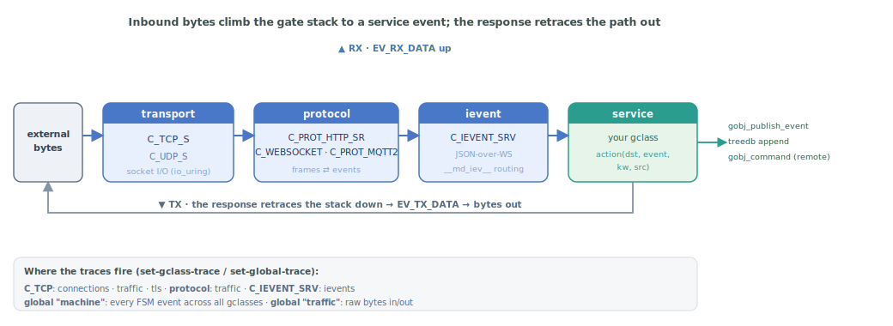

# Inter-process communication in Yuneta

This document covers how things talk to each other in Yuneta: events flowing
between gobjs in the same yuno, events crossing yuno boundaries over the
network, the gates that turn external traffic (TCP/HTTP/WebSocket/MQTT) into
events, and how a browser SPA fits in.

Sibling to [`YUNO_LIFECYCLE.md`](YUNO_LIFECYCLE.md) and [`DEBUGGING.md`](DEBUGGING.md).
Same conventions: every claim cites `file:line`, ASCII diagrams are inline,
sharp edges and recipes at the end.

---

## 1. Mental model

The unit of communication in Yuneta is the **event**:

```
                          ┌────────────────┐
                          │   event name   │   e.g. EV_RX_DATA
                          ├────────────────┤
                          │   kw (json_t)  │   payload
                          ├────────────────┤
                          │   src gobj     │   who sent it
                          ├────────────────┤
                          │   dst gobj     │   who receives it
                          └────────────────┘
```

Three scopes you need to keep separate in your head:

| Scope                      | API                       | Where it lives                        |
|----------------------------|---------------------------|---------------------------------------|
| **Direct intra-yuno**      | `gobj_send_event`         | One process, one event, one receiver  |
| **Broadcast intra-yuno**   | `gobj_publish_event`      | One process, fanout to subscribers    |
| **Inter-yuno (over wire)** | `gobj_command` / ievents  | Two processes, JSON-over-WebSocket    |

External traffic (a TCP client, an HTTP request, an MQTT publish, a browser
WebSocket frame) enters through a **gate** — a tree of protocol/transport
gclasses — and becomes an event for the service to handle. Outgoing traffic
takes the reverse path.



The same path in text:

```
   external bytes  ──► transport gclass ──► protocol gclass ──► service gclass
                       (C_TCP_S, C_UDP_S)   (C_PROT_HTTP_SR,    (your gclass)
                                             C_WEBSOCKET,
                                             C_PROT_MQTT2, …)
                                                    │
                                                    ▼
                                              your_action(dst, event, kw, src)
                                              │
                                              └─► may call gobj_publish_event,
                                                  gobj_command (remote), append
                                                  to a treedb topic, etc.
```

---

## 2. The event model

### 2.1 Events are declared with `event_type_t`

A gclass lists every event it can produce or receive in an `event_type_t`
array. Declared at [`kernel/c/gobj-c/src/gobj.h`](https://github.com/artgins/yunetas/blob/7.7.1/kernel/c/gobj-c/src/gobj.h):

```c
typedef struct event_type_s {
    gobj_event_t event_name;
    event_flag_t event_flag;
} event_type_t;
```

Flags at [`gobj.h`](https://github.com/artgins/yunetas/blob/7.7.1/kernel/c/gobj-c/src/gobj.h):

| Flag                    | Meaning                                                            |
|-------------------------|--------------------------------------------------------------------|
| `EVF_OUTPUT_EVENT`      | The gclass *publishes* this event. Required for `gobj_publish_event`. |
| `EVF_PUBLIC_EVENT`      | Part of the gclass's public API (subscribers from other gclasses can subscribe to it). |
| `EVF_SYSTEM_EVENT`      | Yuneta-internal event. Used by the framework, not user code.       |
| `EVF_NO_WARN_SUBS`      | Silence the *"Publish event WITHOUT subscribers"* warning for optional subscribers. |
| `EVF_AUTHZ_INJECT`      | Requires `__inject_event__` authorisation to send to this gobj.    |
| `EVF_AUTHZ_SUBSCRIBE`   | Requires `__subscribe_event__` authorisation to subscribe.         |
| `EVF_KW_WRITING`        | The action is allowed to modify `kw` in place (not just consume).  |

Example, the minimal gclass [`c_timer.c`](https://github.com/artgins/yunetas/blob/7.7.1/kernel/c/root-linux/src/c_timer.c) declaration (paraphrased):

```c
event_type_t event_types[] = {
    {EV_TIMEOUT,            EVF_OUTPUT_EVENT},
    {EV_TIMEOUT_PERIODIC,   EVF_OUTPUT_EVENT|EVF_NO_WARN_SUBS},
    {NULL, 0}
};
```

The `EVF_NO_WARN_SUBS` on `EV_TIMEOUT_PERIODIC` matches CLAUDE.md's rule:
"missing subscriber is not a bug" annotation, never a generic noise
suppressor.

### 2.2 States and the event→action table

Per-state transitions are declared with `ev_action_t` ([`gobj.h`](https://github.com/artgins/yunetas/blob/7.7.1/kernel/c/gobj-c/src/gobj.h)):

```c
typedef struct {
    gobj_event_t  event;       // event that triggers this row
    gobj_action_fn action;     // function to call; may be NULL (no-op)
    gobj_state_t  next_state;  // target state; NULL means "stay (or transition manually)"
} ev_action_t;
```

A state is a named array of these rows, terminated by `{0,0,0}`. A gclass
is a named array of states (`states_t`, [`gobj.h`](https://github.com/artgins/yunetas/blob/7.7.1/kernel/c/gobj-c/src/gobj.h)), terminated by
`{0,0}`.

Minimal example from [`c_timer.c`](https://github.com/artgins/yunetas/blob/7.7.1/kernel/c/root-linux/src/c_timer.c):

```c
ev_action_t st_idle[] = {
    {EV_TIMEOUT_PERIODIC, ac_timeout, 0},   // fire ac_timeout, stay in ST_IDLE
    {0, 0, 0}
};
states_t states[] = {
    {ST_IDLE, st_idle},
    {0, 0}
};
```

### 2.3 The `kw` ownership rule

Every event-carrying API in Yuneta follows the same rule: **the callee
consumes one reference to `kw`**. If the caller still needs `kw`, it must
[`json_incref()`](https://jansson.readthedocs.io/en/latest/apiref.html#c.json_incref) first.

Macros at [`kwid.h`](https://github.com/artgins/yunetas/blob/7.7.1/kernel/c/gobj-c/src/kwid.h):

```c
#define KW_DECREF(ptr) if(ptr) { kw_decref(ptr); (ptr) = 0; }
#define KW_INCREF(ptr) if(ptr) { kw_incref(ptr); }
```

Action functions always receive ownership; they either `KW_DECREF(kw)` at
the end, or hand `kw` to another consuming API (e.g. `gobj_publish_event`,
`gobj_send_event`, [`msg_iev_build_response`](#msg_iev_build_response)). Failure to consume = leak.
Double consumption = use-after-free.

The framework itself calls `KW_DECREF(kw)` at [`gobj.c`](https://github.com/artgins/yunetas/blob/7.7.1/kernel/c/gobj-c/src/gobj.c) when there's no
action declared, so a missing action does not leak.

---

## 3. Intra-yuno event dispatch

### 3.1 `gobj_send_event(dst, event, kw, src)` — direct dispatch

The workhorse. Entry at [`kernel/c/gobj-c/src/gobj.c`](https://github.com/artgins/yunetas/blob/7.7.1/kernel/c/gobj-c/src/gobj.c). Path:

1. Find `dst->current_state`.
2. Look up `event` in the state's `ev_action_list`
   ([`_find_event_action`](https://github.com/artgins/yunetas/blob/7.7.1/kernel/c/gobj-c/src/gobj.c#L883)).
3. If not found:
   - If the gclass has `mt_inject_event`, delegate to it.
   - Else log `"Event NOT DEFINED in state"` and return -1.
4. If found: change state, then exec the action (next section).

### 3.2 The "IMPORTANT HACK": state changes *before* the action

Quoting verbatim from [`kernel/c/gobj-c/src/gobj.c`](https://github.com/artgins/yunetas/blob/7.7.1/kernel/c/gobj-c/src/gobj.c):

```c
/*
 *  IMPORTANT HACK
 *  Set new state BEFORE run 'action'
 *
 *  The next state is changed before executing the action.
 *  If you don’t like this behavior, set the next-state to NULL
 *  and use change_state() to change the state inside the actions.
 */
if(event_action->next_state) {
    gobj_change_state(dst, event_action->next_state);
}

int ret = -1;
if(event_action->action) {
    ret = (*event_action->action)(dst, event, kw, src);
} else {
    KW_DECREF(kw)
}
```

Practical consequence: inside an action, `gobj_current_state(dst)` returns
the **new** state, not the one that received the event. If you need the
previous state, capture it before the dispatcher gets there (or use
`gobj_last_state()` which is set by `gobj_change_state` itself).

If your action needs to decide the transition based on `kw` content, set
`next_state = NULL` in the table and call `gobj_change_state()` from inside
the action.

### 3.3 `gobj_publish_event(publisher, event, kw)` — broadcast

Entry at [`gobj.c`](https://github.com/artgins/yunetas/blob/7.7.1/kernel/c/gobj-c/src/gobj.c). Loops over `publisher->dl_subscriptions` and calls
`gobj_send_event(subscriber, event, kw2publish, publisher)` for each, after
applying per-subscription filters (`__filter__`, `__local__`, `__global__`,
see §3.5).

If there are no subscribers, [`gobj.c`](https://github.com/artgins/yunetas/blob/7.7.1/kernel/c/gobj-c/src/gobj.c) logs
*"Publish event WITHOUT subscribers"* at `LOG_WARNING` — unless the
`event_type_t` declared `EVF_NO_WARN_SUBS`. This is the canonical "I tried
to publish to nobody" warning; if you're seeing it spuriously, the fix is
**not** to silence with `EVF_NO_WARN_SUBS` indiscriminately (see CLAUDE.md
"Optional-subscriber events"), but to confirm the gclass is the right
flavour (SERVICE vs CHILD) and that its subscriber chain is correct.

### 3.4 `gobj_subscribe_event` / `gobj_unsubscribe_event`

Signatures at [`gobj.h`](https://github.com/artgins/yunetas/blob/7.7.1/kernel/c/gobj-c/src/gobj.h):

```c
json_t *gobj_subscribe_event(publisher, event, kw, subscriber);
int     gobj_unsubscribe_event(publisher, event, kw, subscriber);
```

Storage at [`gobj.c`](https://github.com/artgins/yunetas/blob/7.7.1/kernel/c/gobj-c/src/gobj.c):

- In the **publisher**: `dl_subscriptions` — list of who subscribes to me.
- In the **subscriber**: `dl_subscribings` — list of whom I subscribe to.

Both lists are kept in sync. Destroying a gobj unsubscribes it from
everyone automatically (subscriptions are not gobj-life-extending — the
framework cleans up).

`event = NULL` means "any event". `kw` is not a payload — it's a
configuration dict accepting these keys:

| Key                       | Effect                                                            |
|---------------------------|-------------------------------------------------------------------|
| `__config__`              | Sub-keys: `__hard_subscription__`, `__own_event__`, `__rename_event_name__`, `__first_shot__` |
| `__global__`              | Base kw merged into every published kw before delivery            |
| `__local__`               | Keys to delete from the published kw before delivery              |
| `__filter__`              | Publish only if the published kw matches this selector            |

Unknown keys at the top level produce a warning ([`gobj.c`](https://github.com/artgins/yunetas/blob/7.7.1/kernel/c/gobj-c/src/gobj.c)).

### 3.5 CHILD vs SERVICE patterns

The two `mt_create` blocks from CLAUDE.md, restated here because they are
the most common source of *"Event NOT DEFINED in state"* errors:

**CHILD** — the gobj was born with a parent (typical for protocol
children, per-connection objects, transient helpers). The parent is the
implicit audience:

```c
hgobj subscriber = gobj_read_pointer_attr(gobj, "subscriber");
if(!subscriber) {
    subscriber = gobj_parent(gobj);
}
gobj_subscribe_event(gobj, NULL, NULL, subscriber);
```

The **parent's FSM** must declare every event the child can publish — that
is what trips people up. If you see *"Event NOT DEFINED in state"*, look at
the **parent**, not at the child.

**SERVICE** — the gobj is registered as a service (`gobj_create_default_service`,
`gobj_create_service`). Subscribers opt in explicitly via the `subscriber`
attr:

```c
const hgobj subscriber = gobj_read_pointer_attr(gobj, "subscriber");
if(subscriber) {
    gobj_subscribe_event(gobj, NULL, NULL, subscriber);
}
```

A SERVICE with no `subscriber` and no parent subscription will fire
*"Publish event WITHOUT subscribers"* warnings. The right fix is to mark
truly optional events with `EVF_NO_WARN_SUBS`, **not** to silence them
generally.

### 3.6 `mt_inject_event`: the escape hatch

A gclass can set `gmt->mt_inject_event` to bypass the static FSM table.
When `gobj_send_event` can't find the event in the current state, it
delegates to this method. Used for wildcard routing, dynamic
dispatch, gateways that don't know events ahead of time. The method must
consume `kw` like a normal action.

Don't use it as a band-aid for missing event declarations — that hides
real bugs.

---

## 4. Inter-yuno: the ievent layer

### 4.1 The two ends

| End                | File                                              | Role                                                     |
|--------------------|---------------------------------------------------|----------------------------------------------------------|
| [`C_IEVENT_SRV`](#gclass-c-ievent-srv)     | [`kernel/c/root-linux/src/c_ievent_srv.c`](https://github.com/artgins/yunetas/blob/7.7.1/kernel/c/root-linux/src/c_ievent_srv.c)          | Listens; receives connections from clients.              |
| [`C_IEVENT_CLI`](#gclass-c-ievent-cli)     | [`kernel/c/root-linux/src/c_ievent_cli.c`](https://github.com/artgins/yunetas/blob/7.7.1/kernel/c/root-linux/src/c_ievent_cli.c)          | Initiates; connects to a remote `C_IEVENT_SRV`.          |

Both sit on top of a WebSocket gclass ([`C_WEBSOCKET`](#gclass-c-websocket)), which sits on top
of TCP ([`C_TCP`](#gclass-c-tcp) or [`C_TCP_S`](#gclass-c-tcp-s)):


The same stack in text:

```
    yuno A                                       yuno B
   ┌────────────────┐                       ┌────────────────┐
   │  C_IEVENT_CLI  │ ─── JSON over WS ───► │  C_IEVENT_SRV  │
   ├────────────────┤                       ├────────────────┤
   │  C_WEBSOCKET   │                       │  C_WEBSOCKET   │
   ├────────────────┤                       ├────────────────┤
   │  C_TCP (cli)   │ ────── TCP/TLS ─────► │  C_TCP (clisrv)│
   └────────────────┘                       └────────────────┘
                                                     ▲
                                                     │ (C_TCP_S accepted
                                                     │  the connection)
                                                     ▼
                                              ┌──────────────┐
                                              │   C_TCP_S    │
                                              └──────────────┘
```

The protocol is **JSON-over-WebSocket frames**. There is no separate "Yuneta
wire format" header in the WS payload — each frame is a JSON object with
`event` and `kw` fields (see §4.2).

### 4.2 The wire frame

Serialised in [`kernel/c/root-linux/src/msg_ievent.c`](https://github.com/artgins/yunetas/blob/7.7.1/kernel/c/root-linux/src/msg_ievent.c):

```c
json_pack("{s:s, s:o}",
    "event", event,
    "kw",    kw
)
```

Result is dumped with `JSON_COMPACT` and placed in a WS frame. The receiver
does [`gbuf2json`](#gbuf2json) + [`kw_deserialize`](#kw_deserialize) ([`msg_ievent.c`](https://github.com/artgins/yunetas/blob/7.7.1/kernel/c/root-linux/src/msg_ievent.c)).

Concretely, a command call on the wire looks roughly like:

```json
{
  "event": "EV_MT_COMMAND",
  "kw": {
    "__md_iev__": { ... routing & user metadata ... },
    "__command__": "list-yunos",
    "kw": { "filter": ... }
  }
}
```

### 4.3 The `__md_iev__` metadata block

Documented in [`kernel/c/root-linux/src/msg_ievent.h`](https://github.com/artgins/yunetas/blob/7.7.1/kernel/c/root-linux/src/msg_ievent.h). Top-level
shape:

```
__md_iev__
├── __msg_type__         "__command__" | "__stats__" | "__message__" |
│                        "__identity__" | "__subscribing__" | "__unsubscribing__"
└── ievent_gate_stack    [ { stack entry }, … ]   ← LIFO of hops
    │
    └── one entry per hop, fields:
        ├── src_yuno, src_role, src_service
        ├── dst_yuno, dst_role, dst_service
        ├── user, host             ← who initiated
        ├── __username__           ← from auth layer
        └── input_service, input_channel   ← stamped by SRV on receive
```

Other top-level keys in `kw` outside `__md_iev__`:

- `__md_yuno__` — set by the responder via [`msg_iev_set_back_metadata()`](#msg_iev_set_back_metadata)
  ([`msg_ievent.c`](https://github.com/artgins/yunetas/blob/7.7.1/kernel/c/root-linux/src/msg_ievent.c)). Survives the round-trip.
- `__temp__` — **stripped at the yuno boundary** ([`msg_ievent.c`](https://github.com/artgins/yunetas/blob/7.7.1/kernel/c/root-linux/src/msg_ievent.c)).
  Use it freely for transport-local bookkeeping.
- `__top_side__`, `__bottom_side__` — see §6.5.

The stack is pushed on outbound, popped+reversed on the response, so the
client gets back the same structure it sent (with response data added).
Push/pop helpers: `msg_iev_push_stack` ([`msg_ievent.c:327`](https://github.com/artgins/yunetas/blob/7.7.1/kernel/c/root-linux/src/msg_ievent.c#L327)),
`msg_iev_get_stack`, [`msg_iev_pop_stack`](#msg_iev_pop_stack) ([`msg_ievent.c:419`](https://github.com/artgins/yunetas/blob/7.7.1/kernel/c/root-linux/src/msg_ievent.c#L419)).

`IEVENT_STACK_ID = "ievent_gate_stack"` constant at [`msg_ievent.h`](https://github.com/artgins/yunetas/blob/7.7.1/kernel/c/root-linux/src/msg_ievent.h).

### 4.4 Identity card handshake

When `C_IEVENT_CLI` opens its WS connection, it sends `EV_IDENTITY_CARD`
(declared at [`msg_ievent.h`](https://github.com/artgins/yunetas/blob/7.7.1/kernel/c/root-linux/src/msg_ievent.h), defined at [`msg_ievent.c`](https://github.com/artgins/yunetas/blob/7.7.1/kernel/c/root-linux/src/msg_ievent.c)) carrying:

- `src_yuno`, `src_role`, `src_service` — who I am
- `dst_yuno`, `dst_role`, `dst_service` — who I want to talk to
- `jwt` — optional bearer for auth (also accepted from Cookie if empty,
  [`c_ievent_srv.c`](https://github.com/artgins/yunetas/blob/7.7.1/kernel/c/root-linux/src/c_ievent_srv.c))
- `user`, `host`, `pid`, `watcher_pid` — caller metadata

The server validates ([`c_ievent_srv.c`](https://github.com/artgins/yunetas/blob/7.7.1/kernel/c/root-linux/src/c_ievent_srv.c)):

1. Role match.
2. Optional yuno-name match.
3. Destination service exists (`gobj_find_service(iev_dst_service)`).
4. Auth (`jwt` or cookie).

On success: stores `client_yuno_role`, `client_yuno_name`,
`client_yuno_service`, `authenticated` in its own attrs
([`c_ievent_srv.c`](https://github.com/artgins/yunetas/blob/7.7.1/kernel/c/root-linux/src/c_ievent_srv.c)) and replies with `EV_IDENTITY_CARD_ACK`. The
client unblocks from `ST_WAIT_IDENTITY_CARD_ACK` ([`c_ievent_cli.h`](https://github.com/artgins/yunetas/blob/7.7.1/kernel/c/root-linux/src/c_ievent_cli.h)).

Authentication also returns a `services_roles` dict — one entry per service
the user holds a role in (the primary `dst_service` plus any `required_services`
the user is authorized for, computed from real treedb roles, not from the
client-supplied list). Since 7.6.0 the server captures its **keys** into the
channel's `authorized_services` attr: the set of services this channel may
reach. The no-treedb path yields just `{dst_service:[]}`, so the set degrades to
the single primary service. This realizes the long-standing `available_services`
design — one authentication can legitimately grant several services (the GUI
frontends authenticate against `db_history_wz` and reach `treedb_wattyzer`,
`treedb_authzs`, … over the same channel).

Since 7.6.1 the authenticate response also carries a `superuser` flag, captured
into the channel's `is_superuser` attr. It is TRUE when the user holds an
effective wildcard role (`service="*"`, i.e. `root`), computed from the wildcard
itself, not from a literal role name. The local trusted `yuneta` user (admitted
only over localhost) now goes through the **same** `get_user_roles()` filter as
any user instead of a hardcoded empty role set, so it picks up its real `root`
role and becomes a superuser.

After the handshake the channel is fully bidirectional — events flow
either way.

### 4.5 Routing inside the receiver

`ac_on_message` in [`c_ievent_srv.c:933`](https://github.com/artgins/yunetas/blob/7.7.1/kernel/c/root-linux/src/c_ievent_srv.c#L933):

1. [`iev_create_from_gbuffer`](#iev_create_from_gbuffer) ([`msg_ievent.c:152`](https://github.com/artgins/yunetas/blob/7.7.1/kernel/c/root-linux/src/msg_ievent.c#L152)) deserialises the WS
   frame.
2. Inspect the latest `ievent_gate_stack` entry — `dst_yuno`,
   `dst_role`, `dst_service` ([`c_ievent_srv.c`](https://github.com/artgins/yunetas/blob/7.7.1/kernel/c/root-linux/src/c_ievent_srv.c)).
3. Validate the role/name.
4. [`gobj_find_service(iev_dst_service)`](https://github.com/artgins/yunetas/blob/7.7.1/kernel/c/gobj-c/src/gobj.c#L5076)
   — case-insensitive lookup. Special names:
   - `__default_service__` → the yuno's `gobj_default_service()`.
   - `__yuno__` and `__root__` → both resolve to the top-level yuno gobj
     (treated as aliases by `gobj_find_service`).
5. **Authorize the per-message service** (since 7.6.0). The
   `is_service_authorized()` check runs in the common path of `ac_on_message`
   (so it covers `command` / `stats` / `subscribe` / `unsubscribe` / `inject`)
   and `ac_mt_stats`, comparing the resolved service against the channel's
   `authorized_services` set (captured at identity-card time, §4.4). A peer
   authenticated for service A cannot reach a service B it holds no role in, even
   by naming B in its own routing stack. **Since 7.6.1 a superuser channel
   (`is_superuser`, §4.4) bypasses this gate** — `root` means any
   realm/service/permission, so it reaches `__yuno__` and any sibling service;
   that is not a cross-service escalation. What a command may actually DO is
   still governed by the additional default-off per-command authz gate, see
   [`YUNO_AUTH.md`](https://github.com/artgins/yunetas/blob/7.7.1/yunos/c/yuno_agent/YUNO_AUTH.md) §4.5.

   A refused message never strands the channel: `reject_unrouted_iev()` answers
   `command` / `stats` with a negative `EV_MT_*_ANSWER` (re-arming the read) and
   `drop()`s the channel for the no-answer types — never a silent `return -1`
   that would leave the socket connected but deaf (a zombie).
6. Dispatch by `__msg_type__` (all gated by `authorized_services`, superuser
   bypassing as in step 5):

| `__msg_type__`        | Action on the receiver                                       |
|-----------------------|--------------------------------------------------------------|
| `__command__`         | `gobj_command(service, cmd, kw, src)`  |
| `__stats__`           | `gobj_stats(service, stats, kw, src)`  |
| `__subscribing__`     | `gobj_subscribe_event(service, event, kw, remote_proxy)`  |
| `__unsubscribing__`   | symmetric  |
| `__message__`         | `gobj_send_event(service, event, kw, src)` raw event delivery  |

**Answers travel back the way they came — mind where the serializer sits.**
A `__command__` / `__stats__` reply is sent to the requester recorded in the
ievent stack (`dst_service` of the top frame). But the ievent *serializer* for a
link is not always in the same place. On a **server-accepted** link the
serializer is the `C_IEVENT_SRV` *below* the `C_CHANNEL`, so
`C_CHANNEL.ac_send_iev` just pushes the inner event down to it. On a
**client-initiated** link — a `C_IEVENT_CLI` that connects *out* (e.g. an
agent's `controlcenter` link) — the serializer is the `C_IEVENT_CLI` at the
*top* of the stack; below the channel is a raw `C_PROT_TCP4H`. So an answer
going back **up a client link** must be handed to the `C_IEVENT_CLI` itself
(its `EV_SEND_IEV` action unwraps and serialises the inner event), not to the
channel/iogate — routing it as if the serializer were below the channel puts a
bare `EV_SEND_IEV` / `EV_MT_*_ANSWER` on the wire and the peer rejects it. This
is how a command cascaded controlcenter → agent → managed-yuno gets its answer
back to the SPA (since 7.6.8).

### 4.6 Subscribing across yunos

A remote subscription is just a `__subscribing__` ievent. The receiver
calls `gobj_subscribe_event` *locally*, with the `C_IEVENT_SRV` (or a
proxy gobj on its side) standing in as `subscriber`. When the local
service publishes the event later, the framework calls `gobj_send_event`
on that proxy, which marshals the event back over the WS frame to the
remote subscriber.

The remote side does **not** need to keep the connection idle while
waiting — events can fire whenever the publisher decides. From the
subscriber's point of view, remote events look just like local ones.

---

## 5. Commands and stats

Higher-level API on top of the event machinery.

### 5.0 Addressing a command: every command goes to a *service*

A yuno is a **hierarchical tree of gobjs**; some of them are **services**
(named, externally addressable — registered via `gobj_create_service` /
`gobj_create_default_service`). **Every command is directed to a service.**
If you don't name one, it goes to the default. This is the single rule that
trips up newcomers, so state it explicitly:

[`gobj_find_service()`](https://github.com/artgins/yunetas/blob/7.7.1/kernel/c/gobj-c/src/gobj.c#L5076)
resolves the destination service name (case-insensitive). Two names are
special:

- **`__default_service__`** — the application's own default service (the one
  created with `gobj_create_default_service`). **This is the target when no
  service is specified.**
- **`__yuno__`** (alias **`__root__`**) — the top-level `C_YUNO` root gobj,
  common to every yuno. Use it to reach the yuno itself (e.g. `services`,
  `view-config`, trace commands).
- any other string → looked up among the yuno's registered services.

**From `ycommand`** (the destination service is a connection key, not a
command argument — a frequent mistake is writing `service=` inside `-c`):

```bash
ycommand -c 'roles'                 # → __default_service__ (here C_AGENT) → "command not available"
ycommand -S authz -c 'roles'        # → the `authz` service  (-S/--yuno_service)
```

**Through the agent** — two C_AGENT dispatch commands
([`c_agent.c`](https://github.com/artgins/yunetas/blob/7.7.1/yunos/c/yuno_agent/src/c_agent.c)
`command-agent` / `command-yuno`):

```bash
# a service of the AGENT itself:
ycommand -c 'command-agent service=authz command=roles'
ycommand -c 'command-agent service=__yuno__ command=services'   # list the agent's services

# a service of a MANAGED yuno (no id= ⇒ fan-out to ALL managed yunos):
ycommand -c 'command-yuno id=<yuno> service=__yuno__ command=services'
ycommand -c 'command-yuno id=<yuno> service=<service> command=<cmd> kw="{...}"'
```

So: pick the service first (`services` lists them, with their gclass), then
`command-agent` for the agent, `command-yuno` for a managed yuno, plain `-S`
for a direct connection. Default everywhere is `__default_service__`.

### 5.1 The command table (`SDATACM`)

A gclass exposes commands by declaring them in a `command_table` of
`SDATACM` / `SDATACM2` rows. Each row: name, parameter schema, permission
schema, handler function, description. See [`c_agent.c`](https://github.com/artgins/yunetas/blob/7.7.1/yunos/c/yuno_agent/src/c_agent.c) for a real
example, and the agent's own `YUNO_LIFECYCLE.md` for the table semantics.

### 5.2 `gobj_command` — the public entry point

Signature at [`gobj.h`](https://github.com/artgins/yunetas/blob/7.7.1/kernel/c/gobj-c/src/gobj.h):

```c
PUBLIC json_t *gobj_command(hgobj gobj, const char *command, json_t *kw, hgobj src);
```

When `gobj` is local: looks up the command in the gclass's `command_table`,
checks permissions, calls the handler synchronously, returns a `json_t *`
response (typically built with `msg_iev_build_response`, see §5.4).

When `gobj` is a `C_IEVENT_CLI`: builds an `EV_MT_COMMAND` ievent, sends
it over the WS, blocks on the answer event `EV_MT_COMMAND_ANSWER`. (Or, if
the caller passed an async pattern, the response arrives as a callback.)

### 5.3 The three command events

| Symbol               | Where used                                            |
|----------------------|-------------------------------------------------------|
| `SDATACM`            | Declared once per command in the gclass command table |
| `EV_MT_COMMAND`      | Wire event for invoking a command remotely            |
| `EV_MT_COMMAND_ANSWER` | Wire event for the response                         |
| `EV_ON_COMMAND`      | Local event a service publishes when its command result is ready (mostly for async commands) |

Constants in [`msg_ievent.h`](https://github.com/artgins/yunetas/blob/7.7.1/kernel/c/root-linux/src/msg_ievent.h) / [`msg_ievent.c`](https://github.com/artgins/yunetas/blob/7.7.1/kernel/c/root-linux/src/msg_ievent.c). Don't conflate them:
`SDATACM` is a static declaration, `EV_MT_*` are runtime events that ride
the wire.

### 5.4 `msg_iev_build_response`

Defined at [`msg_ievent.c`](https://github.com/artgins/yunetas/blob/7.7.1/kernel/c/root-linux/src/msg_ievent.c). Every command handler returns one of these
to keep the response shape uniform:

```c
json_t *msg_iev_build_response(
    hgobj gobj,
    int result,           // 0 = ok; negative = error
    json_t *jn_comment,   // human-readable message (may be NULL)
    json_t *jn_schema,    // optional schema of returned data
    json_t *jn_data,      // the data itself (may be NULL)
    json_t *kw            // owned — original request kw, for context
);
```

Note the comment in the source: `// OLD msg_iev_build_webix()`. Legacy
codebases still mention the old name; treat both as the same thing.

The agent's `YUNO_LIFECYCLE.md` shows the [`gobj_yuno_role_plus_name()`](#gobj_yuno_role_plus_name) prefix
convention for `jn_comment`; see `feedback_build_command_response_yuno_prefix`.

### 5.5 `gobj_stats` and `EV_MT_STATS`

Same shape as commands but for "give me a stats dict" calls. Wire events
are `EV_MT_STATS` / `EV_MT_STATS_ANSWER` ([`msg_ievent.c`](https://github.com/artgins/yunetas/blob/7.7.1/kernel/c/root-linux/src/msg_ievent.c)). Use
commands for actions, stats for observation.

---

## 6. Gates: how external traffic becomes events

### 6.1 The protocol/transport tree

A gate is a stack of gclasses, each handling a layer of the protocol:

```
   service gclass             ← your business logic, registered service
        ▲
        │   EV_ON_MESSAGE (HTTP request / WS message / etc.)
        │
   protocol gclass            ← C_PROT_HTTP_SR, C_WEBSOCKET, C_PROT_MQTT2, …
        ▲
        │   EV_RX_DATA (raw bytes)
        │
   transport gclass           ← C_TCP, C_TCP_S, C_UDP_S
        ▲
        │   bytes on socket
        │
     external client
```

Each layer is a separate gobj, chained with `gobj_set_bottom_gobj()` /
`gobj_bottom_gobj()`. The transport publishes `EV_RX_DATA` upward; the
protocol parses it and publishes its own event (`EV_ON_MESSAGE`, etc.)
upward; the service handles it.

### 6.2 Transport layer essentials

`C_TCP` and `C_TCP_S` in [`kernel/c/root-linux/src/c_tcp.c`](https://github.com/artgins/yunetas/blob/7.7.1/kernel/c/root-linux/src/c_tcp.c), [`c_tcp_s.c`](https://github.com/artgins/yunetas/blob/7.7.1/kernel/c/root-linux/src/c_tcp_s.c).
Headline events:

| Event                  | Direction | Meaning                                                |
|------------------------|-----------|--------------------------------------------------------|
| `EV_CONNECTED`         | out (up)  | TLS handshake done (or plain TCP open if not TLS)      |
| `EV_DISCONNECTED`      | out       | Connection closed                                      |
| `EV_RX_DATA`           | out       | Bytes arrived; payload in `kw["data"]`                 |
| `EV_TX_READY`          | out       | OK to send more (flow control)                         |
| `EV_TX_DATA`           | in (down) | Send these bytes                                       |
| `EV_DROP`              | in        | Close the connection                                   |

States typical of `C_TCP`: `STOPPED`, `DISCONNECTED`, `WAIT_CONNECTED`,
`CONNECTED`, `WAIT_HANDSHAKE` (if TLS), `IDLE`. See [`c_tcp.c`](https://github.com/artgins/yunetas/blob/7.7.1/kernel/c/root-linux/src/c_tcp.c).

`C_TCP_S` accepts and spawns a clisrv-mode `C_TCP` per connection. The
filter for what gclass tree to instantiate above each clisrv is held in
the `child_tree_filter` attribute ([`c_tcp_s.c`](https://github.com/artgins/yunetas/blob/7.7.1/kernel/c/root-linux/src/c_tcp_s.c)).

### 6.3 HTTP server example: [`C_PROT_HTTP_SR`](#gclass-c-prot-http-sr) → `C_TCP_S`

[`c_prot_http_sr.c`](https://github.com/artgins/yunetas/blob/7.7.1/kernel/c/root-linux/src/c_prot_http_sr.c): builds a `ghttp_parser` (a wrapper around
**llhttp** — note that yuneta swapped out the older `http_parser` library;
see memory note `project_llhttp_integration`). Output event:
`EV_ON_MESSAGE` with parsed headers, method, URL, body in `kw`.

Service gclass subscribes to that and dispatches by URL or method.

### 6.4 WebSocket: `C_WEBSOCKET` → `C_PROT_HTTP_SR` → `C_TCP_S`

`C_WEBSOCKET` ([`c_websocket.c`](https://github.com/artgins/yunetas/blob/7.7.1/kernel/c/root-linux/src/c_websocket.c)) handles the HTTP Upgrade handshake then
parses [RFC 6455](https://datatracker.ietf.org/doc/html/rfc6455) frames. Output `EV_ON_MESSAGE` carries either the text or
binary payload. The `iamServer` attribute ([`c_websocket.c`](https://github.com/artgins/yunetas/blob/7.7.1/kernel/c/root-linux/src/c_websocket.c))
distinguishes server-mode from client-mode parsing of masked vs unmasked
frames.

### 6.5 `top_side` and `bottom_side` convention

The protocol/transport chain is held together by gclass-level pointer
attributes named conventionally `bottom_side` (downward) — set via
`gobj_set_bottom_gobj()` (and read with `gobj_bottom_gobj()`). The
upward direction is not pointered explicitly — events publish to
subscribers, and the parent is the natural subscriber for CHILD-pattern
gclasses.

You'll also see `__top_side__` / `__bottom_side__` as keys inside `kw`
for some cross-yuno scenarios (e.g. master/non-master treedb access — see
memory `feedback_cross_yuno_via_store_not_command`). Those are routing
markers in the `kw`, not the same as the gobj-tree convention.

### 6.6 TLS

`kernel/c/ytls/` is a runtime-selectable abstraction over OpenSSL and
mbedTLS. `C_TCP_S` passes its `ytls` pointer down to each accepted clisrv
([`c_tcp_s.c`](https://github.com/artgins/yunetas/blob/7.7.1/kernel/c/root-linux/src/c_tcp_s.c)):

```c
gobj_write_pointer_attr(clisrv, "ytls",    priv->ytls);
gobj_write_bool_attr   (clisrv, "use_ssl", priv->use_ssl);
```

In `C_TCP` itself, if `use_ssl=TRUE`, on `EV_CONNECTED` the gobj wraps the
socket via [`ytls_new_secure_filter()`](#ytls_new_secure_filter) ([`c_tcp.c`](https://github.com/artgins/yunetas/blob/7.7.1/kernel/c/root-linux/src/c_tcp.c)), and from then
on `EV_RX_DATA` carries decrypted plaintext while outbound bytes are
encrypted before hitting the wire. The protocol gclass above is unaware
TLS exists.

### 6.7 `public_services` vs `required_services`

In each yuno's config ([`c_yuno.c`](https://github.com/artgins/yunetas/blob/7.7.1/kernel/c/root-linux/src/c_yuno.c)):

- **`public_services`**: array of service names this yuno exposes to
  outside clients. Anything listed here is reachable via `gobj_find_service`
  on incoming ievents and is what `C_IEVENT_SRV`'s identity-card
  validation accepts as a `dst_service`.
- **`required_services`**: array of service names this yuno **depends on**.
  Used by the agent during startup ordering — yunos with unmet
  requirements wait.

A service not in `public_services` is invisible to remote callers, even
if it exists locally. This is the simplest enforcement against accidental
exposure.

---

## 7. The SPA case

A browser SPA is just another `C_IEVENT_CLI` — only that the runtime is
JavaScript ([`kernel/js/gobj-js/src/c_ievent_cli.js`](https://github.com/artgins/yunetas/blob/7.7.1/kernel/js/gobj-js/src/c_ievent_cli.js)) instead of C, and the
transport is the browser's native WebSocket. From the yuno's point of
view it's indistinguishable from another yuno.

### 7.1 Handshake

The SPA sends `EV_IDENTITY_CARD` over the WS just like a C client. The
`jwt` field is typically read from the browser session ([Keycloak](https://www.keycloak.org/) token,
see auth memory notes). The server's identity card validation is the
same code path as for C clients ([`c_ievent_srv.c`](https://github.com/artgins/yunetas/blob/7.7.1/kernel/c/root-linux/src/c_ievent_srv.c)).

### 7.2 What a SPA can do

Anything a C client can. Concretely:

- **Call a command**: `gobj_command(c_ievent_cli_instance, "list-yunos", kw, src)`
  in JS marshals an `EV_MT_COMMAND` ievent and awaits the answer.
- **Query stats**: same with `gobj_stats`.
- **Subscribe to events**: `gobj_subscribe_event` on the client-side
  `C_IEVENT_CLI` registers a `__subscribing__` ievent; the publisher
  yuno calls back via `EV_ON_*` events delivered over the WS.

### 7.3 Live log + dev panel

See `DEBUGGING.md` §8 — the SPA's developer panel uses exactly this
mechanism to display the wire-level ievent traffic in real time. The
teardown order gotcha (`set_remote_log_functions(null)` BEFORE
[`do_disconnect`](https://github.com/artgins/yunetas/blob/7.7.1/modules/c/mqtt/src/c_prot_mqtt.c#L1580)) is documented there.

---

## 8. Sharp edges

### 8.1 The "IMPORTANT HACK" state-before-action

Already covered in §3.2. The single most common subtle bug for newcomers:
reading `gobj_current_state(dst)` inside an action expecting the
*previous* state. Capture it before the dispatcher gets there, or use
`gobj_last_state()`.

### 8.2 "Event NOT DEFINED in state" almost always means a parent's FSM

When a CHILD-pattern gobj publishes an event, the **parent's FSM** must
declare it. The error originates in `gobj_send_event` on the parent, but
the stack trace mentions the child. Always inspect the parent's
`event_action_list` and `event_types[]`. CLAUDE.md's "GClass
subscription model" section spells out the rule; the diagnostic emoji is
`📛`.

### 8.3 `EVF_NO_WARN_SUBS` is not a noise suppressor

It's the explicit *"missing subscriber is not a bug for this event"*
annotation. Using it to silence a noisy warning often hides a real
SERVICE/CHILD pattern mismatch. CLAUDE.md is unambiguous on this; see
`feedback_gclass_visual_layout`.

### 8.4 Subscription lists are in **both** gobjs

If you write tooling that walks the subscription graph, remember
`dl_subscriptions` (publisher → subscribers) and `dl_subscribings`
(subscriber → publishers) are two directed lists, not one. Destroying a
gobj walks both.

### 8.5 `kw` is owned by the callee

Forgetting this leaks JSON memory (often a slow drip). Double-decref
crashes immediately. The rule:

- Calling `gobj_send_event(dst, ev, kw, src)`: `kw` is consumed.
- Calling `gobj_publish_event(p, ev, kw)`: `kw` is consumed.
- Calling `msg_iev_build_response(g, r, c, s, d, kw)`: the last `kw`
  parameter is consumed.

If you need to keep `kw` around (e.g. publish it then publish a derived
event), use `KW_INCREF` or `json_incref` first.

### 8.6 `__temp__` is stripped at the yuno boundary

Useful for in-process scratch data inside `kw`. Useless for anything you
need on the far side of an ievent — that gets discarded by
[`msg_ievent.c`](https://github.com/artgins/yunetas/blob/7.7.1/kernel/c/root-linux/src/msg_ievent.c). If you need persistent metadata across hops,
put it under `__md_iev__` or use the stack.

### 8.7 `msg_iev_build_webix` is the same as `msg_iev_build_response`

The old name lingers in comments ([`msg_ievent.c`](https://github.com/artgins/yunetas/blob/7.7.1/kernel/c/root-linux/src/msg_ievent.c)) and possibly in
some test fixtures. They are aliases; use the new name in new code.

### 8.8 `__default_service__` resolution is case-insensitive

`gobj_find_service` lowercases ([`gobj.c:5076`](https://github.com/artgins/yunetas/blob/7.7.1/kernel/c/gobj-c/src/gobj.c#L5076)). `"My_Service"` and
`"my_service"` are the same service. Don't rely on case to disambiguate.

### 8.9 SPAs see only `public_services`

A common confusion: "I added the command but the SPA can't call it." Check
the yuno config — the service must be listed in `public_services`
([`c_yuno.c`](https://github.com/artgins/yunetas/blob/7.7.1/kernel/c/root-linux/src/c_yuno.c)).

---

## 9. Recipes

### 9.1 Add a new event to a gclass

1. Declare the symbol once (header):

   ```c
   GOBJ_DECLARE_EVENT(EV_MY_THING);
   ```

   ```c
   GOBJ_DEFINE_EVENT(EV_MY_THING);
   ```

2. Add it to the gclass's `event_types[]` with the right flag
   (`EVF_OUTPUT_EVENT` if you'll publish it; add `EVF_PUBLIC_EVENT` if
   subscribers from other gclasses will subscribe to it).

3. If the gclass *receives* it, add an `ev_action_t` row to the relevant
   states' `ev_action_list`s and write the action function.

4. If the gclass *publishes* and the consumer is a parent (CHILD pattern),
   add `EV_MY_THING` to the parent's `event_types[]` and an action row in
   the parent's relevant states. Otherwise you'll get *"Event NOT DEFINED
   in state"* on first publish.

### 9.2 Subscribe locally to another gobj's events

```c
gobj_subscribe_event(
    other_gobj,        // publisher
    EV_MY_THING,       // or NULL for "any event"
    NULL,              // no subscription config
    gobj               // subscriber (often `gobj` from inside mt_create)
);
```

Don't forget to unsubscribe in `mt_stop` / `mt_destroy` if the publisher
might outlive the subscriber.

### 9.3 Subscribe to events from a remote yuno

In the local yuno, create a `C_IEVENT_CLI` pointing at the remote yuno
(`url`, `wanted_yuno_role`, `wanted_yuno_name`, `wanted_yuno_service`,
`jwt`). After the identity card ACK, call:

```c
gobj_subscribe_event(c_ievent_cli, EV_MY_THING, NULL, my_local_service);
```

The framework will forward the `__subscribing__` ievent and re-deliver
remote publications as local events on `my_local_service`. Identical
syntax to local — only the source gobj differs.

### 9.4 Call a command on a remote yuno

Once the identity card is ACKed:

```c
json_t *resp = gobj_command(
    c_ievent_cli_instance,
    "list-yunos",
    json_pack("{s:s}", "filter", "running"),
    my_local_service
);
```

`resp` is the same shape `msg_iev_build_response` builds locally. If you
need the async pattern (don't block), pass a subscriber-style kw and
listen for `EV_MT_COMMAND_ANSWER`.

### 9.5 Expose a new command to the SPA

1. Add a row to your gclass's `command_table` with `SDATACM2`:

   ```c
   SDATACM2(DTP_SCHEMA, "my-cmd", 0, 0, pm_my_cmd, cmd_my_cmd, "Do my thing"),
   ```

2. Write `cmd_my_cmd()` returning a `msg_iev_build_response`.

3. Register the service publicly: ensure the service name is in the yuno's
   `public_services` array.

4. From the SPA:

   ```js
   gobj_command(c_ievent_cli, "my-cmd", { ... }, this);
   ```

5. Verify with [`ycommand`](#util-ycommand):

   ```bash
   ycommand -c 'command-yuno id=<yuno> service=<service> command=my-cmd kw="{...}"'
   ```

### 9.6 Add a new HTTP gate

1. Pick a port and TLS context.

2. In the service's `mt_create`, build the gobj tree:

   ```c
   hgobj tcp_s = gobj_create_pure_child("my_listener", C_TCP_S, json_pack(
       "{s:s, s:i}", "url", "tcp://0.0.0.0:8080", "use_ssl", 0
   ), gobj);
   ```

3. Set `child_tree_filter` on the `C_TCP_S` so each accepted clisrv gets
   a `C_PROT_HTTP_SR` on top.

4. Subscribe to `EV_ON_MESSAGE` from each child to receive parsed
   requests. Use `gobj_publish_event(child, EV_TX_DATA, …)` to write
   responses.

5. Start with `gobj_start_tree(tcp_s)`.

---

## 10. Code pointers

| What                                          | Where                                                                  |
|-----------------------------------------------|------------------------------------------------------------------------|
| Event type declarations                       | [`kernel/c/gobj-c/src/gobj.h`](https://github.com/artgins/yunetas/blob/7.7.1/kernel/c/gobj-c/src/gobj.h)                                   |
| `EVF_*` event flags                           | [`kernel/c/gobj-c/src/gobj.h`](https://github.com/artgins/yunetas/blob/7.7.1/kernel/c/gobj-c/src/gobj.h)                                   |
| Minimal gclass example                        | [`kernel/c/root-linux/src/c_timer.c`](https://github.com/artgins/yunetas/blob/7.7.1/kernel/c/root-linux/src/c_timer.c)                                    |
| `gobj_send_event` dispatcher                  | [`kernel/c/gobj-c/src/gobj.c:7441`](https://github.com/artgins/yunetas/blob/7.7.1/kernel/c/gobj-c/src/gobj.c#L7441)                                 |
| State-before-action ("IMPORTANT HACK")        | [`kernel/c/gobj-c/src/gobj.c`](https://github.com/artgins/yunetas/blob/7.7.1/kernel/c/gobj-c/src/gobj.c)                                 |
| `gobj_publish_event`                          | [`kernel/c/gobj-c/src/gobj.c:8877`](https://github.com/artgins/yunetas/blob/7.7.1/kernel/c/gobj-c/src/gobj.c#L8877)                                 |
| `gobj_subscribe_event` config keys            | [`kernel/c/gobj-c/src/gobj.h`](https://github.com/artgins/yunetas/blob/7.7.1/kernel/c/gobj-c/src/gobj.h)                                 |
| Subscription storage                          | [`kernel/c/gobj-c/src/gobj.c`](https://github.com/artgins/yunetas/blob/7.7.1/kernel/c/gobj-c/src/gobj.c)                        |
| `mt_inject_event` hook                        | [`kernel/c/gobj-c/src/gobj.h`](https://github.com/artgins/yunetas/blob/7.7.1/kernel/c/gobj-c/src/gobj.h), [`gobj.c`](https://github.com/artgins/yunetas/blob/7.7.1/kernel/c/gobj-c/src/gobj.c)                        |
| `KW_DECREF` / `KW_INCREF`                     | [`kernel/c/gobj-c/src/kwid.h`](https://github.com/artgins/yunetas/blob/7.7.1/kernel/c/gobj-c/src/kwid.h)                                    |
| `C_IEVENT_SRV` / `C_IEVENT_CLI`               | `kernel/c/root-linux/src/c_ievent_srv.{c,h}`, `c_ievent_cli.{c,h}`     |
| `__md_iev__` structure                        | [`kernel/c/root-linux/src/msg_ievent.h`](https://github.com/artgins/yunetas/blob/7.7.1/kernel/c/root-linux/src/msg_ievent.h)                           |
| `IEVENT_STACK_ID`                             | [`kernel/c/root-linux/src/msg_ievent.h`](https://github.com/artgins/yunetas/blob/7.7.1/kernel/c/root-linux/src/msg_ievent.h)                              |
| Stack push/pop                                | [`kernel/c/root-linux/src/msg_ievent.c`](https://github.com/artgins/yunetas/blob/7.7.1/kernel/c/root-linux/src/msg_ievent.c)                         |
| Wire frame pack/unpack                        | [`kernel/c/root-linux/src/msg_ievent.c`](https://github.com/artgins/yunetas/blob/7.7.1/kernel/c/root-linux/src/msg_ievent.c)                         |
| `msg_iev_build_response`                      | [`kernel/c/root-linux/src/msg_ievent.c:541`](https://github.com/artgins/yunetas/blob/7.7.1/kernel/c/root-linux/src/msg_ievent.c#L541)                             |
| Identity card validation                      | [`kernel/c/root-linux/src/c_ievent_srv.c`](https://github.com/artgins/yunetas/blob/7.7.1/kernel/c/root-linux/src/c_ievent_srv.c)                       |
| Service routing                               | [`kernel/c/root-linux/src/c_ievent_srv.c`](https://github.com/artgins/yunetas/blob/7.7.1/kernel/c/root-linux/src/c_ievent_srv.c)                      |
| `gobj_find_service` + special names           | [`kernel/c/gobj-c/src/gobj.c:5076`](https://github.com/artgins/yunetas/blob/7.7.1/kernel/c/gobj-c/src/gobj.c#L5076)                                 |
| `gobj_command` / `gobj_stats` public API      | [`kernel/c/gobj-c/src/gobj.h`](https://github.com/artgins/yunetas/blob/7.7.1/kernel/c/gobj-c/src/gobj.h)                                 |
| HTTP server protocol                          | [`kernel/c/root-linux/src/c_prot_http_sr.c`](https://github.com/artgins/yunetas/blob/7.7.1/kernel/c/root-linux/src/c_prot_http_sr.c)                             |
| WebSocket protocol                            | [`kernel/c/root-linux/src/c_websocket.c`](https://github.com/artgins/yunetas/blob/7.7.1/kernel/c/root-linux/src/c_websocket.c)                                |
| TCP transport (states + TLS hookup)           | [`kernel/c/root-linux/src/c_tcp.c`](https://github.com/artgins/yunetas/blob/7.7.1/kernel/c/root-linux/src/c_tcp.c)                       |
| TCP server (`child_tree_filter`)              | [`kernel/c/root-linux/src/c_tcp_s.c`](https://github.com/artgins/yunetas/blob/7.7.1/kernel/c/root-linux/src/c_tcp_s.c)                        |
| TLS abstraction                               | [`kernel/c/ytls/src/ytls.h`](https://github.com/artgins/yunetas/blob/7.7.1/kernel/c/ytls/src/ytls.h)                                      |
| `public_services` / `required_services`       | [`kernel/c/root-linux/src/c_yuno.c`](https://github.com/artgins/yunetas/blob/7.7.1/kernel/c/root-linux/src/c_yuno.c)                             |
| JS-side `C_IEVENT_CLI`                        | [`kernel/js/gobj-js/src/c_ievent_cli.js`](https://github.com/artgins/yunetas/blob/7.7.1/kernel/js/gobj-js/src/c_ievent_cli.js)                                |
