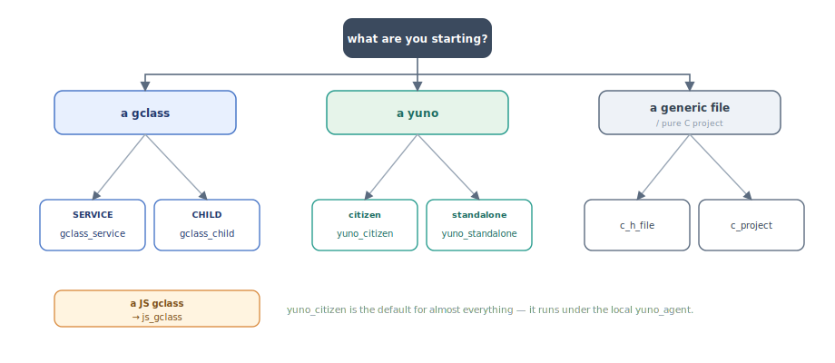

# Scaffolding new yunos and gclasses

This document covers `yuno-skeleton`, the templated scaffolder shipped with
Yuneta, and how to use it correctly so a freshly-created yuno or gclass
matches the conventions enforced elsewhere (notably CLAUDE.md's
"GClass templates and skeletons" hard rule).

Sibling to [`YUNO_LIFECYCLE.md`](YUNO_LIFECYCLE.md) (deploying yunos),
[`REALMS.md`](REALMS.md) (the realm a yuno belongs to),
[`DEBUGGING.md`](DEBUGGING.md), [`IPC.md`](IPC.md).

---

## 1. Which template to pick



The same decision in text:

```
                  what are you starting?
                            │
       ┌────────────────────┼────────────────────┐
       │                    │                    │
       ▼                    ▼                    ▼
   a gclass            a yuno              a generic file
       │                    │              / pure C project
       │                    │                    │
   ┌───┴────┐         ┌─────┴─────┐              ▼
   │        │         │           │         c_h_file
   │        │         │           │         c_project
SERVICE    CHILD   citizen     standalone
   │        │         │           │
   ▼        ▼         ▼           ▼
gclass_  gclass_   yuno_       yuno_
service  child     citizen     standalone

   JS gclass → js_gclass
```

| Template          | Use when …                                                                |
|-------------------|---------------------------------------------------------------------------|
| `yuno_citizen`    | New yuno that will run **under the local yuno_agent** — registers itself, ships logs via the standard handlers, participates in realm coordination. The default for almost everything. |
| `yuno_standalone` | New yuno that runs **outside the agent** — own `argp` CLI, accepts `-f <config_file>`, no agent dependency. Useful for one-shot CLIs, test harnesses, edge cases. |
| `gclass_service`  | New service-level gclass — addressable by name, optional `subscriber` attr, public-event publication. Goes inside an existing yuno. |
| `gclass_child`    | New child-level gclass — created with a parent (`gobj_create_pure_child` or similar), parent is the natural audience. |
| `js_gclass`       | JS equivalent of a gclass, intended for the browser/SPA gobj framework.   |
| `c_h_file`        | Standalone `.c` + `.h` pair, no gobj framework. Just a helper module.     |
| `c_project`       | Pure C project, only `argp-standalone.h` as a dep. No Yuneta runtime.     |

The CLAUDE.md rule is non-negotiable: **every gclass and every yuno
must match the structure of the matching template, even when sections
are empty.** New gclasses → copy the template. Legacy gclasses → don't
reorder, just merge new code into the existing layout.

---

## 2. CLI usage

The tool is `yuno-skeleton`, installed by the `utils/c/yuno-skeleton/`
build. Arguments declared at [`yuno_skeleton.c`](https://github.com/artgins/yunetas/blob/7.7.0/utils/c/yuno-skeleton/yuno_skeleton.c):

| Flag                          | Meaning                                                |
|-------------------------------|--------------------------------------------------------|
| `--list`, `-l`                | List available templates (reads `__skeletons__.json`)  |
| `--skeletons-path`, `-p PATH` | Override the default skeletons directory (default `/yuneta/bin/skeletons`) |
| positional `SKELETON`         | Template name to instantiate                            |

Typical invocations:

```bash
yuno-skeleton --list                          # show what's available

yuno-skeleton yuno_citizen   my_service       # new citizen yuno → ./my_service/
yuno-skeleton yuno_standalone my_tool         # new standalone yuno → ./my_tool/
yuno-skeleton gclass_service my_svc           # new service gclass → ./c_my_svc.{c,h}
yuno-skeleton gclass_child   my_child         # new child gclass
yuno-skeleton js_gclass      my_widget        # new JS gclass
```

The tool walks you through the catalog's per-template `vars` (description,
author, license, …) interactively. The `<name>` you pass becomes the
`rootname` variable used everywhere.

If you don't see what you expect: confirm the catalog path
(`__skeletons__.json`) and the templates live where `--skeletons-path`
points.

---

## 3. The catalog (`__skeletons__.json`)

Lives at `utils/c/yuno-skeleton/skeletons/__skeletons__.json`. Each entry:

```json
{
  "name":    "<template-name>",
  "summary": "<one-line description>",
  "type":    "GClass" | "Yuno" | "Utility",
  "vars": [
    { "var": "description", "message": "…", "default": "" },
    { "var": "author",      "message": "…", "default": "" }
  ]
}
```

Current entries (by line range in the JSON):

| Lines    | Name                | Type    | Summary                                          |
|----------|---------------------|---------|--------------------------------------------------|
| 3-18     | `c_h_file`          | GClass  | Generic `.c` + `.h` file                         |
| 20-50    | `c_project`         | Utility | Pure C project (only `argp-standalone.h`)        |
| 52-67    | `js_gclass`         | GClass  | JS Yuneta gclass                                 |
| 69-84    | `gclass_service`    | GClass  | Service gclass with timer (canonical SERVICE)    |
| 86-101   | `gclass_child`      | GClass  | Typical child gclass (canonical CHILD)           |
| 103-133  | `yuno_standalone`   | Yuno    | Standalone yuno project                          |
| 135-165  | `yuno_citizen`      | Yuno    | Realm's citizen yuno project                     |

If you're adding a new template, follow the same shape; the runner
parses this file at startup to populate the prompts.

---

## 4. The templating engine

`make_skeleton.c` + [`tmpl_dir.c`](https://github.com/artgins/yunetas/blob/7.7.0/utils/c/yuno-skeleton/tmpl_dir.c). Two substitution layers, both using
[PCRE2](https://www.pcre.org/) regex.

### 4.1 Content placeholders: `{{varname}}`

[`tmpl_dir.c`](https://github.com/artgins/yunetas/blob/7.7.0/utils/c/yuno-skeleton/tmpl_dir.c). Pattern `(\{\{.+?\}\})`. Every `{{var}}` block in a
file whose name ends in `_tmpl` is replaced by the matching value from
`jn_values`. Used inside `main.c_tmpl`, `c_+rootname+.c_tmpl`, etc.

### 4.2 Filename placeholders: `+varname+`

[`tmpl_dir.c`](https://github.com/artgins/yunetas/blob/7.7.0/utils/c/yuno-skeleton/tmpl_dir.c). Pattern `(\+.+?\+)`. Every `+var+` block in a
filename or directory name is replaced. The `_tmpl` suffix is stripped
on output ([`tmpl_dir.c`](https://github.com/artgins/yunetas/blob/7.7.0/utils/c/yuno-skeleton/tmpl_dir.c)). Example:

```
template path:   skeletons/gclass_child/c_+rootname+.c_tmpl
rootname=foo →   ./c_foo.c
```

### 4.3 Derived variables

User-prompted vars come from the catalog. The engine adds derived ones
automatically in [`make_skeleton.c`](https://github.com/artgins/yunetas/blob/7.7.0/utils/c/yuno-skeleton/make_skeleton.c):

| Variable      | Derivation                                                |
|---------------|-----------------------------------------------------------|
| `rootname`    | The `<name>` argument, lowercased                         |
| `Rootname`    | Capitalised (first letter upper)                          |
| `ROOTNAME`    | Uppercased                                                |
| `yunorole`    | Yuno role, lowercased (for yuno templates)                |
| `Yunorole`    | Capitalised                                               |
| `YUNOROLE`    | Uppercased                                                |
| `__year__`    | Current year from system time                             |

Use the right case form in your edits. Mixing them silently produces
ugly identifiers (`C_my_service` instead of `C_MY_SERVICE`).

### 4.4 Files that are not templated

Files whose name does not end in `_tmpl` are **copied verbatim**, even
if they contain `{{var}}` markers. The `_tmpl` suffix is the opt-in
trigger.

---

## 5. `yuno_citizen` vs `yuno_standalone`

Both produce a `src/main.c` plus the gclass scaffolding for the yuno's
main service. The structural difference is in `main.c_tmpl`.

### 5.1 `yuno_citizen` (default for almost all yunos)

`skeletons/yuno_citizen/src/main.c_tmpl`:

- Calls `register_c_{{rootname}}()`.
- The `environment` block wires the standard log handlers:
  UDP to logcenter, file to local rotatory, stdout when running in
  console mode. See [`DEBUGGING.md`](DEBUGGING.md) §5.4.
- `fixed_config` sets `yuno_role` and tags.
- `variable_config` declares the standard service stack:
  an `authz` service plus the app service.
- Memory tuning aimed at "lots of small services on a host" (~200M).

Talks to its local `yuno_agent` over an `ievent` channel (the identity
card handshake — see [`IPC.md`](IPC.md) §4.4). Logs ship via UDP to
logcenter by default. Suitable for everything you'd deploy with
`run-yuno`.

### 5.2 `yuno_standalone` (CLI / test / edge)

`skeletons/yuno_standalone/src/main.c_tmpl`:

- Has its own `argp` CLI parser — accepts `-f <config>`
  and `-V`/`--version`.
- No `authz` service; no agent connection.
- `fixed_config` + `variable_config` simpler — only the app service.
- Memory tuning aimed at "one process owns the host" (~1G blocks).

Use when the binary needs to run independently of any agent — for
example: a CLI tool, a test harness, an edge device that doesn't ship
with a full agent.

---

## 6. `gclass_service` vs `gclass_child`

Both produce a `c_+rootname+.{c,h}` pair conforming to CLAUDE.md's
banner structure. The crucial structural difference is the `mt_create`
subscription block. Both versions are in the templates verbatim — copy
them exactly, do not refactor.

### 6.1 `gclass_service` — SERVICE pattern

`skeletons/gclass_service/c_+rootname+.c_tmpl:115-124`:

```c
hgobj subscriber = (hgobj)gobj_read_pointer_attr(gobj, "subscriber");
if(subscriber) {
    gobj_subscribe_event(gobj, NULL, NULL, subscriber);
} else if(gobj_is_pure_child(gobj)) {
    subscriber = gobj_parent(gobj);
    gobj_subscribe_event(gobj, NULL, NULL, subscriber);
}
```

Reads:

- The standard case: a SERVICE has its `subscriber` set explicitly by
  whoever wires it.
- The fallback: if the gobj happens to have been created as a pure
  child anyway, fall back to subscribing the parent.

Service templates also include `help` and `authzs` commands in their
`command_table`.

Use for **anything that is registered with `gobj_create_default_service`,
`gobj_create_service`, or expected to be reachable by name from
another yuno or the SPA**.

### 6.2 `gclass_child` — CHILD pattern

`skeletons/gclass_child/c_+rootname+.c_tmpl:83-89`:

```c
hgobj subscriber = (hgobj)gobj_read_pointer_attr(gobj, "subscriber");
if(!subscriber) {
    subscriber = gobj_parent(gobj);
}
gobj_subscribe_event(gobj, NULL, NULL, subscriber);
```

Reads:

- Use the explicit `subscriber` if provided, otherwise unconditionally
  the parent.
- There is **no else** — every child gets a subscriber.

The CHILD pattern assumes the gobj is always created with a parent
(`gobj_create_pure_child`, `gobj_create_volatil`, etc.). The parent's
FSM **must** declare every event the child can publish (see
[`IPC.md`](IPC.md) §3.5 — this is the canonical *"Event NOT DEFINED in
state"* source).

Use for **per-connection objects, protocol handlers, transient helpers
that always have a parent**.

---

## 7. The banner convention

CLAUDE.md ("GClass templates and skeletons"): *every banner from the
skeleton must be present, even when its section is empty. Don't add
extra banners outside the skeleton set. Don't reorder sections in legacy
gclasses; merge new code into the existing layout to keep `git blame`
clean. Greenfield gclasses follow the skeleton order.*

The banner blocks the templates ship (example from
`yuno_citizen/src/c_+rootname+.c_tmpl`):

```c
                    /******************************
                     *      Framework Methods
                     ******************************/

                    /***************************
                     *      Commands
                     ***************************/

                    /***************************
                     *      Local Methods
                     ***************************/

                    /***************************
                     *      Actions
                     ***************************/
```

Plus the canonical headers for `Attributes`, `PRIVATE DATA`, `Event types`,
`States`, etc. — see [`c_yuno.c`](https://github.com/artgins/yunetas/blob/7.7.0/kernel/c/root-linux/src/c_yuno.c) (large reference example) and [`c_timer.c`](https://github.com/artgins/yunetas/blob/7.7.0/kernel/c/root-linux/src/c_timer.c)
(minimal reference example).

Important consequences:

- Don't delete a banner just because its section has no entries.
- Don't insert a section between two banners.
- Don't rename a banner (the formatting is exact — count blank lines and
  asterisks).

---

## 8. Post-scaffold checklist

After `yuno-skeleton <template> <name>` you have a tree with rendered
`_tmpl` files. Standard next steps:

```bash
cd <name>
mkdir build && cd build
cmake ..
make
```

For a citizen yuno you'll also need to:

1. **Create a binary record** in the agent: `install-binary content64=$$(<role>)`
   (see [`YUNO_LIFECYCLE.md`](YUNO_LIFECYCLE.md) §6.1).
2. **Create a configuration**: `create-config id=<role>.<name>
   content64=$$(<role>_<name>.json)` (alias `install-config`; the version is
   read from the `__version__` field inside the file).
3. **Create the yuno record** linking realm + binary + config.
4. **Enable + run**.

For a standalone yuno you just run the binary with `-f <config.json>`.

If you scaffolded a new gclass, you also need to:

- `#include "c_<rootname>.h"` in the consumer.
- Call `register_c_<rootname>()` in the consuming yuno's `main.c`.
- Verify that you registered it before any `gobj_create*` that mentions
  the gclass — otherwise the runtime aborts.

---

## 9. Sharp edges

### 9.1 Don't refactor away the `mt_create` subscription block

The exact two patterns in §6.1 and §6.2 are CLAUDE.md hard rules. They
look ugly (an inverted-condition `else if(gobj_is_pure_child(gobj))` in
the SERVICE case looks like a smell). It isn't — it's a deliberate
fallback that prevents *"Publish event WITHOUT subscribers"* in mixed
deployments. Copy it verbatim.

### 9.2 The `_tmpl` suffix is the opt-in

A file without `_tmpl` is **not rendered**, even if it contains
`{{var}}` markers. If you write your own template and forget the suffix,
you'll get the literal `{{rootname}}` in the output.

### 9.3 `+varname+` only renames; `{{varname}}` only fills content

The two syntaxes are not interchangeable. If you want a file named after
a variable, use `+var+`. If you want the variable's value inside the
file, use `{{var}}`.

### 9.4 Case forms are not aliases

`{{rootname}}`, `{{Rootname}}`, `{{ROOTNAME}}` are three different
variables. The template author picks each occurrence consciously. If
you mix them, you produce names like `C_my_service` or `c_MY_SERVICE`
that compile but read like a bug report.

### 9.5 `--skeletons-path` defaults to `/yuneta/bin/skeletons`

A development checkout has them at
`utils/c/yuno-skeleton/skeletons/`. If the installed copy is out of date,
pass `-p` to point at the working tree.

### 9.6 The README mentions a sibling `ymake-skeleton`

`utils/c/yuno-skeleton/README.md:12`: *"See also `ymake-skeleton` for
cloning from an existing project rather than a template library."*

`ymake-skeleton` is a separate utility (not in `utils/c/yuno-skeleton/`).
Use it when you want to start from an existing yuno rather than a
template — closer to "clone this project into a new name". The
`yuno-skeleton` tool is the right pick for greenfield.

### 9.7 The JS yuno scaffold lives outside this repo (since 2026-05-21)

CLAUDE.md notes that the **JS GUI yuno** scaffold moved out of yunetas
to `wattyzer/templates/js_gui/` when gobj-ui v8.0 landed. The
`js_gclass` template still lives here and produces a single JS gclass,
not a full GUI yuno project. For a new SPA, start from wattyzer's
template.

---

## 10. Recipes

### 10.1 New citizen yuno from scratch

```bash
# 1. scaffold
yuno-skeleton yuno_citizen my_widget_service

cd my_widget_service
mkdir build && cd build
cmake .. && make

# 2. install the binary in the agent
ycommand -c "install-binary content64=\$\$(my_widget_service)"

# 3. install a config (a JSON file you've written; version from its __version__)
ycommand -c "create-config id=my_widget_service.instance_01 content64=\$\$(my_widget_service_instance_01.json)"

# 4. create the yuno record (realm must already exist — see REALMS.md)
ycommand -c "create-yuno realm_id=<realm-id> yuno_role=my_widget_service yuno_name=instance_01"

# 5. start
ycommand -c "enable-yuno id=<yuno_id>"
ycommand -c "run-yuno    id=<yuno_id>"
```

### 10.2 Add a new SERVICE gclass to an existing yuno

```bash
cd <existing-yuno>/src
yuno-skeleton gclass_service my_new_service

# the new files: c_my_new_service.c, c_my_new_service.h

# in <existing-yuno>/src/CMakeLists.txt
#   add c_my_new_service.c to the sources list

# in <existing-yuno>/src/main.c
#   #include "c_my_new_service.h"
#   call register_c_my_new_service() BEFORE the first gobj_create

# rebuild + redeploy (YUNO_LIFECYCLE.md §6.2)
```

### 10.3 Add a new CHILD gclass

```bash
yuno-skeleton gclass_child my_child

# - register in main.c BEFORE the first gobj_create that uses it
# - the parent gclass MUST declare every event my_child publishes,
#   in its event_action_list for the relevant states
#   (otherwise: "Event NOT DEFINED in state" — see IPC.md §8.2)
```

### 10.4 New JS gclass for the SPA

```bash
yuno-skeleton js_gclass my_widget

# rendered to my_widget.js with the CHILD subscription pattern.
# Drop it into the SPA's source tree and register via the JS framework's
# normal gclass registration (gobj_create + register_gclass equivalents
# in kernel/js/gobj-js — see IPC.md §7 for the SPA case).
```

### 10.5 Standalone CLI tool (no agent)

```bash
yuno-skeleton yuno_standalone my_tool
cd my_tool
mkdir build && cd build
cmake .. && make

# Run directly with a config file
./my_tool -f /path/to/my_tool.json
```

---

## 11. Code pointers

| What                                              | Where                                                                  |
|---------------------------------------------------|------------------------------------------------------------------------|
| Tool entry point                                  | [`utils/c/yuno-skeleton/yuno_skeleton.c`](https://github.com/artgins/yunetas/blob/7.7.0/utils/c/yuno-skeleton/yuno_skeleton.c)                          |
| Templating engine (variables + dispatch)          | [`utils/c/yuno-skeleton/make_skeleton.c`](https://github.com/artgins/yunetas/blob/7.7.0/utils/c/yuno-skeleton/make_skeleton.c)                        |
| Directory walker + content rendering              | [`utils/c/yuno-skeleton/tmpl_dir.c`](https://github.com/artgins/yunetas/blob/7.7.0/utils/c/yuno-skeleton/tmpl_dir.c)                     |
| Template catalog                                  | `utils/c/yuno-skeleton/skeletons/__skeletons__.json`                   |
| `yuno_citizen` main template                      | `utils/c/yuno-skeleton/skeletons/yuno_citizen/src/main.c_tmpl`         |
| `yuno_standalone` main template                   | `utils/c/yuno-skeleton/skeletons/yuno_standalone/src/main.c_tmpl`      |
| SERVICE gclass subscription block                 | `skeletons/gclass_service/c_+rootname+.c_tmpl:115-124`                 |
| CHILD gclass subscription block                   | `skeletons/gclass_child/c_+rootname+.c_tmpl:83-89`                     |
| JS gclass template                                | `skeletons/js_gclass/+rootname+.js_tmpl`                               |
| Banner-rule discussion                            | [`CLAUDE.md`](../../../CLAUDE.md) — "GClass templates and skeletons"   |
| Canonical large gclass examples                   | [`kernel/c/root-linux/src/c_yuno.c`](https://github.com/artgins/yunetas/blob/7.7.0/kernel/c/root-linux/src/c_yuno.c), [`yunos/c/yuno_agent/src/c_agent.c`](https://github.com/artgins/yunetas/blob/7.7.0/yunos/c/yuno_agent/src/c_agent.c) |
| Canonical minimal gclass example                  | [`kernel/c/root-linux/src/c_timer.c`](https://github.com/artgins/yunetas/blob/7.7.0/kernel/c/root-linux/src/c_timer.c)                                    |
