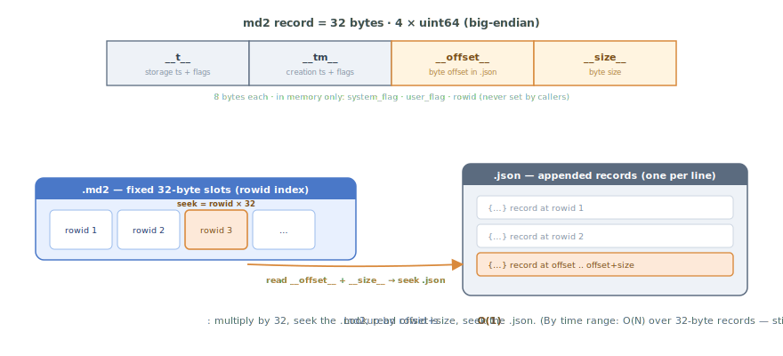

# timeranger2 + treedb, in 30 minutes

This is the crash course on Yuneta's persistence layer. By the end you
should know the difference between **timeranger2** (the append-only
time-series log) and **treedb** (the graph database on top), how
schemas are declared, how nodes link to each other, and which rules
will ruin your day if you ignore them.

> **Conceptual frame.** This document describes the **information
> plane** of Yuneta's typed-graph model. The behavior plane is in
> [`GOBJ.md`](GOBJ.md). The claim that both planes share one set of
> primitives — `topic`/`gclass`, `node`/`gobj`, `hook`/subscription —
> is laid out in
> [The Typed-Graph Model](../../../docs/doc.yuneta.io/philosophy/typed_graph_model.md).
> Read that first if you want to know *why* treedb and gobj look so
> similar before diving into either one.

Companion to [`GOBJ.md`](GOBJ.md). Sibling to [`YUNO_LIFECYCLE.md`](YUNO_LIFECYCLE.md)
(which uses these topics to store realms, yunos, binaries and
configurations), [`YUNO_AUTH.md`](YUNO_AUTH.md) (which uses them for users, roles
and audit), and [`REALMS.md`](REALMS.md) (the realm hooks lifecycle).

---

## 1. Mental model

```
                ┌───────────────────────────────────────┐
                │     your gclass calls gobj_*node()    │
                └───────────────────┬───────────────────┘
                                    │
                                    ▼
                ┌───────────────────────────────────────┐
                │            c_treedb / c_node          │   gobj wrappers
                │  (graph operations, in-memory hooks)  │
                └───────────────────┬───────────────────┘
                                    │
                                    ▼
                ┌───────────────────────────────────────┐
                │            tr_treedb.c                │   graph layer
                │  topics, nodes, hooks, fkeys, schema  │
                └───────────────────┬───────────────────┘
                                    │
                                    ▼
                ┌───────────────────────────────────────┐
                │            timeranger2.c              │   append-only log
                │  per-key files + md2 binary index     │
                └───────────────────┬───────────────────┘
                                    │
                                    ▼
                              filesystem
                       (one directory per topic,
                        one subdir per key,
                        one .json + .md2 per day)
```

Two distinct things:

| Layer        | What it is                                                                 |
|--------------|----------------------------------------------------------------------------|
| **timeranger2** | An append-only time-series log with a key index. Stores records keyed by a primary key, time-partitioned, with a 32-byte binary metadata index for fast lookup by `rowid`, time, or pkey. Knows nothing about graphs. |
| **treedb**     | A graph database that uses timeranger2 as its persistent store. Adds the notion of topics with schemas, typed columns, hooks (parent→children in-memory pointers), and fkeys (child→parent persistent references). |

If you want raw time-series, you go straight to timeranger2. If you want
a graph of typed nodes, you use treedb. The agent uses treedb for
everything (realms, yunos, binaries, configurations, users, roles); the
`logcenter` yuno uses raw timeranger2 to dump records.

---

## 2. timeranger2

### 2.1 The on-disk layout

For each opened database (a top-level directory):


The same layout in text:

```
<database>/
  __timeranger2__.json                ← metadata + master lock
  <topic_1>/
    topic_desc.json                   ← {topic_name, pkey, tkey, system_flag}
    topic_cols.json                   ← persisted cols schema  ⚠ versioning trap
    topic_var.json                    ← user-mutable per-topic flags
    keys/
      <key_value_a>/
        2026-05-22.json               ← appended JSON records, one per line
        2026-05-22.md2                ← 32-byte binary index, one per record
        2026-05-23.json
        2026-05-23.md2
        …
      <key_value_b>/
        …
    disks/                            ← non-master / cross-yuno hardlink slots
      <rt_id>/
        <key_value_a>/                ← hardlinks to the keys/ files
        <key_value_b>/
        …
  <topic_2>/
    …
```

Path-building lives in `kernel/c/timeranger2/src/timeranger2.c`.
The data filename mask is `"%Y-%m-%d"` by default — each appended
record lands in the file whose mask matches its `__t__`. Big topics
naturally rotate every day.

### 2.2 Records and the `md2` index

Each `.md2` file is an array of fixed 32-byte records in big-endian
order. The struct (`timeranger2.c`, in-memory shape
`md2_record_ex_t` at `timeranger2.h`):



```c
typedef struct {
    uint64_t __t__;         // storage timestamp + high-16-bit user flags
    uint64_t __tm__;        // creation timestamp + high-16-bit system flags
    uint64_t __offset__;    // byte offset of the record in the paired .json
    uint64_t __size__;      // byte size of the record
    // (in memory only:)
    uint16_t system_flag;
    uint16_t user_flag;
    uint64_t rowid;
} md2_record_ex_t;
```

The high 16 bits of `__t__` and `__tm__` are reserved for flags. Macros
at `timeranger2.c` extract and pack them. Lookup by rowid is
O(1) — multiply by 32, seek the `.md2`, read offset+size, seek the
`.json`. Lookup by time range is O(N) over `.md2` records, which is
still fast because they're 32 bytes apiece.

### 2.3 `g_rowid` vs `i_rowid` — the rule

Two rowids per record, both maintained **only** by timeranger2:

| Name        | Meaning                                                              |
|-------------|----------------------------------------------------------------------|
| `g_rowid`   | Global rowid for that key — cumulative across all files, never reset |
| `i_rowid`   | Rowid within the current `.md2` file — `(offset / sizeof(md2_record_t)) + 1` |

`tranger2_append_record` ([`timeranger2.c:2332`](https://github.com/artgins/yunetas/blob/7.5.1/kernel/c/timeranger2/src/timeranger2.c#L2332)) computes both and
returns them in `md_record_ex->rowid` (`timeranger2.c`). **Callers
never set them.** For topics with `sf_rowid_key`, timeranger2 also
asserts `g_rowid == i_rowid` (`timeranger2.c`) — a mismatch is
a data-corruption indicator.

If you're writing test fixtures and you find yourself populating
`g_rowid` by hand, stop. That's the framework's job.

### 2.4 `__t__` vs `__tm__`

Both timestamps, but semantically distinct:

| Field    | What it means                                                  | When it's set                          |
|----------|----------------------------------------------------------------|----------------------------------------|
| `__t__`  | When timeranger2 wrote the record to disk                      | At append time. Defaults to "now".     |
| `__tm__` | When the underlying event happened (from the record's `tkey` field) | Caller-controlled via `tkey` config.   |

`__t__` partitions files. `__tm__` is the event-time you'd query by.
For records that are events as they happen, the two are usually
identical (within milliseconds). For batch imports of historical data
the two diverge — `__tm__` is the original event, `__t__` is "now I
imported it".

### 2.5 Topic declaration

When you create a topic you provide a `topic_desc_t`
(`timeranger2.h`):

```c
typedef struct {
    const char       *topic_name;
    const char       *pkey;          // primary-key field name
    const system_flag2_t system_flag;
    const char       *tkey;          // time-key field name
    const json_desc_t *jn_cols;       // column schema
    const json_desc_t *jn_topic_ext;
} topic_desc_t;
```

`system_flag` bits (`timeranger2.h`):

| Flag              | Meaning                                                |
|-------------------|--------------------------------------------------------|
| `sf_string_key`   | pkey is a string. Directory names use it verbatim.     |
| `sf_int_key`      | pkey is a uint64. Directory names zero-padded.         |
| `sf_rowid_key`    | pkey is auto-generated rowid. `g_rowid == i_rowid` enforced. |
| `sf_t_ms`         | `__t__` in milliseconds (default: seconds).            |
| `sf_tm_ms`        | `__tm__` in milliseconds.                              |
| `sf_zip_record`   | `.json` records are zlib-compressed.                   |
| `sf_cipher_record`| `.json` records are encrypted.                         |

Persisted in `topic_desc.json` at create time (`timeranger2.c`)
and loaded on open.

### 2.6 Public API in 12 calls

`timeranger2.h`. Grouped by purpose:

```c
// lifecycle
json_t *tranger2_startup    (hgobj, json_t *jn_tranger, yev_loop_h);
int     tranger2_stop       (json_t *tranger);
int     tranger2_shutdown   (json_t *tranger);
json_t *tranger2_create_topic(json_t *tranger, const char *topic_name,
                              const char *pkey, const char *tkey,
                              json_t *jn_topic_ext, system_flag2_t system_flag,
                              json_t *jn_cols, json_t *jn_var);
json_t *tranger2_open_topic  (json_t *tranger, const char *topic_name, BOOL verbose);
int     tranger2_close_topic (json_t *tranger, const char *topic_name);

// append
int     tranger2_append_record(json_t *tranger, const char *topic_name,
                               uint64_t __t__, uint16_t user_flag,
                               md2_record_ex_t *md_record_ex, json_t *jn_record);

// read
json_t *tranger2_open_iterator    (json_t *tranger, const char *topic_name, const char *key,
                                   json_t *match_cond, tranger2_load_record_callback_t,
                                   const char *iterator_id, hgobj creator, json_t *data, json_t *extra);
json_t *tranger2_iterator_get_page(json_t *tranger, json_t *iterator,
                                   uint64_t from_rowid, int limit, BOOL backward);
int     tranger2_close_iterator   (json_t *tranger, json_t *iterator);

// realtime
json_t *tranger2_open_rt_mem (…);   // master-side realtime (writes pushed via callback)
json_t *tranger2_open_rt_disk(…);   // non-master realtime (watches hardlinks)
```

`tranger2_open_rt_disk` is the workhorse for **cross-yuno** reads —
see §4.5.

### 2.7 Master / non-master

`tranger2_startup` ([`timeranger2.c:330`](https://github.com/artgins/yunetas/blob/7.5.1/kernel/c/timeranger2/src/timeranger2.c#L330)) attempts an **exclusive
lock** on `__timeranger2__.json`. Whoever gets it is the master:

- The master can **read AND write**. Only the master may
  `tranger2_append_record`, `tranger2_delete_topic`, etc.
- Non-masters can only read. They are expected to use
  `tranger2_open_rt_disk` so the master can push updates to them via
  hardlinks in the `disks/<rt_id>/` directory.

The lock is held for the lifetime of the process. If a master crashes
without releasing, the OS releases the flock on exit and the next
yuno that opens the database becomes master.

### 2.8 Snapshots

The current timeranger2 API does **not** expose a snapshot primitive
named `tranger2_*_snap*` — those calls live one layer up at the treedb
level (§3.7). The closest underlying mechanism is the `disks/<rt_id>/`
hardlink trick that gives non-masters a consistent view at the point
the directory was wired.

### 2.9 The delete-record story

Two granularities, both implemented in v7 as of 2026-05-26.

- **Whole record** (= a primary key + every instance under it).
  **`tranger2_delete_key()`** (renamed from `tranger2_delete_record`
  on 2026-05-25; legacy alias kept as a `#define` in `timeranger2.h`).
  Removes `keys/<key>/` and drops the key from `topic_cache`.
  Irrecoverable. Used today by `treedb_delete_node`.
- **One instance** (one row in the `.md2` file).
  **`tranger2_delete_instance(tranger, topic, key, __t__, rowid,
  zero_payload)`** mutates the `.md2` row in place with
  `sf_deleted_instance = 0x0400` (back in `system_flag2_t`, inherited
  side of the mask so `rt_by_disk` followers see the tombstone).
  Optional `zero_payload` overwrites the matching `__size__` bytes in
  the data `.json` for sensitive-data wipes. Read paths
  (`tranger2_open_iterator` history, `tranger2_iterator_get_page`,
  `publish_new_rt_disk_records`) skip dead rows. Master-only,
  idempotent. Slot ids do NOT renumber — `iterator_size` /
  `total_rows` keep counting slots, not live rows.
  **Treedb is NOT a consumer**: `treedb_delete_instance()` is
  per-`pkey2`-index in-memory cleanup only.

#### Propagation to subscribers (2026-05-26)

`tranger2_delete_key()` now notifies every subscriber tracking
the deleted key. Two paths:

- **In-process** (rt_mem, rt_disk in the same yuno as the master,
  open_iterator): a registered
  `tranger2_key_deleted_callback_t` fires for each handle whose
  `key` filter matches (`""` = any).
- **Across-process** (`rt_by_disk` followers): the master
  [`rmrdir`](https://github.com/artgins/yunetas/blob/7.5.1/kernel/c/gobj-c/src/helpers.c#L422)s `topic/disks/<rt_id>/<key>/` BEFORE the live
  `keys/<key>/` so the follower's inotify watcher catches it as
  `FS_SUBDIR_DELETED_TYPE`, which fires the follower's
  `key_deleted_callback`. `fire_key_deleted_locally()` is split by
  transport (`fs_followers` flag): the master in-process call
  serves non-watcher subscribers, the inotify branch serves the
  fs-watcher followers — each subscriber fires exactly once. No new
  IPC channel, no new file convention. (The inotify branch firing
  the fs-watcher callbacks was completed 2026-05-28; before that the
  shared fan-out skipped them and live deletes were silently
  dropped — see CHANGELOG.)

Register with:

```c
tranger2_set_rt_key_deleted_callback(handle, cb, user_data);
```

…on any handle returned by `tranger2_open_rt_mem`,
`tranger2_open_rt_disk` or `tranger2_open_iterator`. Pre-2026-05-26
followers that polled their cache on a timer can drop the timer.

Memory: `project_tranger2_delete_record_deferred`.

### 2.10 Durability

`tranger2_append_record` performs the write but **does not `fsync`**
(`timeranger2.c`). Durability is whatever the OS gives you —
on EXT4 with the default journal, that's "data on disk within the
journal commit interval, usually 5 s". If you need stronger guarantees,
add an explicit `fsync` in the wrapping code, but understand the
throughput cost.

---

## 3. treedb

### 3.1 The graph model

A treedb sits inside a tranger. Topics become entity types, nodes
become records keyed by `id`, hooks are in-memory pointers from parent
nodes to their children, fkeys are persistent references from child
nodes to their parent. Schema is JSON.

The schemas already documented in this repo's docs cover the canonical
examples:

- [`YUNO_LIFECYCLE.md`](YUNO_LIFECYCLE.md) §2.1-2.3 — `binaries`, `configurations`,
  `yunos`.
- [`REALMS.md`](REALMS.md) §2 — `realms`.
- [`YUNO_AUTH.md`](YUNO_AUTH.md) §4.1 — `users`, `roles`, `users_accesses`.

Read those for the operational shape. This section explains how the
schema *works*.

### 3.2 Topic schema JSON

A real, minimal example (yuno_agent schema, paraphrased):

```json
{
  "id":            "yunos",
  "schema_version": 1,
  "topic_version":  19,
  "pkey":          "id",
  "pkey2s":         "yuno_release",
  "tkey":          "",
  "system_flag":   "sf_string_key",
  "cols": {
    "id":         { "type": "string", "flag": ["persistent", "required"] },
    "realm_id":   { "type": "string", "flag": ["fkey"],
                    "fkey": { "realms": "yunos" } },
    "yuno_role":  { "type": "string", "flag": ["persistent", "required"] },
    "configurations": { "type": "object", "flag": ["hook"],
                        "hook": { "configurations": "yunos" } }
  }
}
```

Six things to notice:

1. **`pkey`** — column name that serves as the primary key. Maps to
   `topic_desc_t.pkey`.
2. **`pkey2s`** — optional secondary key (composite). Allows multiple
   records per primary key (e.g. multiple versions of a binary).
   Queried via `treedb_get_instance()` / `treedb_list_instances()` and the
   agent's `instances` command. **Invariant (since dbf532ec9):** the pkey2
   secondary index shares the SAME node object as the primary index;
   `treedb_save_node()` re-points it on every runtime save. Before that fix
   it held a separate object only filled at disk-load, so a runtime
   `update-node` was invisible through `list_instances` until the next
   reload — the bug behind `list-binaries` showing a stale binary right
   after `update-binary`.
3. **`schema_version`** + **`topic_version`** — different. Schema is
   the overall layout; topic is per-topic. **Bump `topic_version`
   whenever you change `cols`** — §3.5.
4. **`cols`** declares typed columns. Type + flag list (next section).
5. **`fkey` field on the child** points at *(parent topic, hook name)*.
   Persisted.
6. **`hook` field on the parent** points at *(child topic, child fkey
   name)*. Rebuilt in-memory at load time.

### 3.3 Column types and flags

Column types live in the JSON spec, parsed by `tr_treedb.c`. Common
ones: `string`, `integer`, `boolean`, `real`, `array`, `object`,
`blob`, `enum`, `wild`. Plus semantic decorations: `email`, `url`,
`password`, `time`.

Flags (parsed by `kw_has_word` throughout `tr_treedb.c`):

| Flag         | Effect                                                                  |
|--------------|-------------------------------------------------------------------------|
| `persistent` | Written through to timeranger2 on save.                                 |
| `required`   | Cannot be null at creation.                                             |
| `notnull`    | Cannot be null ever.                                                    |
| `hook`       | Parent → children link. In-memory only (rebuilt on load from children's fkeys). |
| `fkey`       | Child → parent reference. Persisted. Encoded as `topic^parent_id^hook_name`. |
| `pkey`       | Marks the primary-key column.                                           |
| `pkey2`      | Marks a secondary key.                                                  |
| `tkey`       | Marks the time-key column.                                              |
| `password`   | Treated as opaque secret on inspection.                                 |
| `email`/`url`/`enum`/`wild` | Semantic types; mostly informational.                    |
| `inherit`    | Inherits a value from a related node.                                   |

Absence of `persistent` + absence of `hook`/`fkey` means **volatile** —
in-memory only.

### 3.4 The `__md_treedb__` metadata block

Every loaded node carries a metadata sidecar (`tr_treedb.c`,
attached at `tr_treedb.c`):

```json
"__md_treedb__": {
    "treedb_name": "treedb_yuneta_agent",
    "topic_name":  "yunos",
    "g_rowid":     14,
    "i_rowid":     14,
    "t":           1737499200,
    "tm":          1737499200,
    "tag":         0,
    "pure_node":   true
}
```

- `g_rowid`, `i_rowid` — see §2.3. Never set them yourself.
- `t`, `tm` — the timeranger2 timestamps, surfaced to the node level.
- `tag` — user_flag from md2, used for snapshots (§3.7).
- `pure_node` — true for ordinary nodes; the metadata you look at.

A node that appears in multiple places in a JSON dump (once under the
topic's `id` index, once nested inside its parent's hook) carries the
**same** `__md_treedb__` everywhere. Same record, multiple views.

### 3.5 The `topic_cols.json` versioning trap

Memory
`feedback_treedb_schema_versioning`:

> Any `cols` change needs a `topic_version` bump or the persisted
> `topic_cols.json` keeps masking the new schema; wipe `store/` when
> reproducing.

What happens: `treedb_open_db()` ([`tr_treedb.c:485`](https://github.com/artgins/yunetas/blob/7.5.1/kernel/c/timeranger2/src/tr_treedb.c#L485)) reads the
persisted `topic_cols.json` and compares its `topic_version` against
the schema in code. If they match, the persisted file wins. If you
edited the schema in code but forgot to bump `topic_version`, your
running yuno sees the **old** schema and silently ignores any new
columns you added.

The fix:

1. Bump `topic_version` in the schema JSON every time you change
   `cols`.
2. While debugging schema problems, wipe the topic's directory in
   `store/` to force a clean load.

### 3.6 Node CRUD: the public API

Two layers — `treedb_*` (the low-level graph API) and `gobj_*node` (the
gobj wrappers most user code uses).

Low-level (`tr_treedb.h`):

```c
json_t *treedb_create_node(json_t *tranger, const char *treedb_name,
                           const char *topic_name, json_t *kw);
json_t *treedb_update_node(json_t *tranger, json_t *node, json_t *kw, BOOL save);
int     treedb_delete_node(json_t *tranger, json_t *node, json_t *jn_options);
json_t *treedb_get_node   (json_t *tranger, const char *treedb_name,
                           const char *topic_name, const char *id);
json_t *treedb_list_nodes (json_t *tranger, const char *treedb_name,
                           const char *topic_name, json_t *jn_filter,
                           BOOL (*match_fn)(json_t *node, json_t *jn_filter));

// links (graph operations)
int     treedb_link_nodes  (json_t *tranger, const char *hook_name,
                            json_t *parent_node, json_t *child_node);
int     treedb_unlink_nodes(json_t *tranger, const char *hook_name,
                            json_t *parent_node, json_t *child_node);
```

gobj-level wrappers (`gobj.h`):

```c
json_t *gobj_create_node(hgobj, const char *topic, json_t *kw, json_t *opt, hgobj src);
json_t *gobj_update_node(hgobj, const char *topic, json_t *kw, json_t *opt, hgobj src);
int     gobj_delete_node(hgobj, const char *topic, json_t *kw, json_t *opt, hgobj src);
json_t *gobj_list_nodes (hgobj, const char *topic, json_t *filter, json_t *opt, hgobj src);
int     gobj_link_nodes  (hgobj, const char *hook,
                          const char *parent_topic, json_t *parent_rec,
                          const char *child_topic,  json_t *child_rec, hgobj src);
int     gobj_unlink_nodes(hgobj, const char *hook,
                          const char *parent_topic, json_t *parent_rec,
                          const char *child_topic,  json_t *child_rec, hgobj src);
```

Most production code calls `gobj_*node` — they route to the right
treedb based on the gobj's `priv` and integrate authzs, traces, etc.

### 3.7 The link/unlink-saves-child rule

CLAUDE.md hard rule, reproduced verbatim from `tr_treedb.c`:

```c
PUBLIC int treedb_link_nodes(...) {
    _link_nodes(gobj, tranger, hook_name, parent_node, child_node, FALSE);
    /*---Save persistent: Only children are saved---*/
    return treedb_save_node(tranger, child_node);   // ← only child
}

PUBLIC int treedb_unlink_nodes(...) {
    _unlink_nodes(gobj, tranger, hook_name, parent_node, child_node, FALSE);
    /*---Save persistent: Only children are saved---*/
    return treedb_save_node(tranger, child_node);   // ← only child
}
```

The rule: **link/unlink writes the child to disk, never the parent.**
Why: the persistent reference lives on the child (the `fkey` field).
The parent's `hook` field is in-memory and gets rebuilt on the next
load by scanning all children for `fkey == parent.id`.

Two consequences:

1. After `treedb_link_nodes`, the child's `g_rowid` advances by 1 (one
   new record appended). The parent's `g_rowid` does **not** change.
2. If you write tooling that snapshots state by reading rowids, the
   parent's rowid is a **bad** signal of "has anything happened to
   this node's relationships" — you have to look at the children too.

### 3.8 Cross-yuno reads: the `rt_by_disk` pattern

When a non-master yuno needs to read another yuno's store, it opens
the master's database in read-only mode and registers an
`rt_by_disk` watcher. The master, on every change, writes hardlinks
into `disks/<rt_id>/` for that subscriber. The subscriber's
filesystem watcher fires, and it re-reads the hardlinks.

Memory
`feedback_cross_yuno_via_store_not_command`:
in wattyzer (and by extension other multi-yuno SPAs), cross-yuno
queries from the SPA go through `db_history_wz` reading B+ yunos'
stores *non-master* via this pattern. **[`cmd_command_yuno`](https://github.com/artgins/yunetas/blob/7.5.1/yunos/c/yuno_agent/src/c_agent.c#L6070) does not
work** for B+ yunos because they don't publish their service via
`__top_side__` — the store path is the right one.

Code: `tranger2_open_rt_disk` at `timeranger2.h`. The
mechanism is purely filesystem-mediated — no socket between the master
and the watchers.

### 3.9 Snapshots (treedb-level)

Snapshots tag a point in time across the treedb. APIs at
`tr_treedb.h`:

```c
int     treedb_shoot_snap   (json_t *tranger, const char *treedb_name,
                             const char *snap_name, const char *description);
int     treedb_activate_snap(json_t *tranger, const char *treedb_name,
                             const char *snap_name);
json_t *treedb_list_snaps   (json_t *tranger, const char *treedb_name,
                             json_t *jn_filter);
```

`gobj_list_snaps(gobj, filter, src)` is the gobj-level wrapper.

Snapshots are how the agent picks which binary version to run when
multiple are stored — see [`YUNO_LIFECYCLE.md`](YUNO_LIFECYCLE.md) §4.3. The
binary resolver tries the active snapshot first
(`gobj_list_snaps`, `c_agent.c`), then falls back to a
direct `(role, role_version)` lookup.

---

## 4. Sharp edges

### 4.1 `g_rowid` and `i_rowid` are read-only to user code

(§2.3, §3.4.) Never set them in test fixtures, code that calls
`treedb_create_node`, or anywhere else. They're computed by
timeranger2 and surfaced in `__md_treedb__` for inspection only.

### 4.2 link/unlink saves the child, not the parent

(§3.7.) If you're inspecting `g_rowid` on the parent after a link
operation and it hasn't changed, that's expected. Look at the
child's `g_rowid` instead.

### 4.3 Schema changes need `topic_version` bumps

(§3.5.) Stale `topic_cols.json` silently overrides new code. The
trap is doubly nasty because the yuno still **works** — the new
columns simply don't exist as far as treedb is concerned. Always
bump.

### 4.4 Master-only writes

(§2.7.) `tranger2_append_record` is a no-op (returning -1) on
non-master. If you find yourself writing in a yuno that's the
non-master, you have a deployment bug — two yunos opened the same
store.

### 4.5 timeranger2 is append-only — with two scoped deletes

(§2.9.) The `.json` data log itself is **never rewritten**: appends
go to the end, that's it. What is mutable is the `.md2` index, and
two delete primitives operate on it:

- `tranger2_delete_key()` removes a key's directory wholesale (every
  instance with it) and propagates the deletion to in-process and
  cross-process subscribers via inotify + callback fan-out.
- `tranger2_delete_instance()` tombstones one row of the `.md2` index
  in place (bit `sf_deleted_instance = 0x0400`); readers skip it,
  rowids do not renumber. Opt-in `zero_payload` overwrites the
  matching bytes in the `.json` for GDPR-style wipes.

Both are master-only and irrecoverable. The append-only contract
still holds at the data-log level — only the index is mutated.

### 4.6 No `fsync` after append

(§2.10.) Durability is what the OS gives you. For audit logs where
a crash window of a few seconds is unacceptable, add an explicit
`fsync` — but understand the throughput cost.

### 4.7 Don't open the same store twice in the same process

`tranger2_startup` caches by path. Two starts of the same path return
the same tranger handle, but two distinct yunos in the same process
trying to coexist on the same store is unsupported.

### 4.8 The deprecated `range_ports`/`last_port` columns on `realms`

(See [`REALMS.md`](REALMS.md) §7.1.) Same class of trap as §3.5:
columns that the schema still declares but the runtime ignores. Reading
them returns stale data. Trust the agent's own attrs, not the schema
column.

### 4.9 Multiple node occurrences in dumps share one `g_rowid`

A node listed under `topic.id_index[id]` and also nested inside a
parent's `hook` array is the same record. They share the
`__md_treedb__.g_rowid`. Don't double-count when computing stats from
a dump.

### 4.10 Hooks rebuild on load — only fkeys persist

(§3.7.) If you imagine the on-disk database as a binary blob, you'll
find the children's fkeys but **not** the parents' hooks. Hooks are
purely in-memory pointers reconstructed by scanning children. This is
why a corrupt fkey on a child makes its parent's hook look short;
look at the child first.

### 4.11 No raw `malloc` / `free` for treedb-allocated `json_t`

CLAUDE.md hard rule. `gbmem_*` everywhere. Jansson is routed through
`gbmem_*`, so all `json_*` APIs are safe; never `free()` a `json_t`
yourself.

### 4.12 Don't cache `json_t *` returned by `treedb_get_node` past a
restart

The pointer is valid for the lifetime of the loaded tranger. After a
[`tranger2_stop`](https://github.com/artgins/yunetas/blob/7.5.1/kernel/c/timeranger2/src/timeranger2.c#L527) + `tranger2_startup` cycle the pointer is stale. If
you keep references across stops, the framework won't notice — your
crash will.

---

## 5. Recipes

### 5.1 Browse a topic from the CLI

`yutils/c/ylist/` ships [`ylist`](#util-ylist) for this. Without it, raw `find +
jq`:

```bash
# every record in the realms topic (date-partitioned)
cat /yuneta/store/agent/treedb_yuneta_agent/realms/keys/*/*.json | jq .

# specific node
cat /yuneta/store/agent/treedb_yuneta_agent/yunos/keys/<id>/*.json | jq .
```

For machine-friendly access, prefer [`ycommand`](#util-ycommand) against the agent
(`list-yunos`, `list-realms`, `list-binaries`, `list-configs`) —
those go through the treedb's in-memory state and apply schema
correctly.

### 5.2 Add a new column to an existing topic

```diff
   "cols": {
       …
+      "my_new_field": { "type": "string", "flag": ["persistent"] }
   },
-  "topic_version": 19
+  "topic_version": 20
```

Without the `topic_version` bump the field will be silently ignored
on load. With it, treedb migrates: every existing node gets the
column with its default value on first save.

For a hot rollout where you can't bounce yunos:

1. Update the schema file in source. Bump `topic_version`.
2. Build + redeploy (see [`YUNO_LIFECYCLE.md`](YUNO_LIFECYCLE.md) §6.2).
3. Verify the new field shows up:

   ```bash
   ycommand -c 'command-yuno id=<yuno> service=__yuno__ command=list-nodes topic=<topic>'
   ```

### 5.3 Create a node and link it to a parent

In C, inside an action or command handler:

```c
json_t *node = gobj_create_node(
    gobj,
    "users",
    json_pack("{s:s, s:b}", "id", "alice", "disabled", 0),
    NULL,
    src
);

json_t *parent = gobj_get_node(gobj, "roles",
    json_pack("{s:s}", "id", "operator"), NULL, src);

gobj_link_nodes(gobj, "users",
    "roles", parent,
    "users", node,
    src);

// note: only `node` has been saved (the child with the fkey).
// `parent` is unchanged on disk.
```

### 5.4 Inspect snapshots

```bash
ycommand -c 'command-yuno id=<yuno> service=__yuno__ command=list-snaps'
```

Snapshots are global to a treedb — you'll see one entry per "tag".

### 5.5 Recover from a botched schema change

```bash
# 1. stop the yuno that owns the store
ycommand -c 'kill-yuno id=<yuno>'

# 2. wipe the topic's data (do NOT do this in production — this is
#    for fresh-checkout / dev-loop recovery)
sudo rm -rf /yuneta/store/<realm>/<yuno>/treedb_<name>/<topic>/

# 3. restart — the topic is recreated from the schema
ycommand -c 'run-yuno id=<yuno>'
```

For production, do this against a backup. Never `rm -rf` a live store.

### 5.6 Read another yuno's topic non-master (`rt_by_disk`)

Pseudocode in a different yuno that does NOT own the store:

```c
json_t *tranger = tranger2_startup(gobj, json_pack(
    "{s:s, s:b}",
    "path",     "/yuneta/store/<other_yuno>",
    "master",   false
), yev_loop);

tranger2_open_rt_disk(
    tranger,
    "events",
    "*",                    // every key
    NULL,                   // no extra filter
    my_on_record_callback,
    "my_unique_rt_id",      // mandatory unique id
    gobj,
    NULL
);
```

The master will detect your `disks/my_unique_rt_id/` directory and
start writing hardlinks there on every change. Your callback fires
as soon as the kernel notifies the filesystem watcher. No socket
between the two yunos — pure inode plumbing.

---

## 6. Code pointers

| What                                              | Where                                                                 |
|---------------------------------------------------|-----------------------------------------------------------------------|
| timeranger2 public API                            | `kernel/c/timeranger2/src/timeranger2.h` (747 lines)                  |
| timeranger2 runtime                               | `kernel/c/timeranger2/src/timeranger2.c` (~7.8k lines)                |
| `md2_record_t` (32-byte index)                    | `timeranger2.c`                                                 |
| `md2_record_ex_t` (in-memory)                     | `timeranger2.h`                                               |
| `system_flag2_t` (sf_string_key, sf_int_key, …)   | `timeranger2.h`                                               |
| Master / non-master lock                          | `timeranger2.c`                                               |
| `tranger2_append_record`                          | `timeranger2.c` (g_rowid set at 2667, i_rowid at 2634)      |
| `tranger2_open_rt_disk` (cross-yuno reads)        | `timeranger2.h`                                               |
| TRACE_FS sites                                    | `timeranger2.c` (multiple)                   |
| treedb public API                                 | `kernel/c/timeranger2/src/tr_treedb.h` (617 lines)                    |
| treedb runtime                                    | `kernel/c/timeranger2/src/tr_treedb.c` (~8.9k lines)                  |
| `__md_treedb__` builder                           | `tr_treedb.c`                                    |
| Topic schema loader (`topic_cols.json`)           | `tr_treedb.c`                                                 |
| `topic_version` matching                          | `tr_treedb.c`                                            |
| `treedb_link_nodes` / `treedb_unlink_nodes`       | `tr_treedb.c` (saves child only)                            |
| `treedb_create/update/delete/get/list_node[s]`    | `tr_treedb.h`, `tr_treedb.c`                        |
| Snapshot API                                      | `tr_treedb.h`                                                 |
| gobj wrappers (`gobj_*node`)                      | `gobj.h`                                                    |
| `gobj_list_snaps`                                 | `gobj.h`                                                    |
| Canonical schemas                                 | `yunos/c/yuno_agent/src/treedb_schema_yuneta_agent.c`, `kernel/c/root-linux/src/treedb_schema_authzs.c` |
| Treedb gclass (gobj wrapper)                      | `kernel/c/root-linux/src/c_treedb.c`, `c_node.c`                      |
