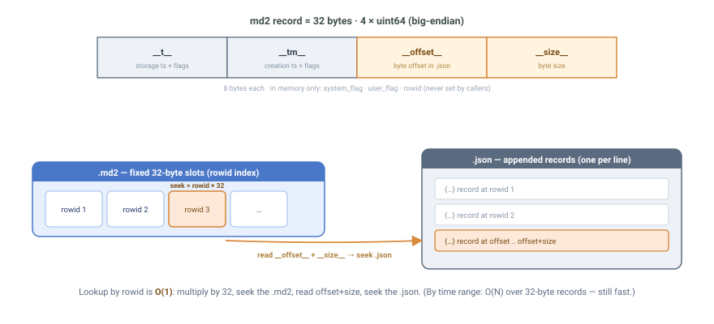

# timeranger2 + treedb, in 30 minutes

This is the crash course on Yuneta's persistence layer. At the end you
know the difference between **timeranger2** (the append-only
time-series log) and **treedb** (the graph database on top), how
schemas are declared, how nodes link to each other, and which rules
will ruin your day if you ignore them.

> **Conceptual frame.** This document describes the **information
> plane** of Yuneta's typed-graph model. The behavior plane is in
> [`GOBJ.md`](GOBJ.md). The claim that both planes share one set of
> primitives — `topic`/`gclass`, `node`/`gobj`, `hook`/subscription —
> is laid out in
> [The Typed-Graph Model](../../../docs/doc.yuneta.io/philosophy/typed_graph_model.md).
> Read that first if you want to know *why* treedb and gobj look so
> similar before diving into either one.

Companion to [`GOBJ.md`](GOBJ.md). Sibling to [`YUNO_LIFECYCLE.md`](YUNO_LIFECYCLE.md)
(which uses these topics to store realms, yunos, binaries and
configurations), [`YUNO_AUTH.md`](YUNO_AUTH.md) (which uses them for users, roles
and audit), and [`REALMS.md`](REALMS.md) (the realm hooks lifecycle).

---

## 1. Mental model

```
                ┌───────────────────────────────────────┐
                │     your gclass calls gobj_*node()    │
                └───────────────────┬───────────────────┘
                                    │
                                    ▼
                ┌───────────────────────────────────────┐
                │            c_treedb / c_node          │   gobj wrappers
                │  (graph operations, in-memory hooks)  │
                └───────────────────┬───────────────────┘
                                    │
                                    ▼
                ┌───────────────────────────────────────┐
                │            tr_treedb.c                │   graph layer
                │  topics, nodes, hooks, fkeys, schema  │
                └───────────────────┬───────────────────┘
                                    │
                                    ▼
                ┌───────────────────────────────────────┐
                │            timeranger2.c              │   append-only log
                │  per-key files + md2 binary index     │
                └───────────────────┬───────────────────┘
                                    │
                                    ▼
                              filesystem
                       (one directory per topic,
                        one subdir per key,
                        one .json + .md2 per day)
```

Two distinct things:

| Layer        | What it is                                                                 |
|--------------|----------------------------------------------------------------------------|
| **timeranger2** | An append-only time-series log with a key index. Stores records keyed by a primary key, time-partitioned, with a 32-byte binary metadata index for fast lookup by `rowid`, time, or pkey. Knows nothing about graphs. |
| **treedb**     | A graph database that uses timeranger2 as its persistent store. Adds the notion of topics with schemas, typed columns, hooks (parent→children in-memory pointers), and fkeys (child→parent persistent references). |

If you want raw time-series, you go straight to timeranger2. If you want
a graph of typed nodes, you use treedb. The agent uses treedb for
everything: realms, yunos, binaries, configurations, users and roles. The
`logcenter` yuno uses raw timeranger2 to write records.

---

## 2. timeranger2

### 2.1 The on-disk layout

For each opened database (a top-level directory):


The same layout in text:

```
<database>/
  __timeranger2__.json                ← metadata + master lock
  <topic_1>/
    topic_desc.json                   ← {topic_name, pkey, tkey, system_flag}
    topic_cols.json                   ← persisted cols schema  ⚠ versioning trap
    topic_var.json                    ← user-mutable per-topic flags
    keys/
      <key_value_a>/
        2026-05-22.json               ← appended JSON records, one per line
        2026-05-22.md2                ← 32-byte binary index, one per record
        2026-05-23.json
        2026-05-23.md2
        …
      <key_value_b>/
        …
    disks/                            ← non-master / cross-yuno hardlink slots
      <rt_id>/
        <key_value_a>/                ← hardlinks to the keys/ files
        <key_value_b>/
        …
  <topic_2>/
    …
```

Path-building lives in [`kernel/c/timeranger2/src/timeranger2.c`](https://github.com/artgins/yunetas/blob/7.18.0/kernel/c/timeranger2/src/timeranger2.c).
The data filename mask is `"%Y-%m-%d"` by default — each appended
record lands in the file whose mask matches its `__t__`. Big topics
naturally rotate every day.

### 2.2 Records and the `md2` index

Each `.md2` file is an array of fixed 32-byte records in big-endian
order. The struct ([`timeranger2.c`](https://github.com/artgins/yunetas/blob/7.18.0/kernel/c/timeranger2/src/timeranger2.c), in-memory shape
`md2_record_ex_t` at [`timeranger2.h`](https://github.com/artgins/yunetas/blob/7.18.0/kernel/c/timeranger2/src/timeranger2.h)):



```c
typedef struct {
    uint64_t __t__;         // storage timestamp + high-16-bit user flags
    uint64_t __tm__;        // creation timestamp + high-16-bit system flags
    uint64_t __offset__;    // byte offset of the record in the paired .json
    uint64_t __size__;      // byte size of the record
    // (in memory only:)
    uint16_t system_flag;
    uint16_t user_flag;
    uint64_t rowid;
} md2_record_ex_t;
```

The high 16 bits of `__t__` and `__tm__` are reserved for flags. Macros
at [`timeranger2.c`](https://github.com/artgins/yunetas/blob/7.18.0/kernel/c/timeranger2/src/timeranger2.c) extract and pack them. Lookup by rowid is
O(1) — multiply by 32, seek the `.md2`, read offset+size, seek the
`.json`. Lookup by time range is O(N) over `.md2` records, which is
still fast, because each record is 32 bytes.

### 2.3 `g_rowid` vs `i_rowid` — the rule

Two rowids per record, both maintained **only** by timeranger2:

| Name        | Meaning                                                              |
|-------------|----------------------------------------------------------------------|
| `g_rowid`   | Global rowid for that key — cumulative across all files, never reset |
| `i_rowid`   | Rowid within the current `.md2` file — `(offset / sizeof(md2_record_t)) + 1` |

[`tranger2_append_record`](#tranger2_append_record) ([`timeranger2.c:2332`](https://github.com/artgins/yunetas/blob/7.18.0/kernel/c/timeranger2/src/timeranger2.c#L2332)) computes both and
returns them in `md_record_ex->rowid` ([`timeranger2.c`](https://github.com/artgins/yunetas/blob/7.18.0/kernel/c/timeranger2/src/timeranger2.c)). **Callers
never set them.** For topics with `sf_rowid_key`, timeranger2 also
asserts `g_rowid == i_rowid` ([`timeranger2.c`](https://github.com/artgins/yunetas/blob/7.18.0/kernel/c/timeranger2/src/timeranger2.c)) — a mismatch is
a data-corruption indicator.

If you write test fixtures and you fill `g_rowid` by hand, stop. That is
the work of the framework.

### 2.4 `__t__` vs `__tm__`

Both timestamps, but semantically distinct:

| Field    | What it means                                                  | When it is set                          |
|----------|----------------------------------------------------------------|----------------------------------------|
| `__t__`  | When timeranger2 wrote the record to disk                      | At append time. Defaults to "now".     |
| `__tm__` | When the underlying event happened (from the record's `tkey` field) | Caller-controlled via `tkey` config.   |

`__t__` partitions files. `__tm__` is the event-time for your queries.
For records that are events as they happen, the two are usually
identical (within milliseconds). For batch imports of historical data
the two diverge — `__tm__` is the original event, `__t__` is "now I
imported it".

### 2.5 Topic declaration

When you create a topic you provide a `topic_desc_t`
([`timeranger2.h`](https://github.com/artgins/yunetas/blob/7.18.0/kernel/c/timeranger2/src/timeranger2.h)):

```c
typedef struct {
    const char       *topic_name;
    const char       *pkey;          // primary-key field name
    const system_flag2_t system_flag;
    const char       *tkey;          // time-key field name
    const json_desc_t *jn_cols;       // column schema
    const json_desc_t *jn_topic_ext;
} topic_desc_t;
```

`system_flag` bits ([`timeranger2.h`](https://github.com/artgins/yunetas/blob/7.18.0/kernel/c/timeranger2/src/timeranger2.h)):

| Flag              | Meaning                                                |
|-------------------|--------------------------------------------------------|
| `sf_string_key`   | pkey is a string. Directory names use it verbatim.     |
| `sf_int_key`      | pkey is a uint64. Directory names zero-padded.         |
| `sf_rowid_key`    | pkey is auto-generated rowid. `g_rowid == i_rowid` enforced. |
| `sf_t_ms`         | `__t__` in milliseconds (default: seconds).            |
| `sf_tm_ms`        | `__tm__` in milliseconds.                              |
| `sf_zip_record`   | `.json` records are zlib-compressed.                   |
| `sf_cipher_record`| `.json` records are encrypted.                         |

Persisted in `topic_desc.json` at create time ([`timeranger2.c`](https://github.com/artgins/yunetas/blob/7.18.0/kernel/c/timeranger2/src/timeranger2.c))
and loaded on open.

### 2.6 Public API in 12 calls

[`timeranger2.h`](https://github.com/artgins/yunetas/blob/7.18.0/kernel/c/timeranger2/src/timeranger2.h). Grouped by purpose:

```c
// lifecycle
json_t *tranger2_startup    (hgobj, json_t *jn_tranger, yev_loop_h);
int     tranger2_stop       (json_t *tranger);
int     tranger2_shutdown   (json_t *tranger);
json_t *tranger2_create_topic(json_t *tranger, const char *topic_name,
                              const char *pkey, const char *tkey,
                              json_t *jn_topic_ext, system_flag2_t system_flag,
                              json_t *jn_cols, json_t *jn_var);
json_t *tranger2_open_topic  (json_t *tranger, const char *topic_name, BOOL verbose);
int     tranger2_close_topic (json_t *tranger, const char *topic_name);

// append
int     tranger2_append_record(json_t *tranger, const char *topic_name,
                               uint64_t __t__, uint16_t user_flag,
                               md2_record_ex_t *md_record_ex, json_t *jn_record);

// read
json_t *tranger2_open_iterator    (json_t *tranger, const char *topic_name, const char *key,
                                   json_t *match_cond, tranger2_load_record_callback_t,
                                   const char *iterator_id, hgobj creator, json_t *data, json_t *extra);
json_t *tranger2_iterator_get_page(json_t *tranger, json_t *iterator,
                                   uint64_t from_rowid, int limit, BOOL backward);
int     tranger2_close_iterator   (json_t *tranger, json_t *iterator);

// realtime
json_t *tranger2_open_rt_mem (…);   // master-side realtime (writes pushed via callback)
json_t *tranger2_open_rt_disk(…);   // non-master realtime (watches hardlinks)
```

[`tranger2_open_rt_disk`](#tranger2_open_rt_disk) is the workhorse for **cross-yuno** reads —
see §4.5.

### 2.6b The two time axes (`t` and `tm`)

Every record carries **two** timestamps, and they are independent:

| Axis | Meaning | Its source |
|------|---------|---------------------|
| `t`  | **Persistence** time — when the record was appended | the `__t__` argument of `tranger2_append_record` (now, if 0) |
| `tm` | **Message** time — when the event it carries happened | the record's **tkey** field (usually `tm`), set by the producer |

They diverge whenever data is backfilled or a device uploads a buffer late.
Both are in the **topic's** unit: seconds, or **milliseconds** when the topic
sets `sf_t_ms` / `sf_tm_ms` (read `system_flag` from the topic desc — over the
wire, `topics expanded=1`).

The `match_cond` of an iterator takes a range on each axis (`from_t` and
`to_t`, `from_tm` and `to_tm`), the `from_rowid` and `to_rowid` pair, and
the `user_flag` conditions,
and **ANDs** them. Every condition is honored **per record**: a filtered paging
iterator builds its row **index** when it opens, so `tranger2_iterator_size()`,
`pages` and the pages themselves count only matching records — and
`get_page`'s `from_rowid` is then a position among the *matching* rows, not a
global rowid. An unfiltered iterator builds no index (its open stays cheap
regardless of key size) and its positions are the global rowids.

`list-keys` reports, per key, `records` plus the key's span on both axes
(`fr_t`/`to_t`, `fr_tm`/`to_tm`), read from the topic's in-memory cache totals —
so a client can bound a time picker to the content of the key, and it reads
no record.

> **Note (in the md2 record, times carry flags).** On disk the 16 high bits of
> `__t__` hold the `user_flag` and those of `__tm__` the `system_flag`. Always
> read them through `get_time_t()` or `get_time_tm()`. The raw field gives
> you a timestamp that still contains the flags.

### 2.7 Master / non-master

Exactly one process owns a store for writing:

- The master can **read AND write**. Only the master can
  call `tranger2_append_record`, [`tranger2_delete_topic`](#tranger2_delete_topic) and the other write functions.
- Non-masters can only read. They are expected to use
  `tranger2_open_rt_disk` so the master can push updates to them via
  hardlinks in the `disks/<rt_id>/` directory.

**The role comes from the configuration, not from a start-up race.** The
`master` attr of the yuno's config goes directly to
[`tranger2_startup`](#tranger2_startup), and **only a yuno configured as master
opens `__timeranger2__.json` in exclusive mode**
([`timeranger2.c:443`](https://github.com/artgins/yunetas/blob/7.18.0/kernel/c/timeranger2/src/timeranger2.c#L443)).
A yuno configured `master: false` never competes for the lock: it opens the
file in shared mode and stays a replica, whatever the start order. To move the
mastership of a store, change the configuration. Do not change the order of the
restarts.

**A configured master that finds the store locked stops. It does not become a
replica.** The exclusive probe fails and logs a CRITICAL that carries
`on_critical_error`, which is `2` (`LOG_OPT_EXIT_ZERO`) by default and is
hardcoded to that value by `C_AUTHZ`. That CRITICAL calls `exit(0)` inside the
log, before the non-master fallback below it. The exit code `0` is deliberate:
the watcher does not relaunch a clean exit, so the second instance stays down
and the store keeps exactly one owner. The fallback that opens the file in
shared mode and clears the flag is reached only when `on_critical_error` is
`0` — a read-only replica that is configured to run non-master.

The lock is held for the lifetime of the process. If a master crashes, the OS
releases the flock on exit, and the next yuno **configured as master** takes
the store.

The flag is **per tranger**, not per yuno: one yuno is routinely the master of
its `treedb_system_schema` and a replica of a data treedb that it shares with
another yuno.

```
db_history_ce (1620):  "Authz.master": true    → master of the authzs store
gate_central  (2020):  "Authz.master": false   → replica of the same store
```

**Asking a running yuno: `treedb-info`.** Until 7.13.0 the flag was not
reachable from the control plane at all — it is an `SDF_RD` attr of the
tranger, absent from `services`, from `treedbs` and from the stats, so the only
place it surfaced was the whole `print-tranger` dump. `C_NODE` answers it now:

```bash
ycommand -c 'command-yuno id=<yuno> service=<treedb> command=treedb-info'
{
    "treedb_name": "treedb_authzs",
    "master": false,
    "schema_version": 19,
    "topics": ["__snaps__", "__graphs__", "__assets__", "roles", "users", "users_accesses"]
}
```

`schema_version` is the treedb's own `__schema_version__` inside the tranger
(written by `treedb_open_db`), and it is what tells a client whether the schema
it is looking at is the one it knows — a change of cols must bump it, or the
persisted `topic_cols.json` masks the new in-memory schema (§3.4).

**Writing to a replica is refused, and used to be silent.** `create-node`,
`update-node`, `delete-node`, `link-nodes`, `unlink-nodes` and `import-db` on a
non-master `C_NODE` now answer

```
ERROR -1: gate_central^2020: treedb 'treedb_authzs' is READ-ONLY, this yuno is not the master of its tranger
```

Before 7.13.0 they answered **success**: the node was built in the in-memory
treedb, `tranger2_append_record`'s own "NO master" guard was never reached
(a non-master treedb does not attempt the append), nothing was logged, and the
row was gone at the next reload. An editor showed a saved record that was
already lost. The check runs **before** the authz check on purpose: on a replica
nobody can write, whoever they are, and a `-403` would send an operator looking
for a permission that would not help.

### 2.8 Snapshots

The current timeranger2 API does **not** expose a snapshot primitive
named `tranger2_*_snap*` — those calls live one layer up at the treedb
level (§3.7). The closest underlying mechanism is the `disks/<rt_id>/`
hardlink trick that gives non-masters a consistent view at the point
the directory was wired.

### 2.9 The delete-record story

Two granularities, both implemented in v7 as of 2026-05-26.

- **Whole record** (= a primary key + every instance under it).
  **[`tranger2_delete_key()`](#tranger2_delete_key)** (renamed from `tranger2_delete_record`
  on 2026-05-25. A `#define` in [`timeranger2.h`](https://github.com/artgins/yunetas/blob/7.18.0/kernel/c/timeranger2/src/timeranger2.h) keeps the legacy alias).
  Removes `keys/<key>/` and drops the key from `topic_cache`.
  Irrecoverable. Used today by `treedb_delete_node`.
- **One instance** (one row in the `.md2` file).
  **`tranger2_delete_instance(tranger, topic, key, __t__, rowid,
  zero_payload)`** mutates the `.md2` row in place with
  `sf_deleted_instance = 0x0400` (back in `system_flag2_t`, inherited
  side of the mask so `rt_by_disk` followers see the tombstone).
  Optional `zero_payload` overwrites the matching `__size__` bytes in
  the data `.json` for sensitive-data wipes. Read paths
  ([`tranger2_open_iterator`](#tranger2_open_iterator) history, [`tranger2_iterator_get_page`](#tranger2_iterator_get_page),
  [`publish_new_rt_disk_records`](https://github.com/artgins/yunetas/blob/7.18.0/kernel/c/timeranger2/src/timeranger2.c#L5384)) skip dead rows. Master-only,
  idempotent. Slot ids do NOT renumber — `iterator_size` /
  `total_rows` keep counting slots, not live rows.
  **Treedb is NOT a consumer**: [`treedb_delete_instance()`](#treedb_delete_instance) is
  per-`pkey2`-index in-memory cleanup only.

#### Propagation to subscribers (2026-05-26)

`tranger2_delete_key()` now notifies every subscriber tracking
the deleted key. Two paths:

- **In-process** (rt_mem, rt_disk in the same yuno as the master,
  open_iterator): a registered
  `tranger2_key_deleted_callback_t` fires for each handle whose
  `key` filter matches (`""` = any).
- **Across-process** (`rt_by_disk` followers): the master
  [`rmrdir`](#rmrdir)s `topic/disks/<rt_id>/<key>/` BEFORE the live
  `keys/<key>/` so the follower's [inotify](https://man7.org/linux/man-pages/man7/inotify.7.html) watcher catches it as
  `FS_SUBDIR_DELETED_TYPE`, which fires the follower's
  `key_deleted_callback`. [`fire_key_deleted_locally()`](https://github.com/artgins/yunetas/blob/7.18.0/kernel/c/timeranger2/src/timeranger2.c#L2974) is split by
  transport (`fs_followers` flag): the master in-process call
  serves non-watcher subscribers, the inotify branch serves the
  fs-watcher followers — each subscriber fires exactly once. No new
  IPC channel, no new file convention. (The inotify branch firing
  the fs-watcher callbacks was completed 2026-05-28. Before that date the
  shared distribution skipped them, and live deletes were dropped with no
  message. See the CHANGELOG.)

Register with:

```c
tranger2_set_rt_key_deleted_callback(handle, cb, user_data);
```

…on any handle returned by [`tranger2_open_rt_mem`](#tranger2_open_rt_mem),
`tranger2_open_rt_disk` or `tranger2_open_iterator`. Pre-2026-05-26
followers that polled their cache on a timer can drop the timer.

Memory: `project_tranger2_delete_record_deferred`.

### 2.10 Durability

`tranger2_append_record` performs the write but **does not `fsync`**
([`timeranger2.c`](https://github.com/artgins/yunetas/blob/7.18.0/kernel/c/timeranger2/src/timeranger2.c)). Durability is whatever the OS gives you —
on [EXT4](https://en.wikipedia.org/wiki/Ext4) with the default journal, that is "data on disk within the
journal commit interval, usually 5 s". If you need stronger guarantees,
add an explicit `fsync` in the wrapping code, but understand the
throughput cost.

---

## 3. treedb

### 3.1 The graph model

A treedb sits inside a tranger. Topics become entity types, nodes
become records keyed by `id`, hooks are in-memory pointers from parent
nodes to their children, fkeys are persistent references from child
nodes to their parent. Schema is JSON.

The schemas already documented in this repo's docs cover the canonical
examples:

- [`YUNO_LIFECYCLE.md`](YUNO_LIFECYCLE.md) §2.1-2.3 — `binaries`, `configurations`,
  `yunos`.
- [`REALMS.md`](REALMS.md) §2 — `realms`.
- [`YUNO_AUTH.md`](YUNO_AUTH.md) §4.1 — `users`, `roles`, `users_accesses`.

Read those for the operational shape. This section explains how the
schema *works*.

### 3.2 Topic schema JSON

A real, minimal example (yuno_agent schema, paraphrased):

```json
{
  "id":            "yunos",
  "schema_version": 1,
  "topic_version":  19,
  "pkey":          "id",
  "pkey2s":         "yuno_release",
  "tkey":          "",
  "system_flag":   "sf_string_key",
  "cols": {
    "id":         { "type": "string", "flag": ["persistent", "required"] },
    "realm_id":   { "type": "string", "flag": ["fkey"],
                    "fkey": { "realms": "yunos" } },
    "yuno_role":  { "type": "string", "flag": ["persistent", "required"] },
    "configurations": { "type": "object", "flag": ["hook"],
                        "hook": { "configurations": "yunos" } }
  }
}
```

Six things to notice:

1. **`pkey`** — column name that serves as the primary key. Maps to
   `topic_desc_t.pkey`.
2. **`pkey2s`** — optional secondary key (composite). Allows multiple
   records per primary key, for example several versions of a binary.
   [`treedb_get_instance()`](#treedb_get_instance), [`treedb_list_instances()`](#treedb_list_instances) and the agent's
   `instances` command query them. **Invariant (since dbf532ec9):** the pkey2
   secondary index shares the SAME node object as the primary index, and
   [`treedb_save_node()`](#treedb_save_node) points it again on every runtime save. Before that
   correction it held a separate object that only the disk-load filled. A
   runtime `update-node` was therefore invisible through `list_instances`
   until the next reload. That was the bug behind `list-binaries`, which
   showed a stale binary immediately after `update-binary`.
3. **`schema_version`** and **`topic_version`** — these are different.
   Schema is the overall layout. Topic is per-topic. **Raise
   `topic_version` every time you change `cols`** — §3.5.
4. **`cols`** declares typed columns. Type + flag list (next section).
5. **`fkey` field on the child** points at *(parent topic, hook name)*.
   Persisted.
6. **`hook` field on the parent** points at *(child topic, child fkey
   name)*. Rebuilt in-memory at load time.

### 3.3 Column types and flags

Column types live in the JSON spec, parsed by [`tr_treedb.c`](https://github.com/artgins/yunetas/blob/7.18.0/kernel/c/timeranger2/src/tr_treedb.c). Common
ones: `string`, `integer`, `boolean`, `real`, `array`, `object`,
`blob`, `enum`, `wild`. Plus semantic decorations: `email`, `url`,
`password`, `time`.

Flags (parsed by [`kw_has_word`](#kw_has_word) throughout [`tr_treedb.c`](https://github.com/artgins/yunetas/blob/7.18.0/kernel/c/timeranger2/src/tr_treedb.c)):

| Flag         | Effect                                                                  |
|--------------|-------------------------------------------------------------------------|
| `persistent` | Written through to timeranger2 on save.                                 |
| `required`   | Cannot be null at creation.                                             |
| `notnull`    | Cannot be null ever.                                                    |
| `hook`       | Parent → children link. In-memory only (rebuilt on load from children's fkeys). |
| `fkey`       | Child → parent reference. Persisted. Encoded as `topic^parent_id^hook_name`. |
| `pkey`       | Marks the primary-key column.                                           |
| `pkey2`      | Marks a secondary key.                                                  |
| `tkey`       | Marks the time-key column.                                              |
| `uuid`       | On the `id` column: a create that sends no `id` gets a random UUID.     |
| `rowid`      | On the `id` column: a create that sends no `id` gets the topic size plus one. |
| `qualified`  | On the `id` column: a create that sends no `id` gets the id of its parent, a dot, and its own name. |
| `password`   | Treated as opaque secret on inspection.                                 |
| `email`/`url`/`enum`/`wild` | Semantic types, mostly informational.                    |
| `inherit`    | Inherits a value from a related node.                                   |

Absence of `persistent` + absence of `hook`/`fkey` means **volatile** —
in-memory only.

**`uuid`, `rowid` and `qualified` are the three ways the store hands a key
out, and a column carries at most one of them.** All three sit on the `id`
column, and all three act only when the create sends no `id`: an `id` in the
kw is always kept as it is. They are not equivalent.

- `uuid` gives an address that is unique everywhere and means nothing to a
  person.
- `rowid` gives the topic size plus one. That address is unique but arbitrary:
  it does not reproduce, and a `rowid` pkey has no update, so an editor that
  saves a record appends a second one instead of changing the first. It is
  here for the stores that already use it. Do not declare it in a new topic.
- `qualified` gives a name: the id of the parent, a dot, and the name of the
  record. The name is the first secondary key of the topic (`pkey2s`), and the
  parent is the one named in the fkey of the kw. Full story in §3.11.

`qualified` has three conditions. [`treedb_create_node()`](#treedb_create_node)
logs the cause and creates nothing when one of them is not true:

1. The topic declares `pkey2s`, and the kw carries that field. That field is
   the name.
2. The kw carries an fkey with a parent. A `qualified` record is always the
   child of something.
3. The composed id is not longer than a record key
   (`RECORD_KEY_VALUE_MAX`). A key too long is refused, never trimmed: a
   truncated id is the address of another node.

The separator is a dot, and it cannot be `^`. That is the character an fkey
reference is split on, so an id that carries one makes every reference to that
node undecodable (§3.11).

### 3.4 The `__md_treedb__` metadata block

Every loaded node carries a metadata sidecar ([`tr_treedb.c`](https://github.com/artgins/yunetas/blob/7.18.0/kernel/c/timeranger2/src/tr_treedb.c),
attached at [`tr_treedb.c`](https://github.com/artgins/yunetas/blob/7.18.0/kernel/c/timeranger2/src/tr_treedb.c)):

```json
"__md_treedb__": {
    "treedb_name": "treedb_yuneta_agent",
    "topic_name":  "yunos",
    "g_rowid":     14,
    "i_rowid":     14,
    "t":           1737499200,
    "tm":          1737499200,
    "tag":         0,
    "pure_node":   true
}
```

- `g_rowid`, `i_rowid` — see §2.3. Never set them yourself.
- `t`, `tm` — the timeranger2 timestamps, surfaced to the node level.
- `tag` — user_flag from md2, used for snapshots (§3.7).
- `immutable` — present **only when set** (omitted on ordinary nodes).
  `true` means the record carries the `sf_immutable_record` md2 bit and
cannot be deleted. See §3.10.
- `pure_node` — true for ordinary nodes. This is the metadata that you read.

A node that appears in multiple places in a JSON dump (once under the
topic's `id` index, once nested inside its parent's hook) carries the
**same** `__md_treedb__` everywhere. Same record, multiple views.

### 3.5 The `topic_cols.json` versioning trap

Memory
`feedback_treedb_schema_versioning`:

> Any `cols` change needs a higher `topic_version`. If you do not raise it,
> the persisted `topic_cols.json` continues to mask the new schema. Delete
> `store/` when you reproduce the problem.

What happens: [`treedb_open_db()`](#treedb_open_db) ([`tr_treedb.c:485`](https://github.com/artgins/yunetas/blob/7.18.0/kernel/c/timeranger2/src/tr_treedb.c#L485)) reads the
persisted `topic_cols.json` and compares its `topic_version` against
the schema in code. If they match, the persisted file wins. If you
edited the schema in code but forgot to bump `topic_version`, your
running yuno sees the **old** schema and silently ignores any new
columns you added.

The fix:

1. Bump `topic_version` in the schema JSON every time you change
   `cols`.
2. While debugging schema problems, wipe the topic's directory in
   `store/` to force a clean load.

One change does NOT wait for the bump: a schema whose columns are the same
and say the same things, in a different **order**. The freeze exists so that a
change to what a column declares cannot arrive unannounced; an order declares
nothing new, so `tranger2_create_topic()` rewrites the file for it (§3.11).

### 3.6 Node CRUD: the public API

Two layers — `treedb_*` (the low-level graph API) and `gobj_*node` (the
gobj wrappers most user code uses).

Low-level ([`tr_treedb.h`](https://github.com/artgins/yunetas/blob/7.18.0/kernel/c/timeranger2/src/tr_treedb.h)):

```c
json_t *treedb_create_node(json_t *tranger, const char *treedb_name,
                           const char *topic_name, json_t *kw);
json_t *treedb_update_node(json_t *tranger, json_t *node, json_t *kw, BOOL save);
int     treedb_delete_node(json_t *tranger, json_t *node, json_t *jn_options);
json_t *treedb_get_node   (json_t *tranger, const char *treedb_name,
                           const char *topic_name, const char *id);
json_t *treedb_list_nodes (json_t *tranger, const char *treedb_name,
                           const char *topic_name, json_t *jn_filter,
                           BOOL (*match_fn)(json_t *node, json_t *jn_filter));

// links (graph operations)
int     treedb_link_nodes  (json_t *tranger, const char *hook_name,
                            json_t *parent_node, json_t *child_node);
int     treedb_unlink_nodes(json_t *tranger, const char *hook_name,
                            json_t *parent_node, json_t *child_node);
```

gobj-level wrappers ([`gobj.h`](https://github.com/artgins/yunetas/blob/7.18.0/kernel/c/gobj-c/src/gobj.h)):

```c
json_t *gobj_create_node(hgobj, const char *topic, json_t *kw, json_t *opt, hgobj src);
json_t *gobj_update_node(hgobj, const char *topic, json_t *kw, json_t *opt, hgobj src);
int     gobj_delete_node(hgobj, const char *topic, json_t *kw, json_t *opt, hgobj src);
json_t *gobj_list_nodes (hgobj, const char *topic, json_t *filter, json_t *opt, hgobj src);
int     gobj_link_nodes  (hgobj, const char *hook,
                          const char *parent_topic, json_t *parent_rec,
                          const char *child_topic,  json_t *child_rec, hgobj src);
int     gobj_unlink_nodes(hgobj, const char *hook,
                          const char *parent_topic, json_t *parent_rec,
                          const char *child_topic,  json_t *child_rec, hgobj src);
```

Most production code calls `gobj_*node`. Those functions route to the right
treedb from the `priv` of the gobj, and they integrate the authzs and the
traces.

**What a write validates** (since 7.13.0 — before it, less than this):

| | create | update |
|---|---|---|
| Type of each field, per the topic's cols | yes | **yes** |
| `required` on a missing field | yes | n/a (the node already has one) |
| `notnull` | yes | **yes** |
| `enum` membership | **yes** | **yes** |

An update used to store whatever it was handed: no type, no `notnull`, no
`enum`. And `enum` was checked only when a *schema* was parsed, never when a
*node* was written, so the list a column declares did not survive the first
write — on either path. Both now run the same normalization, and an update
validates every incoming field **before** touching the node, so a refusal
leaves nothing half-applied.

A refused write returns NULL (`-1` for links), and `cmd_create_node` /
`cmd_update_node` answer `result: -1` with the cause. Until 7.13.0
`mt_update_node` dropped the return of `treedb_update_node` and answered the
collapsed view of the unchanged node — a refused update read as a success.

### 3.7 The link/unlink-saves-child rule

CLAUDE.md hard rule, reproduced verbatim from [`tr_treedb.c`](https://github.com/artgins/yunetas/blob/7.18.0/kernel/c/timeranger2/src/tr_treedb.c):

```c
PUBLIC int treedb_link_nodes(...) {
    _link_nodes(gobj, tranger, hook_name, parent_node, child_node, FALSE);
    /*---Save persistent: Only children are saved---*/
    return treedb_save_node(tranger, child_node);   // ← only child
}

PUBLIC int treedb_unlink_nodes(...) {
    _unlink_nodes(gobj, tranger, hook_name, parent_node, child_node, FALSE);
    /*---Save persistent: Only children are saved---*/
    return treedb_save_node(tranger, child_node);   // ← only child
}
```

The rule: **link/unlink writes the child to disk, never the parent.**
Why: the persistent reference lives on the child (the `fkey` field).
The parent's `hook` field is in-memory and gets rebuilt on the next
load by scanning all children for `fkey == parent.id`.

Two consequences:

1. After `treedb_link_nodes`, the child's `g_rowid` advances by 1 (one
   new record appended). The parent's `g_rowid` does **not** change.
2. If you write tooling that snapshots state by reading rowids, the
   parent's rowid is a **bad** signal of "has anything happened to
   this node's relationships" — you have to look at the children too.

### 3.8 Cross-yuno reads: the `rt_by_disk` pattern

When a non-master yuno needs to read another yuno's store, it opens
the master's database in read-only mode and registers an
`rt_by_disk` watcher. The master, on every change, writes hardlinks
into `disks/<rt_id>/` for that subscriber. The subscriber's
filesystem watcher fires, and it re-reads the hardlinks.

Memory
`feedback_cross_yuno_via_store_not_command`:
in wattyzer (and by extension other multi-yuno SPAs), cross-yuno
queries from the SPA go through `db_history_wz` reading B+ yunos'
stores *non-master* via this pattern. **[`cmd_command_yuno`](https://github.com/artgins/yunetas/blob/7.18.0/yunos/c/yuno_agent/src/c_agent.c#L6267) does not
work** for B+ yunos, because they do not publish their service through
`__top_side__`. The store path is the correct one.

Code: `tranger2_open_rt_disk` at [`timeranger2.h`](https://github.com/artgins/yunetas/blob/7.18.0/kernel/c/timeranger2/src/timeranger2.h). The
mechanism is purely filesystem-mediated — no socket between the master
and the watchers.

### 3.9 Snapshots (treedb-level)

Snapshots tag a point in time across the treedb. APIs at
[`tr_treedb.h`](https://github.com/artgins/yunetas/blob/7.18.0/kernel/c/timeranger2/src/tr_treedb.h):

```c
int     treedb_shoot_snap   (json_t *tranger, const char *treedb_name,
                             const char *snap_name, const char *description);
int     treedb_activate_snap(json_t *tranger, const char *treedb_name,
                             const char *snap_name);
json_t *treedb_list_snaps   (json_t *tranger, const char *treedb_name,
                             json_t *jn_filter);
```

`gobj_list_snaps(gobj, filter, src)` is the gobj-level wrapper.

Snapshots are how the agent picks which binary version to run when
multiple are stored — see [`YUNO_LIFECYCLE.md`](YUNO_LIFECYCLE.md) §4.3. The
binary resolver tries the active snapshot first
([`gobj_list_snaps`](#gobj_list_snaps), [`c_agent.c`](https://github.com/artgins/yunetas/blob/7.18.0/yunos/c/yuno_agent/src/c_agent.c)). If that fails, it does a
direct `(role, role_version)` lookup.

### 3.10 Immutable nodes and non-deletable topics

Some records must never be deleted by CRUD (the seed `root` role and
`yuneta` user — see [`YUNO_AUTH.md`](YUNO_AUTH.md) §4.2), and some topics
must never be dropped (the `__system__` treedb's structural topics, and
every treedb's `__snaps__` / `__graphs__` / `__assets__`). The protection is **metadata,
never a data column** — it does not touch the user schema and never bumps
`topic_version`. Design write-up:
[`DESIGN-immutable-topics-records.md`](https://github.com/artgins/yunetas/blob/7.18.0/kernel/c/timeranger2/DESIGN-immutable-topics-records.md).

**Record level** rides a free md2 `system_flag` bit, `sf_immutable_record`
(`0x0800`, inherited band) — the same metadata channel as the snapshot
`tag`, persisted on disk and decoded on every load:

- Set it with `treedb_set_node_immutable(tranger, node, set)`, which
  rewrites the node's current primary record **in place** (no new record)
  via the gated `tranger2_set_system_flag()`, and flips
  `__md_treedb__`immutable` in memory.
- `treedb_save_node()` re-stamps the bit after every update (the re-append
  inherits only the topic-default `system_flag`, so the bit is re-applied
  exactly like `tag`).
- `treedb_delete_node()` and `treedb_delete_instance()` refuse an immutable
  record, and **`force` does NOT override** (stronger than the snapshot-tag
  guard). `tranger2_delete_instance()` carries the same refusal as a
  backstop.
- Because the mark is not a JSON field, a client **cannot inject it** via
  `create-node` / `update-node` — only an in-process `mt`-level caller can
  set it. No strip boundary needed.

**Topic level** rides `system_topic: true` in the topic's `topic_var.json`
(additive, no `topic_version` bump). Declare it in the schema next to
`topic_version`, or pass `system_topic=TRUE` to `treedb_create_topic()`.
`treedb_delete_topic()` (and `tranger2_delete_topic()` as a backstop) refuse
it. A system topic's **records stay deletable** — only the topic is frozen.

**Out of scope on purpose:** `delete-treedb` / a whole-store `rm -rf`. This
protects against CRUD/control-plane deletion, not against an operator wiping
the realm — "only a full store wipe removes them". Regression coverage:
[`tests/c/tr_treedb_immutable`](https://github.com/artgins/yunetas/tree/7.18.0/tests/c/tr_treedb_immutable).

**Declaring the seed: the `initial_load` attr of `C_NODE`.** Marking a record
immutable protects it; it does not put it there. The records a system cannot
come up without — the seed role, the admin account, the root of the tree a
scope hangs from — are declared in the treedb's configuration, and `C_NODE`
applies them in `mt_start` right after it opens the treedb, master only:

```json
"initial_load": {
    "org_nodes": [
        {"id": "es", "name": "Spain", "level": "country"}
    ],
    "users": [
        {"id": "yuneta", "scopes": ["org_nodes^es^users"]}
    ]
}
```

One entry per topic, a list of records, and **the links ride inside the
record as fkey values** (`parent_topic^parent_id^hook`) — the same form the
child stores, so what you declare is what you would read back. Reach it
through `open-treedb`'s `initial_load` parameter, or set the attr directly
when a gclass builds its own `C_NODE` (`C_AUTHZ` hands down its
`Authz.initial_load` that way).

What the loop does on **every** start, in **two passes** — the way
`treedb_open_db()` brings a store up from disk, records first and links
second, so that both ends of a link exist before it is written and the order
of the topics in `initial_load` does not matter (`users` could come before
`org_nodes` above):

1. **Records.** A record that is **missing** is created, without its fkey
   values. A record that is **present** is never rewritten. Either way it is
   marked immutable.
2. **Links.** Every link a seed declares and does not have is written —
   all of them for a record just created, the missing one for a record that
   lost it.

It links, and it never re-writes, for a reason: an autolink over an existing
node goes through `treedb_clean_node()` first, which drops every link the seed
does **not** declare — including the ones a person added on purpose (§4.10
and the partial-update trap in §3.6).

**A link a seed is declared with is as immutable as the seed.** The
immutable mark is one md2 bit on the *record*, and `tr_treedb` does not know
which links matter; the declaration does. So `C_NODE`, the owner of
`initial_load`, refuses the four writes that can cut a declared link, and
`force` overrides none of them:

- `unlink-nodes` of it: *"initial_load: cannot unlink a seed link"*.
- an `update-node` with `autolink` that does not repeat it (the partial-update
  trap: what kw omits, `treedb_clean_node()` drops): *"initial_load: update
  would drop a seed link"*. Repeat the declared refs in the update and it goes
  through.
- `delete-node` of the **parent** the seed hangs from — the one cut that never
  passes through `unlink_nodes`, because with `force`
  `treedb_delete_node()` unlinks every child itself: *"initial_load: cannot
  delete the parent of a seed link"*.
- `link-nodes` into a **single-valued** fkey: *"initial_load: link would
  overwrite a seed link"*. A link does not always add. `_link_nodes()`
  branches on the shape of the child's fkey column: a list takes the new ref
  beside the ones already there and an object keys it, but a **string** column
  has room for one, and the new ref is written over what it held without a
  comparison. So a link to another parent through a single-valued fkey cuts
  the declared link as surely as an unlink. Re-linking to the very parent the
  seed declares loses nothing and goes through.

No new column flag was needed, and none would do: a flag on the column would
freeze that column for every record of the topic, and the record's metadata
holds one bit, not a list of refs. The declaration is the list. The links a
person adds to a seed **afterwards** are ordinary: they can be cut, and a
node no seed hangs from can be deleted.

A node a seed hangs from should be a seed too. A parent that is not declared
is created by something else (a batch, a person), so on a fresh store the
first pass finds it missing and the second logs *"initial_load: parent of a
seed link not found"* until whatever creates it has run — the link is then
written on the next start. Declare the parent and the seed comes up whole on
the first start.

Do not put anything in `initial_load` that a person is meant to edit or remove
later: everything it names becomes undeletable, and so do the links it names.
It is for what the system cannot start without. Regression coverage:
[`tests/c/c_node_initial_load`](https://github.com/artgins/yunetas/tree/7.18.0/tests/c/c_node_initial_load).

### 3.11 The `__system__` treedb: a schema stored as data

A schema has two homes. The one you write is the C literal
(`treedb_schema_*.c`), persisted as
`<tranger_dir>/<treedb_name>.treedb_schema.json` on first open (§3.5). The
other is the **`__system__` treedb**, which every `C_TREEDB` service builds
next to the treedbs it manages, at `<path>/__system__`. There the same
schema is stored **as ordinary treedb data**:

```
treedbs   ── id, schema_version, c_schema_version,
             system_schema_version ──hook topics──▶
topics    ── id (<treedb>.<topic>), value, order, pkey, pkey2s, system_flag,
             tkey, topic_version, system_topic ──hook cols──▶
cols      ── id (<topic id>.<column>), value, order, header, fillspace, type,
             placeholder,
             flag, enum, template, hook, pkey2s, default,
             description, properties
```

Its schema is `treedb_system_schema.c`, and it is the reason a schema can be
read, listed and edited at runtime with the same `nodes` / `create-node` /
`update-node` commands as any other data — no new command surface.

**`topics` and `cols` are keyed by the QUALIFIED name, and the bare one
lives in `value`.** A name is unique only inside its parent: two topics with
an `id` column would collide on a single `cols` topic keyed by name, and two
treedbs with a `users` topic would collide on a single `topics` topic keyed by
name — `users` is a topic of `authzs`, `mqtt_broker` and `controlcenter`
alike. So the id of a node is **the id of its parent, a dot, and its own
name**: `treedb_yunovatioscodb.yunos` for a topic,
`treedb_yunovatioscodb.yunos.yuno_role` for a column. Unique by construction,
and the projector composes it instead of looking it up.

The separator cannot be `^`. That is the character an fkey reference is split
on (`decode_parent_ref()` requires exactly `parent_topic^parent_id^hook`), so
an id carrying one makes every reference to that node undecodable.

`id` carries the flag **`qualified`**, a third way for the store to hand a key
out beside `uuid` and `rowid`: a create that sends no `id` gets one composed
from the parent named in its fkey and the value of the topic's first secondary
key ([`tr_treedb.c`](https://github.com/artgins/yunetas/blob/7.18.0/kernel/c/timeranger2/src/tr_treedb.c), `build_qualified_id`). So an editor creates a column the
same way it creates any other record.

These two topics used to be keyed by a **rowid** handed out from the topic
size. That address was unique but arbitrary: it did not reproduce, it made
every lookup a linear scan over `value`, and — because a rowid pkey has no
update — an editor saving a column appended a second one instead of changing
it. `migrate_schema_ids_to_qualified()` in
[`c_treedb.c`](https://github.com/artgins/yunetas/blob/7.18.0/kernel/c/root-linux/src/c_treedb.c) moves a projection made that way, node by node, content
and all, on the re-projection that the meta-schema bump triggers.

The keying is also why the descriptor used to validate a *user* column is
derived, not copied, from that topic: `_treedb_create_topic_cols_desc()`
renames `value` back to `id` and drops the storage-only fields (`id`,
`topics`, `order`, `_geometry`). Add a field for user columns to the `cols`
topic; add a storage-only field there **and** to that skip list.

**`order` is what keeps a schema in shape.** The order of the columns is part
of a schema — it is the order a table paints them in and the order a form asks
for them — and a projection cannot supply it by itself: its nodes are records,
they come back in the order the store holds them, which is the order
`readdir()` returns the key directories in. So the projector stamps the
position each node occupies in the schema compiled in C, and
`get_treedb_schema()` sorts by it and then **removes it**: in a schema the
order IS the sequence of the `cols` dict, and a schema carrying both would
hand every topic a column attribute nobody declared. A node the projection
cannot place — one projected before the index existed — falls back to where C
declares it, and goes last when C does not know it either. `order` defaults to
**9999**, so a column created here by hand, which says nothing about where it
goes, goes last too.

Two more things hold that order down, below the schema. The keys of a topic
are read **sorted** (`find_keys_in_disk()`), because `readdir()` order was
never a contract: the same store read back differently twice, and two replicas
of it differently from each other. And a `topic_cols.json` that differs from
the schema **only in the order** is rewritten instead of waiting for a
`topic_version` bump (§3.5) — the freeze is there to stop a change to WHAT a
column declares from arriving unannounced, and a change to the order announces
nothing new.

The name still has to reach a reader, and that is paid by
`tranger2_topic_desc()`, which carries `pkey2s` with the descriptor since
7.13.1. A qualified id names the record, but it names every ancestor with it,
and a rowid named nothing at all: that is how the agent console came to draw a
graph of cards reading `181`, `225`, `193`. With `pkey2s` in the descriptor a
reader can tell a key that is not the plain name (its column carries the
`rowid`, `uuid` or `qualified` flag) from one that is, and label by the
secondary key instead. The id stays the address; it is not the label.

**Who fills it, and who wins.** `C_TREEDB`'s `open-treedb` projects the C
literal into `__system__` the first time it sees a treedb, and afterwards only
when the literal is **strictly newer**, exactly as `schema_version` already
decides between the literal and the persisted schema file (§3.5). Raising the
version is how either side publishes a change.

The `treedbs` node carries **three** numbers, and they are not
interchangeable:

| | Written by | Means |
|---|---|---|
| `schema_version` | whoever edits the schema (an editor raises it on save) | what this schema is worth to `treedb_open_db` |
| `c_schema_version` | only the projection | which version of the C literal this projection came from |
| `system_schema_version` | only the projection | which version of the **meta-schema** produced it |

The third one exists because a projection is a function of two things: the
literal, and the meta-schema that says how a schema is stored and projected.
Comparing only the literal froze a projection made by an older SDK forever —
and an older SDK is exactly the one whose projection may be missing what it did
not know how to store yet. So raising the meta-schema's own `schema_version` is
the lever that **re-projects every store on the next start**, and it moves when
the projector changes even if no field does.

Reconciliation compares the literal against **`c_schema_version`**. Sharing one
counter would mean that the first edit made here — which has to raise
`schema_version` to reach the treedb at all — silently outranks every later
release of the literal, and nothing would say so. A re-projection also
publishes under `max(stored, literal) + 1`, or the persisted schema file,
sitting at the edited number, would keep masking it. Stores projected before
`c_schema_version` existed fall back to `schema_version`.

**Reconciling is an upsert — nothing is ever deleted.** A delete is the one
destructive primitive of the store: it drops the schema's own history (the
reason to keep a schema in a treedb at all) and refuses a snapshot-tagged
node. An update appends a new version instead, so what a column used to
declare stays readable with `instances`. What exists in `__system__` and not
in the incoming schema is left alone: it is indistinguishable from an operator
addition, and removing a topic or a column is a deliberate action, never a
side effect of an upgrade. The one exception is the move to qualified ids,
which has to retire an address the store can no longer reach a node by, and
runs once per store.

**`diff-schema` says what the projection holds that C does not.** Nothing
deletes, and a re-projection publishes under a version of its own, so the three
numbers above tell you that *something* was published and never *what*: a
`treedbs` node at `schema_version` 24 with `c_schema_version` 23 is the shape of
an operator edit **and** the shape of a plain re-projection. The command tells
the two apart. It is a command of `C_TREEDB`, the service that owns
`__system__`:

```bash
# One treedb of the node's own agent
ycommand -c 'command-agent service=treedbs command=diff-schema \
    treedb_name=treedb_yuneta_agent'

# Every treedb this service opened with a schema from C
ycommand -c 'command-agent service=treedbs command=diff-schema'

# In any other yuno, through its own C_TREEDB service
ycommand -c 'command-yuno id=<id> service=<treedb_service> command=diff-schema'
```

It answers one row per difference — `treedb`, `kind`, `topic`, `col`, `attr`,
`stored`, `from_c` — and a comment carrying the three stored numbers, the two
the running yuno has, and the count:

| `kind` | Means |
|---|---|
| `changed` | both sides declare the attribute, with different values |
| `only_in_stored` | in `__system__` and not in the schema from C: an operator addition, or something a later schema dropped and the upsert kept |
| `only_in_c` | declared in C and missing from the projection: it never took |
| `version` | the projection came from another release of the schema than the one running, or a topic's stored version is BEHIND it |

Three rules keep the answer readable, and all three are about the store rather
than about schemas.

A treedb record carries **every** column of its topic, filled with the empty
value of its type, so an attribute nobody wrote is stored as `""`, `{}`, `[]`
or `0`. That is not a difference. Read as one, those defaults buried 6 real
differences under 592 on the first run.

**And an attribute the schema never mentions is stored with its DECLARED
default, which is not the empty value of its type.** The projection of a column
copies what the schema declares and no more; the stored node went through
treedb, which fills every attribute the descriptor gives a `default`. So the
attribute is absent on one side and holds its default on the other, and the
comparison read that as an operator addition. `fillspace` defaults to 10 and
almost no schema writes it: on a treedb of 45 columns that was **43 differences
no `Apply` could ever settle**. The projection is deliberately not filled with
defaults instead — it is what the projector UPSERTS, so a default written there
would overwrite the value an operator set by hand.

And the version stamps are not compared as content — the projector raises them
itself — so only the anomaly is reported: a projection that came from a
different release, or a topic the re-projection never reached.

The command compares against the schema the treedb was **opened** with, kept in
memory for that purpose, so it can only answer for a treedb opened with one. A
treedb opened from its projection alone has no other half to compare with.

**A treedb opens from its projection, always.** There used to be a flag
(`use_internal_schema`) to open from the literal instead, and with it an edit
made in `__system__` reached nothing until every yuno's config was changed one
by one. It distinguishes nothing now: the projection is seeded from the literal
and re-made whenever the literal or the projector moves ahead, so opening from
it *is* opening from the literal until somebody edits it — which is the point.
The literal remains the fallback, for a projection that cannot be rebuilt into
a valid schema.

**The schema file still has the last word.** Whichever home supplies the
schema, `treedb_open_db` compares its `schema_version` against the persisted
`<treedb_name>.treedb_schema.json` and the **file wins on ties** (§3.5). Same
rule again, one layer down. So a change reaches a running treedb only if
`schema_version` moved on the `treedbs` node **and** `topic_version` on each
topic touched — the second is what regenerates `topic_cols.json`, and without
it the new columns exist in the schema and not in the topic.

**You do not raise them: the write does.** A change that forgets either does
nothing and says nothing, so leaving the rule to whoever writes means every
editor, script and console has to carry it — and it is easy to get wrong even
while looking at it. Writing a `cols` or `topics` node of `__system__`
therefore raises the versions that publish it, walking up the fkeys to the
column's topic and its treedb. The projector sets them itself and marks the
tranger while it works (`__schema_publishing__`), which is also what stops the
rule from answering its own writes.

**A write here is a schema change, so it answers to the rules of a schema.**
On top of the ordinary validation of §3.6, writes to these topics are refused
when they could not produce a working schema — at the point of writing,
because none of these is loud later:

- a column is checked against the descriptor a user column answers to, the
  same one `parse_schema_cols()` applies when a schema is opened. Stored
  unchecked, the column breaks the treedb at its **next open**, far from
  whoever wrote it;
- `pkey` must be `id` and `system_flag` must be `sf_string_key` —
  `treedb_open_db()` silently drops a topic that disagrees;
- `pkey`, `tkey` and `system_flag` **cannot change once the topic exists**:
  `topic_desc.json` is written at creation and never rewritten, so the change
  would be stored here, shown by every reader, and ignored by the topic for
  good;
- two columns with the same name in one topic are refused **when the column
  is linked** to it, which is when the clash becomes real. The name is the key
  a schema is rebuilt by, so a duplicate drops one of the two definitions on
  the next read.

**Applying an edit: `pause-yuno` + `play-yuno`, never `close-treedb`.** An
edited schema reaches a running treedb only when the treedb is reopened, and
the reopen has to be driven by the yuno that opened it. `close-treedb`
destroys the treedb's `C_NODE` and its `C_TRANGER`, and an owner typically
keeps raw handles that no framework cleanup can reach — the service pointer,
the `tranger` json_t read from it, copies of both on a hot path, and whatever
else it opened on that same tranger (`db_history_co` opens its `msg2db_alarms`
there). Called from outside on a playing yuno, the next record processed
writes into released memory. Every in-tree consumer therefore closes only from
`mt_pause` and reopens in `mt_play`, which re-acquires every handle; from
outside, that pair is `pause-yuno` + `play-yuno`, and it does **not** restart
the process. `cmd_close_treedb` refuses while the yuno plays (`force=1` for a
caller that holds nothing of the treedb). Note `pause` stops the yuno's other
services too, so its gate goes down for the cycle.

Round-trip coverage:
[`tests/c/c_treedb_system_schema`](https://github.com/artgins/yunetas/tree/7.18.0/tests/c/c_treedb_system_schema).

**Known gap:** `delete-treedb` (`delete_client_treedb_schema()`) removes the
parent node before its children and passes collapsed views where pure nodes
are required. It does not work, and it is unrelated to the data of the client
treedb, which it never touches.

---

## 4. Sharp edges

### 4.1 `g_rowid` and `i_rowid` are read-only to user code

(§2.3, §3.4.) Never set them in test fixtures, code that calls
`treedb_create_node`, or anywhere else. timeranger2 computes them and
shows them in `__md_treedb__` for inspection only.

### 4.2 link/unlink saves the child, not the parent

(§3.7.) If you read `g_rowid` on the parent after a link operation and it
did not change, that is correct. Read the `g_rowid` of the child instead.

### 4.3 Schema changes need a higher `topic_version`

(§3.5.) A stale `topic_cols.json` overrides new code, and it gives no
message. The trap is worse because the yuno still **works**. For treedb
the new columns do not exist. Always raise the version.

### 4.4 Master-only writes

(§2.7.) `tranger2_append_record` does nothing on a non-master and returns
-1. If you write in a yuno that is the non-master, you have a deployment
bug: two yunos opened the same store.

### 4.5 timeranger2 is append-only — with two scoped deletes

(§2.9.) Nothing **ever rewrites** the `.json` data log itself. Appends go
to the end, and nothing else changes. What is mutable is the `.md2` index, and
two delete primitives operate on it:

- `tranger2_delete_key()` removes a key's directory wholesale (every
  instance with it) and propagates the deletion to in-process and
  cross-process subscribers via inotify + callback fan-out.
- [`tranger2_delete_instance()`](#tranger2_delete_instance) tombstones one row of the `.md2` index
  in place (bit `sf_deleted_instance = 0x0400`). Readers skip it, and
  rowids do not renumber. Opt-in `zero_payload` overwrites the
  matching bytes in the `.json` for [GDPR](https://en.wikipedia.org/wiki/General_Data_Protection_Regulation)-style wipes.

Both are master-only and irrecoverable. The append-only contract
still holds at the data-log level — only the index is mutated.

### 4.6 No `fsync` after append

(§2.10.) Durability is what the OS gives you. For audit logs where
a crash window of a few seconds is unacceptable, add an explicit
`fsync` — but understand the throughput cost.

### 4.7 Do not open the same store twice in the same process

`tranger2_startup` caches by path. Two starts of the same path return
the same tranger handle, but two distinct yunos in the same process
trying to coexist on the same store is unsupported.

### 4.8 The deprecated `range_ports`/`last_port` columns on `realms`

(See [`REALMS.md`](REALMS.md) §7.1.) Same class of trap as §3.5:
columns that the schema still declares but the runtime ignores. Reading
them returns stale data. Trust the agent's own attrs, not the schema
column.

### 4.9 Multiple node occurrences in dumps share one `g_rowid`

A node listed under `topic.id_index[id]` and also nested inside a
parent's `hook` array is the same record. They share the
`__md_treedb__.g_rowid`. Do not count it twice when you compute stats from
a dump.

### 4.10 Hooks rebuild on load — only fkeys persist

(§3.7.) In the database on disk you find the fkeys of the children but
**not** the hooks of the parents. Hooks are in-memory pointers only, and
treedb builds them again when it scans the children. This is why a corrupt
fkey on a child makes the hook of its parent look short. Read the child
first.

### 4.11 No raw `malloc` / `free` for treedb-allocated [`json_t`](https://jansson.readthedocs.io/en/latest/apiref.html#c.json_t)

CLAUDE.md hard rule. `gbmem_*` everywhere. Jansson is routed through
`gbmem_*`, so all `json_*` APIs are safe. Never `free()` a `json_t`
yourself.

### 4.12 Do not cache a `json_t *` from [`treedb_get_node`](#treedb_get_node) across a
restart

The pointer is valid for the life of the loaded tranger. After a
[`tranger2_stop`](#tranger2_stop) and `tranger2_startup` cycle the pointer is stale. If
you keep references across stops, the framework does not detect it. Your
crash does.

### 4.13 Link events are OFF by default — and turning them on REMOVES an event

`C_NODE` publishes `EV_TREEDB_NODE_LINKED` / `EV_TREEDB_NODE_UNLINKED`
only when its `with_link_events` attr is set (`SDF_RD`, default
**false**). Two things bite here:

- **It is an either/or, not additive.** With the flag ON, a link/unlink
  publishes the link event and **stops** publishing the
  backward-compatible `EV_TREEDB_NODE_UPDATED` of the **parent**. So
  enabling it on a treedb that also serves an older consumer changes
  what that consumer receives. Check every subscriber before flipping it.
- **The compat event names the wrong node for edge tracking.** An edge
  *is* a fkey of the **child** (§4.2, link-saves-child), but the compat
  path announces the **parent** — whose fkeys did not change. A consumer
  that derives edges from fkeys therefore sees "a node was updated" and
  correctly concludes there is nothing to redraw, so its graph shows
  **stale edges**. That is the reason for the dedicated link events. Their
  kw is the relationship, not a node:
  `{hook_name, parent_topic_name, child_topic_name, parent_id, child_id,
  treedb_name}` — note there is **no `topic_name`**, so a per-topic
  subscription filter matches nothing (filter by `treedb_name`).

---

## 5. Recipes

### 5.1 Browse a topic from the CLI

`yutils/c/ylist/` ships [`ylist`](#util-ylist) for this. Without it, raw `find +
jq`:

```bash
# every record in the realms topic (date-partitioned)
cat /yuneta/store/agent/treedb_yuneta_agent/realms/keys/*/*.json | jq .

# specific node
cat /yuneta/store/agent/treedb_yuneta_agent/yunos/keys/<id>/*.json | jq .
```

For machine-friendly access, prefer [`ycommand`](#util-ycommand) against the agent
(`list-yunos`, `list-realms`, `list-binaries`, `list-configs`) —
those go through the treedb's in-memory state and apply schema
correctly.

### 5.2 Add a new column to an existing topic

```diff
   "cols": {
       …
+      "my_new_field": { "type": "string", "flag": ["persistent"] }
   },
-  "topic_version": 19
+  "topic_version": 20
```

Without the `topic_version` bump the field will be silently ignored
on load. With it, treedb migrates: every existing node gets the
column with its default value on first save.

For a hot rollout in which you cannot restart the yunos:

1. Update the schema file in source. Bump `topic_version`.
2. Build + redeploy (see [`YUNO_LIFECYCLE.md`](YUNO_LIFECYCLE.md) §6.2).
3. Verify the new field shows up:

   ```bash
   ycommand -c 'command-yuno id=<yuno> service=<treedb> command=list-nodes topic=<topic>'
   ```

### 5.3 Read a topic a PAGE at a time

A treedb lives in memory, so walking it is not what costs: serializing every
node, pushing it through a websocket and parsing it in a browser is. So
`nodes` can cut the answer on the way out:

```bash
# every node, as always
ycommand -c 'command-yuno id=<yuno> service=<treedb> command=nodes topic_name=<topic>'

# the second page of 50
ycommand -c 'command-yuno id=<yuno> service=<treedb> command=nodes topic_name=<topic> from=51 limit=50'
```

`from` is **1-based**. With **no `limit`** the answer is the plain list it has
always been, so every client written before this keeps working; asking for a
page gets the envelope `get-page` uses:

```json
{"total_rows": 1234, "pages": 25, "data": [ ... ]}
```

That is deliberately the same contract as `list-keys` of `C_TRANGER`, so a
client pages nodes exactly as it pages records. A page past the end is empty
and still reports the true `total_rows`.

Filtering happens BEFORE the cut: `filter` selects, `from`/`limit` slice what
was selected, so `total_rows` is the size of the match and not of the topic.

Pinned by `tests/c/c_node_paged_nodes`.

### 5.4 Create a node and link it to a parent

In C, inside an action or command handler:

```c
json_t *node = gobj_create_node(
    gobj,
    "users",
    json_pack("{s:s, s:b}", "id", "alice", "disabled", 0),
    NULL,
    src
);

json_t *parent = gobj_get_node(gobj, "roles",
    json_pack("{s:s}", "id", "operator"), NULL, src);

gobj_link_nodes(gobj, "users",
    "roles", parent,
    "users", node,
    src);

// note: only `node` has been saved (the child with the fkey).
// `parent` is unchanged on disk.
```

### 5.5 Inspect snapshots

```bash
ycommand -c 'command-yuno id=<yuno> service=<treedb> command=snaps'
```

Snapshots are global to a treedb. You see one entry per "tag".

The command is `snaps`, not `list-snaps` — only its handler is called
`cmd_list_snaps`. And these commands live in `C_NODE`, so `service` is the
**treedb service**, never `__yuno__`: `C_YUNO` has no command parser that
forwards to other services, so `__yuno__` answers that the command does not
exist. The same applies to `list-nodes` above, which is an alias of `nodes`.

### 5.6 Recover from a botched schema change

```bash
# 1. stop the yuno that owns the store
ycommand -c 'kill-yuno id=<yuno>'

# 2. wipe the topic's data (do NOT do this in production — this is
#    for fresh-checkout / dev-loop recovery)
sudo rm -rf /yuneta/store/<realm>/<yuno>/treedb_<name>/<topic>/

# 3. restart — the topic is recreated from the schema
ycommand -c 'run-yuno id=<yuno>'
```

For production, do this against a backup. Never `rm -rf` a live store.

### 5.7 Read another yuno's topic non-master (`rt_by_disk`)

Pseudocode in a different yuno that does NOT own the store:

```c
json_t *tranger = tranger2_startup(gobj, json_pack(
    "{s:s, s:b}",
    "path",     "/yuneta/store/<other_yuno>",
    "master",   false
), yev_loop);

tranger2_open_rt_disk(
    tranger,
    "events",
    "*",                    // every key
    NULL,                   // no extra filter
    my_on_record_callback,
    "my_unique_rt_id",      // mandatory unique id
    gobj,
    NULL
);
```

The master will detect your `disks/my_unique_rt_id/` directory and
start writing hardlinks there on every change. Your callback fires
as soon as the kernel notifies the filesystem watcher. No socket
between the two yunos — pure inode plumbing.

---

## 6. Code pointers

| What                                              | Where                                                                 |
|---------------------------------------------------|-----------------------------------------------------------------------|
| timeranger2 public API                            | [`kernel/c/timeranger2/src/timeranger2.h`](https://github.com/artgins/yunetas/blob/7.18.0/kernel/c/timeranger2/src/timeranger2.h) (747 lines)                  |
| timeranger2 runtime                               | [`kernel/c/timeranger2/src/timeranger2.c`](https://github.com/artgins/yunetas/blob/7.18.0/kernel/c/timeranger2/src/timeranger2.c) (~7.8k lines)                |
| `md2_record_t` (32-byte index)                    | [`timeranger2.c`](https://github.com/artgins/yunetas/blob/7.18.0/kernel/c/timeranger2/src/timeranger2.c)                                                 |
| `md2_record_ex_t` (in-memory)                     | [`timeranger2.h`](https://github.com/artgins/yunetas/blob/7.18.0/kernel/c/timeranger2/src/timeranger2.h)                                               |
| `system_flag2_t` (sf_string_key, sf_int_key, …)   | [`timeranger2.h`](https://github.com/artgins/yunetas/blob/7.18.0/kernel/c/timeranger2/src/timeranger2.h)                                               |
| Master / non-master lock                          | [`timeranger2.c`](https://github.com/artgins/yunetas/blob/7.18.0/kernel/c/timeranger2/src/timeranger2.c)                                               |
| `tranger2_append_record`                          | [`timeranger2.c`](https://github.com/artgins/yunetas/blob/7.18.0/kernel/c/timeranger2/src/timeranger2.c) (g_rowid set at 2667, i_rowid at 2634)      |
| `tranger2_open_rt_disk` (cross-yuno reads)        | [`timeranger2.h`](https://github.com/artgins/yunetas/blob/7.18.0/kernel/c/timeranger2/src/timeranger2.h)                                               |
| TRACE_FS sites                                    | [`timeranger2.c`](https://github.com/artgins/yunetas/blob/7.18.0/kernel/c/timeranger2/src/timeranger2.c) (multiple)                   |
| treedb public API                                 | [`kernel/c/timeranger2/src/tr_treedb.h`](https://github.com/artgins/yunetas/blob/7.18.0/kernel/c/timeranger2/src/tr_treedb.h) (617 lines)                    |
| treedb runtime                                    | [`kernel/c/timeranger2/src/tr_treedb.c`](https://github.com/artgins/yunetas/blob/7.18.0/kernel/c/timeranger2/src/tr_treedb.c) (~8.9k lines)                  |
| `__md_treedb__` builder                           | [`tr_treedb.c`](https://github.com/artgins/yunetas/blob/7.18.0/kernel/c/timeranger2/src/tr_treedb.c)                                    |
| Topic schema loader (`topic_cols.json`)           | [`tr_treedb.c`](https://github.com/artgins/yunetas/blob/7.18.0/kernel/c/timeranger2/src/tr_treedb.c)                                                 |
| `topic_version` matching                          | [`tr_treedb.c`](https://github.com/artgins/yunetas/blob/7.18.0/kernel/c/timeranger2/src/tr_treedb.c)                                            |
| `treedb_link_nodes` / `treedb_unlink_nodes`       | [`tr_treedb.c`](https://github.com/artgins/yunetas/blob/7.18.0/kernel/c/timeranger2/src/tr_treedb.c) (saves child only)                            |
| `treedb_create/update/delete/get/list_node[s]`    | [`tr_treedb.h`](https://github.com/artgins/yunetas/blob/7.18.0/kernel/c/timeranger2/src/tr_treedb.h), [`tr_treedb.c`](https://github.com/artgins/yunetas/blob/7.18.0/kernel/c/timeranger2/src/tr_treedb.c)                        |
| Snapshot API                                      | [`tr_treedb.h`](https://github.com/artgins/yunetas/blob/7.18.0/kernel/c/timeranger2/src/tr_treedb.h)                                                 |
| gobj wrappers (`gobj_*node`)                      | [`gobj.h`](https://github.com/artgins/yunetas/blob/7.18.0/kernel/c/gobj-c/src/gobj.h)                                                    |
| `gobj_list_snaps`                                 | [`gobj.h`](https://github.com/artgins/yunetas/blob/7.18.0/kernel/c/gobj-c/src/gobj.h)                                                    |
| Canonical schemas                                 | [`yunos/c/yuno_agent/src/treedb_schema_yuneta_agent.c`](https://github.com/artgins/yunetas/blob/7.18.0/yunos/c/yuno_agent/src/treedb_schema_yuneta_agent.c), [`kernel/c/root-linux/src/treedb_schema_authzs.c`](https://github.com/artgins/yunetas/blob/7.18.0/kernel/c/root-linux/src/treedb_schema_authzs.c) |
| Treedb gclass (gobj wrapper)                      | [`kernel/c/root-linux/src/c_treedb.c`](https://github.com/artgins/yunetas/blob/7.18.0/kernel/c/root-linux/src/c_treedb.c), [`c_node.c`](https://github.com/artgins/yunetas/blob/7.18.0/kernel/c/root-linux/src/c_node.c)                      |
